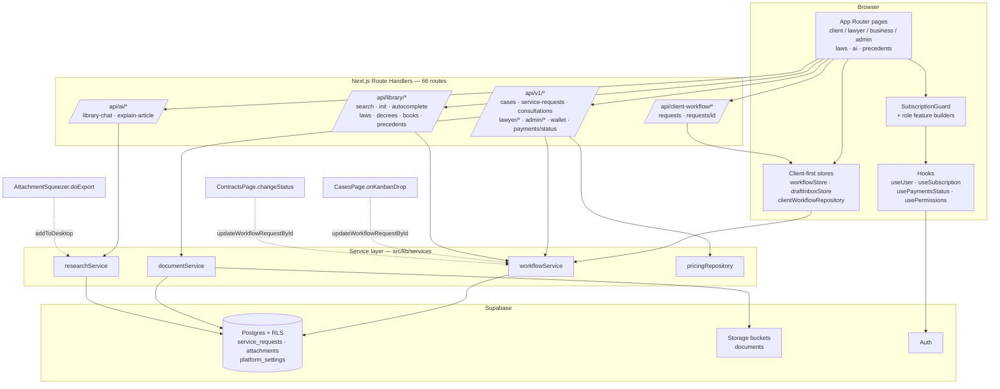
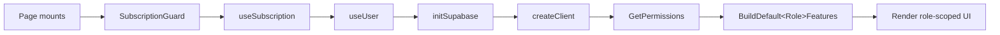

# Architecture — NZAMY Legal Platform

> Auto-generated from the GitNexus knowledge graph (`latest-nzamy-full`):
> **948 files · 15,214 symbols · 300 indexed execution flows · 83 functional areas · 66 API routes.**
> Last regenerated 2026-06-28. To refresh, run `npx gitnexus analyze` then re-invoke `/mcp__gitnexus-stdio__generate_map`.

## 1. Overview

NZAMY is an Arabic-first legal-services platform built on **Next.js 16 (App Router, Turbopack) + React + TypeScript + Supabase**. It serves four audiences through role-scoped dashboards under `src/app/dashboard/**`:

| Audience | Entry area | Purpose |
|----------|-----------|---------|
| **Client** | `dashboard/client/**` | Book consultations, file requests, manage documents/contracts/wallet, community Q&A, referrals |
| **Lawyer** | `dashboard/lawyer/**` | Case Kanban, contracts, hearings, tasks, clients, finance, profile, activity |
| **Business / Firm** | `dashboard/business/**` | Reviews, health-check, departments, employee contracts, seconded counsel, tasks |
| **Admin** | `dashboard/admin/**` | Users, verifications, subscriptions, teams, marketplace, library, ERP, credits, corporates, settings |

Shared public surfaces — `laws/**` (legal library), `precedents/**`, `book/**`, `ai/**` (AI research/analyze) — sit alongside the dashboards.

The backend is a thin Next.js Route Handler layer (`src/app/api/**`) over **Supabase** (Postgres + Storage + Auth). Most data flows through typed service modules and local-first repository/store pairs that sync to Supabase.

## 2. Layered structure

```
src/app/**                      Presentation — App Router pages & layouts (role-scoped dashboards)
  └─ api/**                      Route handlers (66 routes: /api/v1, /api/library, /api/ai, /api/client-workflow)
src/components/**                Shared UI (462 symbols, 91% cohesion — the largest area)
src/hooks/**                     useUser, useSubscription, usePaymentsStatus, usePermissions …
src/lib/services/**              workflowService, documentService, researchService … (typed DB access)
src/lib/*Store.ts                Client-first state: workflowStore, draftInboxStore …
src/lib/clientWorkflowRepository.ts   Local workflow cache + dispatch
src/lib/supabase/client.ts       Browser/server Supabase client factory (createClient)
supabase/migrations/**           RLS policies, storage buckets, platform_settings
```

### API surface (66 routes)

| Prefix | Domain | Representative routes |
|--------|--------|----------------------|
| `/api/v1/cases` | Cases & workflow | `cases`, `cases/[id]` |
| `/api/v1/service-requests` | Requests | `service-requests`, `[id]`, `[id]/events` |
| `/api/v1/consultations` | Consultations | `consultations`, `[id]` |
| `/api/v1/lawyer/*` | Lawyer workspace | `tasks`, `clients`, `finance`, `activity`, `dashboard/summary` |
| `/api/v1/admin/*` | Admin console | `users`, `verifications`, `subscriptions`, `teams`, `marketplace`, `library`, `erp`, `credits`, `corporates`, `settings`, `stats` |
| `/api/v1/wallet` · `/api/v1/payments/status` | Money | wallet balance, payments-gateway gate |
| `/api/library/*` | Legal library | `search`, `init`, `autocomplete`, `folders`, `reports`, `laws/[slug]`, `decrees/[id]`, `books/[slug]`, `precedents/[slug]` |
| `/api/ai/*` | AI | `library-chat`, `explain-article` |
| `/api/client-workflow/*` | Client-side workflow sync | `requests`, `requests/[id]` |
| `/api/v1/research/*` · `/api/v1/drafts/*` | Research & draft inbox | `sessions`, `desktop`, `drafts/cart` |
| `/api/v1/community/*` · `/api/v1/chat/*` · `/api/v1/groups/*` | Social | posts, answers, votes, chat rooms/messages, groups + members/invite |

## 3. Functional areas (GitNexus clusters)

Top areas by symbol count (of 83 total). Generic names (`Components`, `_components`, `[id]`, `[slug]`) are App-Router structural clusters; named clusters are true functional domains.

| Area | Symbols | Cohesion | Role |
|------|---------|----------|------|
| Components | 462 | 91% | Shared UI primitives |
| Services | 93 | 67% | Typed data-access layer |
| Steps | 65 | 84% | Multi-step flows (consultation onboarding, WA steps) |
| Tabs | 64 | 91% | Admin/dashboard tab panels |
| Cases | 61 | 81% | Lawyer case Kanban + workflow |
| Hooks | 55 | 79% | React data/permission hooks |
| Constants | 40 | 88% | Shared config/enums |
| Draft | 35 | 70% | AI draft inbox & research cart |
| Laws | 34 | 81% | Legal-library rendering |
| Dashboard | 32 | 66% | Dashboard shells & summaries |
| Parsers | 29 | 100% | Law-text / FEKH parsers |
| Lawyer | 29 | 99% | Lawyer-domain logic |
| Legal-opinion | 26 | 77% | Legal-opinion drafting |
| Sector-profiles | 25 | 82% | Sector/company profiles |
| Scripts | 25 | 98% | Seed/parse CLI scripts |
| Wa-steps | 24 | 91% | Workflow-automation steps |
| Pricing | 23 | 91% | Fee calculator & client pricing |
| Client-workflow | 14 | 97% | Client-side workflow repository |
| Contracts | 12 | 89% | Lawyer contracts |
| Hearings | 12 | 92% | Lawyer hearings |
| Library | 11 | 65% | Library data layer |
| Admin | 10 | 75% | Admin console logic |
| Fee-calculator | 9 | 94% | Fee computation |
| Onboarding | 15 | 75% | Signup/onboarding flow |

## 4. Key execution flows

Traced from the knowledge graph. Step format: `symbol (file)`.

### 4.1 Case Kanban status update — `CasesPage → DispatchWorkflowUpdate` (7 steps)
The lawyer drags a case across Kanban columns; the optimistic UI updates, then the workflow service persists the new status; on failure it reverts.

1. `CasesPage` — `src/app/dashboard/lawyer/cases/page.tsx`
2. `KanbanView` — `src/app/dashboard/lawyer/cases/page.tsx`
3. `onKanbanDrop` — `src/app/dashboard/lawyer/cases/page.tsx`
4. `updateWorkflowRequestById` — `src/lib/services/workflowService.ts`
5. `updateWorkflowRequest` — `src/lib/workflowStore.ts`
6. `updateWorkflowRequestLocal` — `src/lib/clientWorkflowRepository.ts`
7. `dispatchWorkflowUpdate` — `src/lib/clientWorkflowRepository.ts`

> `CasesPage → ReadWorkflowRequestsLocal` is the same chain ending in `readWorkflowRequestsLocal` — the local-cache read path.

### 4.2 Contract status change — `ContractsPage → DispatchWorkflowUpdate` (6 steps)
1. `ContractsPage` — `src/app/dashboard/lawyer/contracts/page.tsx`
2. `changeStatus` — `src/app/dashboard/lawyer/contracts/page.tsx`
3. `updateWorkflowRequestById` — `src/lib/services/workflowService.ts`
4. `updateWorkflowRequest` — `src/lib/workflowStore.ts`
5. `updateWorkflowRequestLocal` — `src/lib/clientWorkflowRepository.ts`
6. `dispatchWorkflowUpdate` — `src/lib/clientWorkflowRepository.ts`

### 4.3 Supabase client bootstrap + subscription gate — `BusinessReviewsPage → CreateClient` (6 steps)
The canonical "page loads → auth + subscription resolved" flow. Nearly every dashboard page follows this shape (`CreateClient`, `ReadSessionFromStorage`, `ReadDemoKeyFromStorage`, then `GetPermissions` / `BuildDefault<Role>Features`).

1. `BusinessReviewsPage` — `src/app/dashboard/business/reviews/page.tsx`
2. `SubscriptionGuard` — `src/components/dashboard/SubscriptionGuard.tsx`
3. `useSubscription` — `src/hooks/useSubscription.ts`
4. `useUser` — `src/hooks/useUser.ts`
5. `initSupabase` — `src/hooks/useUser.ts`
6. `createClient` — `src/lib/supabase/client.ts`

### 4.4 AI attachment export to draft inbox — `AttachmentSqueezer → ReadItems` (6 steps)
1. `AttachmentSqueezer` — `src/app/ai/analyze/_components/AttachmentSqueezer.tsx`
2. `doExport` — `src/app/ai/analyze/_components/AttachmentSqueezer.tsx`
3. `addToDesktop` — `src/lib/services/researchService.ts`
4. `addToDesktop` — `src/lib/draftInboxStore.ts`
5. `_addItem` — `src/lib/draftInboxStore.ts`
6. `readItems` — `src/lib/draftInboxStore.ts`

### 4.5 Permission / feature-gating pattern (dominant cross-cutting flow)
The single most repeated flow shape in the graph. Each dashboard page resolves permissions and builds the role-specific feature set:

`<Page> → SubscriptionGuard → useSubscription → useUser → GetPermissions → BuildDefault{Company,Firm,Government,Ngo,Micro}Features`

Page families that follow it: `CasesPage`, `BusinessReviewsPage`, `BusinessKanbanPage`, `HealthCheckDashboard`, `DepartmentsPage`, `EmployeeContractsPage`, `NewReviewPage`, `SecondedCounselPage`, `FirmHealthCheckPage`, `FirmTasksPage`, `NewConsultationPage`, `ConsultationsPage`.

## 5. Architecture diagram





## 6. Conventions & gotchas

- **Workflow persistence is double-written.** Writes go through `workflowService.updateWorkflowRequestById` → `workflowStore.updateWorkflowRequest` → `clientWorkflowRepository.updateWorkflowRequestLocal` → `dispatchWorkflowUpdate`. The local repository is the source of truth for optimistic UI; Supabase is the durable backend. Failure-revert must capture the *original* value before the optimistic `setState` (see `onKanbanDrop`).
- **Payments gateway is feature-gated.** `usePaymentsStatus` polls `/api/v1/payments/status` (served with `Cache-Control: no-store`). UI that depends on payment availability must wait for `!loading` before treating `disabled` as authoritative, to avoid a flash of "المدفوعات غير متاحة" on first load. The real provider is deferred behind the runtime `payments_gateway` flag.
- **RLS is scoped per bucket.** Storage policies in `supabase/migrations/*` are scoped to `bucket_id = 'documents'` and use `auth.uid() = storage.foldername(name)[1]` so per-user folders are isolated; enabling RLS on `storage.objects` does not affect other buckets (no policy = no access).
- **Demo/mock fallbacks are being phased out.** Many pages previously fell back to mock data (`MOCK["1"]`, `CASES_DB`, `MOCK_LAWYERS`); the audit pass replaced these with clean not-found / real-API states. Residual mock arrays are gated behind dev flags or `DashboardComingSoon` cards.
- **Index maintenance.** Running `gitnexus analyze --embeddings` can leave FTS indexes degraded (`query()` then returns empty); `gitnexus analyze --force` rebuilds them. On win32/x64 the vector index is unavailable, so semantic search falls back to exact-scan (capped at 10,000 chunks) — adequate for symbol-level `query`/`context`/`impact` calls.

## 7. Where to look next

| Task | Tool |
|------|------|
| "How does X work?" | `gitnexus_query({query: "concept"})` → process-grouped flows |
| Full symbol context (callers/callees) | `gitnexus_context({name: "symbol"})` |
| Blast radius before editing | `gitnexus_impact({target: "symbol", direction: "upstream"})` |
| Pre-commit change scope | `gitnexus_detect_changes()` |
| Safe multi-file rename | `gitnexus_rename` (never find-and-replace) |
| Raw graph queries | `gitnexus_cypher` (see `gitnexus://repo/latest-nzamy-full/schema`) |