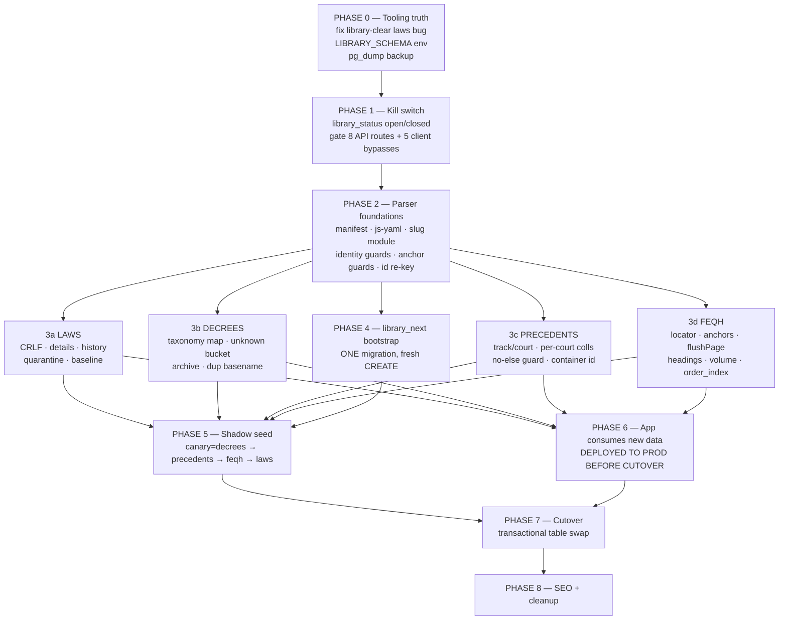

# NZAMY Legal Library — Sequenced Release Plan

**Author:** Release Architect · **Date:** 2026‑07‑29 · **Repo:** `D:\DEV\projects\SITE MAPS NZAMY (1)\SITE MAPS NZAMY\nzamy-website`
**Scope:** 7 verified fix specs (laws‑amendments, precedents‑court, feqh‑structure, decrees‑taxonomy, identity‑integrity, frontend‑seo, library‑toggle) → one shippable program.

---

## ⚠️ STATUS — read before using this plan (updated 2026‑07‑30)

This document is the original plan. Parts of it are now **superseded**; the live
record of what was actually built, and of every plan claim that turned out false,
is **`LIBRARY_PROGRESS_TRACKER.md`**. Read that first.

| Phase | State |
|---|---|
| 0 Tooling truth & safety net | ✅ done |
| 1 Kill switch | ✅ built — **not deployed** |
| 2 Parser foundations | ✅ done |
| 3 Content correctness (4 tracks) | ✅ done — all four |
| ~~4 Build `library_next`~~ | ❌ **DROPPED** |
| 5 Seed | ⬜ now a plain wipe + reseed into a **fresh** database |
| 6 App consumes new data | ✅ done |
| ~~7 Cutover~~ | ❌ **DROPPED** |
| 8 SEO, cleanup, owner deliverable | ⬜ |

**Why 4 and 7 are dropped:** the owner confirmed the current Supabase database is
**disposable** — a fresh one is being built once the content is final. The shadow
schema and the transactional cutover existed only to protect live data that no
longer needs protecting. That removes the single riskiest step in this plan.

**What did NOT change:** the migrations are still required (a new database needs
the schema), the owner's source fixes are still required (a disposable database
does not make a slug collision harmless — the documents still vanish silently at
seed time), and every parser guard still applies (they matter more when there is
no backup).

§0.1 and §3 below are **superseded** — see §3 for the real migration set.

---

## 0. Read this first — a blocking defect none of the 7 specs found

I verified the reseed tooling myself before planning around it. **The wipe mechanism every spec tells you to use cannot delete `library.laws`.**

`library-toolkit/library-clear.mjs:157-160`:

```js
      const { error } = await supabase
        .schema("library")
        .from(table)
        .delete()
        .not("id", "is", null);
```

with the comment two lines above: *"works for any table with an `id` PK (all library tables have one)"*.

That comment is false. `supabase/migrations/20260626_legal_library_schema.sql:72-73`:

```sql
create table if not exists library.laws (
  slug                   varchar(200)  primary key,
```

`library.laws` **has no `id` column.** PostgREST returns 42703 (`column laws.id does not exist`), and `library-clear.mjs` does `console.error(...); continue;` — it does **not** exit non‑zero. So:

| Command | Actual effect on prod |
|---|---|
| `library:clear --live --force-prod --type laws` | Deletes `article_amendments`, `articles`, `chapters`. **Fails silently on `laws`.** Exits **0**. |
| `library:reseed:wipe --type laws` | Runs the above, sees exit 0, proceeds to parse + seed. |

**This is the exact historical incident in the brief** — "running `--clean` on laws wiped chapters/articles/amendments and then the seeder crashed, leaving the live site with empty law content." It is not a one‑off; it is reproducible on every run and it is still armed today.

The seeder's own helper already gets this right — `scripts/seed-library.ts:110-112`:

```ts
      if (params.toString() === "") {
        params.append(table === "laws" ? "slug" : "id", "not.is.null");
      }
```

**Consequence for the plan:** the `laws-amendments` verdict's *CORRECTION 3* ("the wipe is performed by `library-toolkit/library-clear.mjs`, NOT by `scripts/seed-library.ts`'s `--clean` path") correctly identified the mechanism but drew the wrong conclusion — it points you at the broken tool. **Phase 0 fixes `library-clear.mjs` before anything else touches production.**

### 0.1 ~~Second structural decision: do not wipe production at all~~ — SUPERSEDED

> **This section no longer applies.** The database is disposable and is being
> rebuilt from scratch, so there is no live library to protect and no shadow
> schema. Phase 5 is a plain seed into a fresh database. The reasoning below is
> kept only to record why the shadow-schema route was chosen at the time.

Every one of the four content types requires a clean rebuild (ids/slugs change in laws, precedents, feqh; orphan purge in decrees). That is not an incremental patch — **it is a 100% rebuild of the library.** Wiping a live 319,000‑row library in place to rebuild it is the highest‑risk possible way to do a job that has a safe alternative.

**Primary strategy: build in a shadow schema `library_next`, verify it fully, then swap the 14 content tables into `library` inside ONE transaction.** Production never sees a half‑seeded state, and rollback is the inverse swap (sub‑minute). Details in §5. Plan B (in‑place, staged) is specified in §5.6 for the case where the owner rejects schema DDL.

I verified this is cheap to enable: the schema name appears as **two string literals** in `scripts/seed-library.ts:60-61` (`"Content-Profile": "library"`, `"Accept-Profile": "library"`) and one `.schema("library")` call per toolkit script. The 59 `schema('library')` call sites in `src/` need **zero** changes, because the cutover renames tables *into* `library` — the app keeps saying `library` throughout.

---

## 1. Verdict triage — what survives, what was corrected, what is dropped

Two specs came back **FLAWED**, two **SOUND_WITH_CORRECTIONS**, and three items inside otherwise‑sound specs were proven factually wrong. I honor every verdict. Where a spec was downgraded or dropped, it is named.

| Spec / item | Verdict | Decision | Why |
|---|---|---|---|
| **laws‑amendments** (whole spec) | FLAWED | **Keep, with Corrections 1–6 mandatory** | 10/10 items confirmed; the failure was in *one proposed regex*, not the diagnosis. |
| ↳ heading strip `^[ \t]*#{1,6}[ \t]+.*$` | data loss | **REPLACED** by Correction 1 (label‑only strip + hard fail on emptied body) | Verdict measured 4,798 articles whose entire statutory text is on the heading line. Original would have deleted them. |
| ↳ `repealed-articles-lose-all-text` count 1,499 | wrong measurement | **Baseline re‑derived empirically in Phase 3a.** Do not reuse 1,499 or 6,719. | Both figures were computed against different (one broken) pipelines. |
| ↳ migration part 2 `cross_section_search` snippet work | dead work | **DROPPED.** Matview recreated only because `drop column fts` requires it; grants re‑added. | Verdict grepped the repo: zero consumers in `src/`, `scripts/`, `library-toolkit/`. |
| ↳ search fix | wrong target | **REDIRECTED** to `src/app/api/library/search/route.ts` (add `original_text` to select + snippet fallback). | The real consumer. |
| **precedents‑court** (whole spec) | FLAWED | **Keep 5 confirmed items; rewrite 1; re‑baseline all numbers** | Core diagnosis (fabricated collection, `track` always `''`, `court_type` default) is sound. |
| ↳ `moj-collection-id-collision` | premise FALSE | **DROPPED AS WRITTEN.** Replaced by: exclude the 44 section‑97‑root stubs; derive container id from frontmatter `meta.id`; content‑keyed duplicate detector. | Verdict proved root files are 8–11 KB stubs with 1 placeholder ruling; the fix would have **published 44 stub collections** and left the real 1,000+ ruling loss untouched. |
| ↳ `laws-page-hardcoded-court-fallbacks` | dead code today | **DOWNGRADED** to follow `judicial-collections-category-missing-column`; drop the line‑715 claim. | `dbPrinciples` is empty in prod because of the phantom `category` column, so those fallbacks never execute. |
| **feqh‑structure** | SOUND_WITH_CORRECTIONS | **Keep 12 of 13 items with Corrections 1–8** | |
| ↳ `\b` in Arabic keyword regexes | dead code | **MANDATORY FIX** — remove every `\b`. | `/^كتاب\b/.test('كتاب الطهارة')` is `false`; shipping it is *worse* than current code. |
| ↳ `RE_LOCATOR` compound volumes `7-1` | cannot match | **MANDATORY FIX** — admit internal hyphen; re‑baseline `nonNumericVolume` 189 → 490. | 316 real pages would hard‑fail or become sections. |
| ↳ `feqh-matn-sharh-split` | confirmed | **DEFERRED to post‑cutover** (spec itself says "safe to defer entirely") | Only item that *moves* legal text between columns. Highest mislabel risk, lowest current benefit. |
| **decrees‑taxonomy** | SOUND_WITH_CORRECTIONS | **Keep all 12 items with Corrections 1–7** | Cleanest spec of the seven. |
| ↳ duplicate basename `قرار مجلس الوزراء 123 - 1443-02-21هـ.md` | new critical | **ADDED as a Phase 3b item** — detector + owner source rename. Do **not** change the id scheme. | Two distinct decrees (8,025 B vs 8,740 B, different sha1) collapse to one row today. |
| ↳ `--types decrees` in verification | wrong flag | **CORRECTED to `--type decrees`** (verified: `seed-library.ts:892` reads `--type`, single value only). | |
| **identity‑integrity** | SOUND_WITH_CORRECTIONS | **Keep all 7 items with Corrections 1–8** | The foundation everything else sits on. |
| ↳ `alter column number type text` | blocked | **MOOT under shadow schema** — the column is *created* as `text`. No ALTER, no matview conflict, no lock. | Verdict found `cross_section_search` line 681 blocks the ALTER with 0A000. |
| ↳ `npm run library:reseed:wipe` | destroys user data | **BANNED from the runbook.** See §5.5. | No `--type` ⇒ `library-clear.mjs` also clears `smart_folders`, `smart_folder_items`, `issue_reports`, `invitations`. |
| ↳ `slugifyArabic('الطيران المدني') === 'al-tyran-al-mdny'` | false | Unit table corrected to `'altyran-almdny'` + `'_الطيران_المدني' → 'al-tyran-al-mdny'`. | Shipping the false assertion would provoke a "fix" that re‑keys 767 slugs. |
| **frontend‑seo** | FLAWED | **Keep 9 confirmed items; 4 corrections mandatory; 3 sub‑items deferred** | Diagnoses all correct; two proposed fixes were unreachable or fabricating. |
| ↳ `LOCATOR_NOUNS` incl. `"Page"`, `"الصفحة"` | fabricates citations | **MANDATORY FIX** — explicit reject rule. | Verdict measured **10,451 blocks (24.9%)** citing a *page number* as the legal locator. |
| ↳ `@type: schema_type === "HowTo" ? "HowTo" : "Legislation"` | invents a value | **REPLACED** by a closed map that emits *no* JSON‑LD on unknown. | Would relabel 23 GovernmentService + 12 Article docs as Saudi legislation. |
| ↳ `section_code` fix | built on an empty column | **RE‑SEQUENCED** — root cause is `parse-laws.ts:173-178` quote‑strip‑then‑coerce. Fix in Phase 2, consume in Phase 8. | 55 of 56 seeded laws have `section_code = ''`. |
| ↳ `/laws/section/[code]` hubs, `aeo_pairs` FAQPage | valid but costly | **DEFERRED to Phase 8+ / post‑launch.** | |
| **library‑toggle** | SOUND_WITH_CORRECTIONS | **Keep, scope‑cut to `open`/`closed`** | See §7. |
| ↳ `preview` state | confirmed | **DEFERRED.** Ship 2 states. | Costs 7 serializer rewrites + UI for a state the owner did not ask for ("نقفل المكتبة ككل"). |
| ↳ "two client‑side fallbacks" | there are **five** | **MANDATORY** — all 5 gated (incl. `/precedents/[slug]` 33 JSON files ≈ 34 MB, `/book/[slug]`, `/laws/feqh-preview`). | |

---

## 2. Dependency graph



### 2.1 Hard ordering rules (violations that cause an incident)

| # | Rule | Consequence of violating |
|---|---|---|
| **D1** | `library-clear.mjs` laws fix ships **before** any wipe. | Laws rows survive with zero articles → live site shows empty law pages. |
| **D2** | Kill switch (Phase 1) is live **before** the cutover. | No way to take a corrupt library offline without a redeploy. |
| **D3** | `js-yaml` swap + `section_code` coercion fix precede **every** downstream field consumer. | 8.2% of files fail; `section_code` stays empty; SEO wiring stores truncated quote‑corrupted values. |
| **D4** | Manifest vendoring precedes any CI or clean‑clone parse. | `parse-laws` prints `✅ Parsed 0 laws` and exits **0**. |
| **D5** | All id/slug changes (Phase 2) land **before** the single seed. | Upsert creates duplicates + orphans instead of updating. |
| **D6** | All parser content fixes (Phase 3) land **before** the seed that consumes them. | Second reseed required = second risk window. |
| **D7** | `library_next` DDL (Phase 4) precedes the seeder writing new columns. | PGRST204 per row; `batchUpsert` recursive split degrades to 1 request/row across ~42k rows, records per‑row errors, exits 1 only at the very end. |
| **D8** | Phase 6 UI/API deploys to prod **before** Phase 7 cutover, and is backward‑compatible with old data. | `ORDER_TYPE_STYLES[o.type]` → `undefined.label` → **client crash on the Orders tab AND on `LawsTabContent`**. And 1,474 repealed articles render blank. |
| **D9** | Bookmark/report remap map is built from old parse output **before** the swap, applied **after**. | `smart_folder_items.entity_id` / `issue_reports.entity_id` are plain `text` with **no FK** — every user bookmark silently points at nothing. |
| **D10** | `notify pgrst, 'reload schema'` after every DDL that adds a column the seeder writes. | Seeder sees a stale schema cache. |

---

## 3. Migrations — the real set, verified against the live database

> Replaces the earlier M1–M4 shadow-schema batching, which assumed Phases 4 and 7.
> Every row below was checked by querying the live database on 2026‑07‑30, not
> read off a changelog.

### 3.1 The six library migrations, in apply order

| Order | File | On the live DB | What it does |
|---|---|---|---|
| 1 | `20260626_legal_library_schema.sql` | ✅ applied | The whole `library` schema: 18 tables, the `library.arabic` FTS config, the `cross_section_search` matview. |
| 2 | `20260722_laws_add_gregorian_guid.sql` | ✅ applied | `laws.issue_date_gregorian`, `laws.law_guid`. |
| 3 | `20260729_library_status.sql` | ✅ applied | Kill-switch flag. Seeds `platform_settings.library_status = open`, so applying it is a behavioural no-op. |
| 4 | `20260729_decree_instrument_taxonomy.sql` | ❌ **NOT applied** | Widens the `decrees_circulars.type` CHECK from 3 values to 21 **while retaining the legacy 3**; adds `instrument_ar`. |
| 5 | `20260729_article_history_columns.sql` | ❌ **NOT applied** | `articles.original_text` / `historic_regulation_text` / `unparsed_details`; rebuilds `articles.fts` to index `original_text`; drops and recreates `cross_section_search`. |
| 6 | `20260729_feqh_locator_labels.sql` | ❌ **NOT applied** | `feqh_blocks.page_label` / `volume_label` / `book_id`; makes `volume_number`/`page_number` nullable; adds `idx_feqh_blocks_order` and `idx_feqh_blocks_book_order`. |

**Only 4, 5 and 6 remain.** They are mutually independent — 4 touches
`decrees_circulars`, 5 touches `articles`, 6 touches `feqh_blocks` — but apply
them in filename order anyway, because 5 drops and recreates the
`cross_section_search` matview and doing that last keeps the rebuild ordering
obvious.

### 3.2 Order relative to the seed — this one matters

**All three must be applied BEFORE `library:seed`, and PostgREST must be told to
reload.** Two hard consequences if they are not:

- Without #4 the widened CHECK does not exist, so every decree carrying one of the
  18 new instrument types is **rejected at insert** (707 of 2,077 decrees were
  mistyped, so this is not an edge case).
- Without #5 and #6 the seeder writes columns that do not exist, and PostgREST
  rejects the whole row batch with PGRST204.

```sql
-- after applying, in the SQL editor:
notify pgrst, 'reload schema';
```

Skipping the reload is the classic failure here: the columns exist, but PostgREST
is still serving its cached schema and every insert fails.

### 3.3 What the app does if they are missing

The Phase 6 routes were written to degrade rather than break, so a code-first
deploy is safe — it just leaves features dead, loudly, in the server log:

| Missing | Symptom |
|---|---|
| `20260729_article_history_columns` | Search retries without `original_text` and logs a warning; **1,613 repealed articles render blank**. |
| `20260729_feqh_locator_labels` | The per-book ordered read has no usable index — measured 3.2–4.3s against the **3s statement timeout the anon role runs under**, so large fiqh books intermittently return 57014 and render empty. Books above **396 sections** have no working fallback at all. |
| `20260729_decree_instrument_taxonomy` | Nothing breaks until the reseed, then decree inserts are rejected by the CHECK. |

### 3.4 Building the fresh database

The whole repo migration set is **34 files**; they apply in filename order
(`supabase db push`). Two honest warnings:

1. **This set has never been replayed from empty.** Several files are RLS/patch
   migrations layered on earlier ones (`20260615_fix_rls_policies`,
   `20260617_fix_remaining_rls`, `20260625_fix_rls_recursion`,
   `20260716_security_hardening`). Rehearse on a throwaway Supabase project
   before pointing the real one at it.
2. **`library_next` is not needed.** Any instruction elsewhere in this document to
   create it, expose it, or swap schemas is superseded — see the status banner.

After the schema is up: expose `library` under Settings → API → Exposed schemas,
`notify pgrst, 'reload schema';`, then seed.

---
## 4. Phases

Effort is honest dev‑days for one senior engineer fluent in this codebase. Phase 3 parallelizes across 4 tracks.

### PHASE 0 — Tooling truth & safety net
**Goal:** make the destructive tools honest and take a restorable backup. Nothing user‑visible changes.
**Effort:** 2–3 d.

| # | Step |
|---|---|
| 0.1 | `library-toolkit/library-clear.mjs` — replace `.not("id","is",null)` with a per‑table PK: `const pk = table === "laws" ? "slug" : "id";` `.not(pk,"is",null)`. Mirror the comment already in `seed-library.ts:110-112`. |
| 0.2 | Same file — track failures and `process.exit(1)` at the end if `failures > 0`. Today a failed delete prints and continues, and the script exits 0. |
| 0.3 | Same file — refuse to clear the `user` group unless `--type user` is passed **explicitly**. Today a bare `--live` clears smart folders, issue reports and invitations. |
| 0.4 | `scripts/seed-library.ts`, `library-clear.mjs`, `library-status.mjs` — read the schema from `process.env.LIBRARY_SCHEMA ?? "library"` instead of the literal. (2 lines in `seed-library.ts:60-61`; one `.schema()` call each in the others.) |
| 0.5 | `pg_dump --schema=library` of production → store off‑machine, verify it restores into a scratch database. |
| 0.6 | Capture the **baseline snapshot**: `npm run library:status` output + `select count(*)` per table + `select type, count(*) from library.decrees_circulars group by 1` + `md5(string_agg(...))` over a sampled 1,000 articles. Commit to `library-toolkit/baseline-2026-07-29.json`. |

**Exit criteria**
```bash
npm run library:clear                      # DRY: must list all 5 groups + real counts
npm run library:clear -- --type laws       # DRY: must show laws with a non-zero count
# In a scratch DB restored from the dump:
LIBRARY_SCHEMA=scratch node library-toolkit/library-clear.mjs --live --force-prod --type laws
#   → must delete laws rows AND exit 0; re-run library:status → laws = 0
# Negative: revoke DELETE on one table, re-run → must exit 1, not 0
```
**Rollback:** revert the 4 files. Nothing was written to prod.

---

### PHASE 1 — Kill switch (ship to production)
**Goal:** the owner can take the library offline in one click, with zero redeploy, before any risky work begins. This is the insurance policy for Phase 7.
**Effort:** 3–4 d. **Scope‑cut:** `open` / `closed` only — `preview` deferred (§7).

| # | Step |
|---|---|
| 1.1 | Apply **M1** (`library_status`, default `'open'`). Verify it is a behavioural no‑op. |
| 1.2 | Add `"library_status"` to `ALLOWED_SETTINGS_KEYS` in `src/app/api/v1/admin/settings/route.ts:5-12`, **plus a value validator** rejecting anything but `open`/`closed` (a typo like `"closd"` reads back as OPEN — a failed close that looks like a success). |
| 1.3 | `getLibraryStatus()` in `src/lib/access-control.ts` (mirror `getPaymentGatewayStatus()` at :319‑345). **Fail open, log loudly** — justified in the spec and correct: the tier paywall in `checkLibraryAccess` is independent and already degrades toward *more* locking on failure. |
| 1.4 | `src/app/api/v1/library/status/route.ts` (under `/api/v1/`, so it is not caught by its own gate) + `src/hooks/useLibraryStatus.ts`. |
| 1.5 | `src/lib/library-gate.ts`; wire as the first statement of **8** routes: the 7 content routes **plus `src/app/api/ai/library-chat/route.ts`** (verdict: unauthenticated RAG proxy over the same corpus). Reuse `requireAdmin()` rather than re‑implementing the `profiles.user_type` lookup. Do **not** gate `folders`, `folders/items`, `reports`, `admin/library`. |
| 1.6 | Gate **all five** client‑side bundled‑content bypasses — not the two the spec named: `/laws/companies-law` (`COMPANIES_LAW`), `/laws/civil-procedure` (`ARTICLES`), `/laws/feqh-preview` (`DEMO_BOOK`), `/precedents/[slug]` (33 JSON files ≈ 34 MB), `/book/[slug]` (`DEMO_RAWD` + `sources-of-right-1.json`). For the last two there is **no `!res.ok` branch** — the shape is `if (res.ok) { …; return; }` with fall‑through, so the gate goes *before* the fetch. |
| 1.7 | `LibraryClosedNotice` over `DashboardComingSoon`; render on 9 pages. **Every page must render a spinner while `lib.loading`** — rendering early flashes real statutory text. |
| 1.8 | Admin Section 4 in `src/app/dashboard/admin/settings/page.tsx`, with a **confirm step** for `closed`. Expose `isAdmin`/`effectiveStatus` from the status endpoint so the server‑side admin bypass is reachable from the browser. |
| 1.9 | **Deploy to VPS**: `git pull && npm install && npm run build && pm2 restart`. |

**Exit criteria (run against production, logged out)**
```bash
BASE=https://nezamy.sa
# flip to closed via the admin UI, then — with NO redeploy:
for u in "/api/library/init?limit=5&page=1" "/api/library/laws/civil-procedure-law" \
         "/api/library/autocomplete?q=%D8%A8%D8%B7%D9%84%D8%A7%D9%86" ; do
  curl -s -o /tmp/o -w "$u → %{http_code}\n" "$BASE$u"; grep -c "تطبق المحاكم" /tmp/o; done
# expect 503 on each, grep count 0
```
Plus **browser DOM checks** (curl cannot see these): `/laws/companies-law` must not contain `مرسوم ملكي رقم (م/132)`; `/precedents/admin-supreme-1443-part1` must not contain `مبادئ المحكمة الإدارية العليا — 1443هـ`; `/laws/feqh-preview` must not contain `وَشُرُوطُهَا تِسْعَةٌ`. Then flip to `open` → all pages byte‑identical to pre‑change.

**Rollback:** set `library_status = open` (instant); or revert the deploy. M1 leaves an unread row — harmless.

---

### PHASE 2 — Parser foundations
**Goal:** every parser is deterministic, collision‑proof, fail‑loud, and runnable from a clean clone. **No content semantics change yet.**
**Effort:** 6–9 d.

| # | Step | Spec |
|---|---|---|
| 2.1 | Vendor `schema_manifest.json` into `scripts/parsers/` (tracked). Widen `resolveManifestPath()` with `SCHEMA_MANIFEST_PATH` override + legacy paths. **Call `getManifest()` once at the top of each parser entry, outside any try/catch** — today the throw is swallowed per file and the run prints `✅ Parsed 0 laws` and exits 0. Add a shape assertion on `enums.*`. | identity |
| 2.2 | `npm i -D js-yaml@^4.1.1 @types/js-yaml`; new `scripts/parsers/lib/frontmatter.ts` using `CORE_SCHEMA` (not `DEFAULT_SCHEMA` — avoids Date coercion; verified 0 Date values across 5,694 files). Keep the BOM strip and malformed‑fence repair. **Do not pass `json: true`** (that restores silent last‑key‑wins). | identity, frontend‑seo |
| 2.3 | **`section_code` root cause.** `parse-laws.ts:173-178` strips quotes *then* coerces digits, so `section_code: '00'` → integer `0`, and `seed-library.ts:273`'s `String(law.section_code \|\| "")` turns `0` into `''`. 55 of 56 seeded laws have `section_code = ''` **today**. Fix: never coerce a value that was quoted; `String(...).padStart(2,'0')` at the seeder. This unblocks the search category filter, which is dead in prod for the same reason. | frontend‑seo |
| 2.4 | Shared `scripts/parsers/lib/slug.ts`; delete all 4 `AR_TRANSLIT` copies; add U+0660‑0669 and U+06F0‑06F9. **Freeze `\bال`** with the corrected unit table (`'الطيران المدني' → 'altyran-almdny'`, `'_الطيران_المدني' → 'al-tyran-al-mdny'`). Removing it would re‑key 767 slugs for zero gain. | identity |
| 2.5 | `scripts/parsers/lib/identity.ts` — `assertUniqueIdentity()`; `dedupeOrDie()` replacing the 4 silent `new Map(...)` dedups in `seed-library.ts` (341‑344, 440‑441, 581‑583, 724‑727). **Never auto‑generate a disambiguating suffix** — a machine‑invented slug is a fabricated citation URL. | identity |
| 2.6 | `scripts/parsers/lib/guard.ts` — `ParseLedger`, ق‑3 anchor conservation, `--accept-rejects <sha256>` two‑key gate. Relax `ARTICLE_START` to `[:\s]` with `(?![A-Z_])` in **all three** sites (`parse-laws.ts:344`, `parse-precedents.ts:480`, `:506`) — not just one. Delete the 5 per‑file catch‑and‑continue blocks. | identity |
| 2.7 | Provenance: `source_path`, `source_anchor_index` on articles/principles. **`source_anchor_index` must be pre‑scanned once per file, before chapter splitting** — `outsideBody.replace(chapterBlockRe,"")` destroys offsets, and a per‑call ordinal repeats within a file, which would trip the new partial‑unique index and drop articles into `errors[]`. | identity |
| 2.8 | Kill `Number()` coercion: `number_raw: string \| null` everywhere. 1,703 law articles + 735 principle numbers (`"14B"`, `"323/2/432"`, `"21 مكرر"`) are destroyed today; 2,135 articles get `order_index = 0` (worst law: `regulation-----1437-2016` at 213, **not** `aml-cft-guide-sama` at 155). Widen `ParsedArticle.number_text` to `string \| null`. | identity, frontend‑seo |
| 2.9 | **Re‑key ids.** `artId = ${lawId}__c${chapterIndex}-a${articleIndex}`; `chapterId = toUuid(${lawId}__c${chapterIndex})`; `prId = ${collId}__f${fileIndex}-p${i}`. Add a hard pre‑seed assertion `new Set(ids).size === ids.length`. Today: 2,388 articles + 882 principles + 195 chapters silently discarded; and `Number(artMeta.number \|\| 0)` collapses 2,886 non‑numeric markers to a single `__art-NaN` per law. | identity |
| 2.10 | **Build the old→new id map** while both schemes exist: run the OLD parser, run the NEW parser, join on `(source_path, source_anchor_index)`, emit `library-toolkit/output/article-id-map.json`. Required for D9. | identity |

**Exit criteria**
```bash
npm run library:parse -- --input "last_owner/01_المكتبة_القانونية"
# → exit 0, or exit 1 with a reject digest that a human has reviewed
node -e "const d=require('./library-toolkit/output/laws.json');
  const ids=[]; for(const l of d.laws) for(const c of l.chapters) for(const a of c.articles) ids.push(a.id||'');
  console.log('articles',ids.length,'unique',new Set(ids).size)"          # must be equal
git clone . /tmp/probe && cd /tmp/probe && npm ci && npm run library:parse -- --input <abs path>
#   must produce a NON-EMPTY laws.json  (today: laws:[] and exit 0)
SCHEMA_MANIFEST_PATH=/nope npm run library:parse -- --input <path>
#   must exit non-zero within ~1s and must NOT print "✅ Parsed 0 laws"
```
**Rollback:** parser changes only touch JSON on disk. Revert the branch.

---

### PHASE 3 — Content correctness (4 parallel tracks)
**Goal:** each parser emits legally faithful output with a loud, frozen defect baseline. **Effort:** 12–18 d serial, ~8 d with two engineers.

#### 3a — Laws (4–6 d)
Apply Corrections 1–6 of the laws verdict as written.
- `normalizeNewlines()` at read time (1,366 of 1,765 files are CRLF; `/^###?\s+.*\n/m` never fires on them).
- `cleanArticleText()` in the mandated order: regulations extracted first (16 `<details>` contain a `REGULATION` anchor), then details, then **all** HTML comments (the old regex missed 135 `<!-- AMENDMENTS -->` and 190 `<!-- END_AMENDMENT -->`), then **heading‑label‑only strip (Correction 1)**, then per‑line quote strip.
- **Correction 1 hard fail, no baseline escape:** `if (hadBody && !cleanText.trim() && !originalText && !unparsedDetails) throw`.
- `extractHistory()` with the 6 verbatim fixtures V1–V6; negative‑first `classify()` (the 4 `**تعذّر …**` markers must yield `original_text: null`).
- Layer 1 quarantine (`unparsed_details`, never in `fts`, never in the API), Layer 2 baseline gate, Layer 3 unconditional hard fails.
- **Re‑derive the empty‑text baseline empirically.** Do not reuse 1,499 or 6,719.
- Widen `ArticleStatus` in `parse-laws.ts:32` too (45 `added` + 1 `merged`), and throw on unknown instead of defaulting to `active`.

#### 3b — Decrees (2–3 d) ← **canary track, finish first**
- Delete `detectDecreeType`'s substring chain; exact‑match `DECREE_TYPE_MAP` (23 keys). Delete `|| "circular"`.
- `decree_type:` fallback (3 real cabinet decisions), conflict → unknown report.
- Strict unknown gate (`DECREES_STRICT`, exit 2), `_deleted_backups_archive` exclusion (232 files), `EXTRACTION_REPORT` skip moved into the parser.
- **NEW (verdict):** duplicate‑basename detector. Halt on `قرار مجلس الوزراء 123 - 1443-02-21هـ.md` (two distinct files, different sha1). **Do not change the id scheme** — that would re‑key every decree; the owner renames one file at source.
- Seeder: allow‑list assertion instead of the clamp; `instrument_ar` **verbatim** (per verdict Correction 4: normalize only to build the lookup key, never the stored/displayed value).

#### 3c — Precedents (3–4 d)
- `FOLDER_TRACK` + `COURT_TRACK_MAP` + `classify()` ladder ending in `"unknown"`, never `"ordinary"`. Add the 3 unnumbered section‑97 folders + `_deleted_backups_archive` to the skip list.
- Rename `court_type` → `court` + `track`; type the seeder input; runtime drift guard.
- Delete the hardcoded `court-precedents-collection`; synthesize per‑(track, court) collections in the parser; delete the legacy row only when provably childless.
- `else` branch + `unclassified[]` + exit 2. **Baseline: 42 files fall through today, not 1**; 4 need an owner decision (§8).
- **Replaces the dropped `moj-collection-id-collision`:** exclude the 44 section‑97‑root stub files; derive container id from frontmatter `meta.id` (`moj-rulings-143X-vNN`) — an official id exists, do not slugify Arabic `part_label`; add a content‑keyed duplicate detector. This recovers the **29 of 30 full 1434 volumes + 12 of 13 full 1435 volumes (~1,000+ real rulings)** currently discarded by the Map dedupe.
- Corrected expectations: 98‑ordinary = **8** (not 7); `court == 'ديوان المظالم'` = **62** (not 61); `98/1/3- القضاء العمالي` = **5** files (not 8).

#### 3d — Feqh (4–5 d)
- **Remove every `\b`** from the Arabic keyword tests (Correction 1). Without this the entire heading classifier is dead code and *worse* than today.
- `RE_LOCATOR` must admit an internal hyphen (Correction 2) — 316 real `الجزء 7-1` pages. Re‑baseline `nonNumericVolume` 189 → 490 and hard failures 317 → 1.
- Narrow the hard‑fail predicate so the one legitimate `مسألة` heading containing the word `صفحة` does not block the corpus forever (Correction 4).
- `(?:\\n)*` tolerance + diagnostic on the regex‑miss path (Correction 5) — `الوسيط_ج3:3436` has a double literal `\n\n`.
- `flushPage` conditional reset; anchor dispatcher; bracket classifier; volume precedence; hr guard; `PDF_EXTRACTION_REPORT` exclusion; footnote → `hashiyah`.
- `feqh_blocks.order_index` → **book‑global counter** (today ~all rows are `0`, so `0 >= freeLimit` is false and every paid feqh book is fully unlocked). Visible paywall change — flag to the owner.
- **Deferred:** `feqh-matn-sharh-split`.
- Count the two invented values the spec preserves without flagging (`عام` section, `مقدمة` chapter) in diagnostics.

**Exit criteria per track:** the corrected numeric assertions in each spec's `verification` block, run against `library-toolkit/output/*.json`. Every track must additionally satisfy:
```bash
node -e "const fs=require('fs');for(const f of ['laws','decrees','precedents','feqh']){
  const s=fs.readFileSync('./library-toolkit/output/'+f+'.json','utf8');
  console.log(f,'markup:',(s.match(/<details|<summary|<!--/g)||[]).length,'CR:',(s.match(/\\\\r/g)||[]).length)}"
# every count must be 0
```
**Rollback:** per track, revert that parser. Tracks are independent.

---

### ~~PHASE 4 — Build `library_next`~~ — ❌ DROPPED

> Dropped: the shadow schema existed only to protect live data, and the database
> is disposable. Nothing in this phase is needed. Kept for the record.
**Goal:** the target schema exists, at final shape, with zero contact with live data. **Effort:** 2–3 d.

1. Generate M2 (§3.1). Review the generated SQL by hand — especially the `'library.arabic'` restoration and the exclusion of the 4 user tables.
2. Add `library_next` to Supabase → Settings → API → Exposed schemas. `notify pgrst, 'reload config';`
3. Apply M2 to production. **Verify it changed nothing:**
```sql
select count(*) from library.laws;           -- unchanged vs baseline
select count(*) from library_next.laws;      -- 0
select table_name from information_schema.tables where table_schema='library_next' order by 1;  -- 14 + matview, NO smart_folders
select has_table_privilege('anon','library_next.laws','SELECT');  -- true (grants at end of M2)
```
4. `notify pgrst, 'reload schema';` then probe writability with the service key:
```bash
curl -s -X POST "$SUPABASE_URL/rest/v1/laws" -H "Content-Profile: library_next" \
  -H "apikey: $SRK" -H "Authorization: Bearer $SRK" -H "Content-Type: application/json" \
  -d '[{"slug":"__probe__","title":"probe"}]' -w "\n%{http_code}\n"    # expect 201
curl -s -X DELETE "$SUPABASE_URL/rest/v1/laws?slug=eq.__probe__" -H "Content-Profile: library_next" ...
```
**Rollback:** `drop schema library_next cascade;` — zero impact on live data.

---

### PHASE 5 — Shadow seed & integrity (the high‑risk step, de‑risked)
See §5 for the full design. **Effort:** 3–5 d.

---

### PHASE 6 — App changes that consume the new data — ✅ DONE (commit `07b27ae`)

> Delivered. Three corrections to what this phase specified, all measured:
> **(a)** `repealedBy` / `repealedDate` / `numberLabel` have **no source** — all
> 41,845 `ARTICLE_START` anchors were surveyed and carry no repeal-provenance
> field, so populating them would invent a legal citation (ق‑2). They stay absent.
> **(b)** there is **1** `|| "circular"`, not 2, and the order-type ternaries live
> in `laws/orders/[slug]/`, not the paths given below. **(c)** the plan missed two
> places the recovered text was being lost: `library.articles` had no column for
> it, and `laws/[slug]/page.tsx` re-maps articles through a field whitelist that
> dropped `originalText`.
>
> Verifying against the live database also surfaced **three pre-existing production
> outages** this phase had to fix to be testable at all: the entire library search
> returned 0 results (unparseable `library.arabic` FTS config), all 144 fiqh book
> pages 404'd (slug double-encoding), and 138 of 144 books returned no blocks
> (oversized `.in()` URL). Full detail in `LIBRARY_PROGRESS_TRACKER.md`.
**Goal:** production code can render the new shape, **while still rendering the old shape identically.** Deployed before cutover. **Effort:** 6–9 d.

| Track | Changes | Backward‑compat requirement |
|---|---|---|
| **Decrees (D8 blocker)** | `ORDER_TYPE_STYLES` re‑keyed to `Record<string,…>` with all 22 values + `ORDER_TYPE_FALLBACK`; **every** `ORDER_TYPE_STYLES[o.type]` followed by `?? ORDER_TYPE_FALLBACK`; shared `orderTypeLabel()` replacing the 2 ternaries in `page.tsx:270-272` and `_sidebar.tsx:47-49`; second `ORDER_TYPE_LABELS_EN` at `demo-data-orders.ts:211` updated or deleted; `\|\| "circular"` → `\|\| "unknown"`. | Legacy `royal`/`cabinet`/`circular` still render correctly. **This must ship before the data arrives or the Orders tab AND `LawsTabContent` throw.** |
| **Laws** | `formatArticleWithPaywall` emits `originalText` (truncated identically for locked), `repealedBy`, `repealedDate`, `numberLabel`, `numberText`, `number`; never `unparsed_details`. Repealed render branch **gated by `isLocked`** (it is not today); amendments **and executive regulation** moved out of the `else` fragment (87 repealed articles have unreachable `executive_reg_text`); `<MD>` instead of bare JSX; copy prefix. `search/route.ts`: add `original_text` to the select at :87 and a snippet fallback at :119 (**this, not the matview**). | All new fields optional; `?? null`. |
| **Precedents** | `getCourtOrIssuer` priority inverted, title fallback deleted, citation clause omitted when unknown; **`_identity-panel.tsx:32/34/40/45` and `page.tsx:463/466` routed through it** (missing from the spec's file list); `init/route.ts` drops the phantom `category` column and adds `track`. | `court: string \| null` widening will surface TS errors — that is the point. |
| **Feqh** | `books/[slug]/route.ts` select list + block map gain `page_label`/`volume_label`; `page.tsx:296/322-337/522` null‑guarded so a NULL volume renders the verbatim label, never `"null"`. | Old rows have NULL labels → falls back to `volume_number`. |
| **Citation** | New pure `src/app/laws/[slug]/_citation.ts` with the **corrected** `LOCATOR_NOUNS` (no `Page`/`الصفحة`/`Article`) + explicit page‑heading reject. Unit‑tested standalone. | Falls back to `من ${docTitle}:` when no locator. |

**Exit criteria:** deploy to prod with the library still on OLD data → `npm run library:verify` green, visual regression on `/laws`, `/laws/[slug]`, `/laws/orders/[slug]`, `/precedents/[slug]`, `/book/[slug]` shows **no change**. Plus:
```bash
rg -n 'ORDER_TYPE_STYLES\[' src           # every hit followed by ?? ORDER_TYPE_FALLBACK
rg -n '\|\| "circular"' src/app/laws/page.tsx   # no hits
npm run type-check && npm run build
```
**Rollback:** standard VPS revert (`git checkout <prev> && npm ci && npm run build && pm2 restart`).

---

### ~~PHASE 7 — Cutover~~ — ❌ DROPPED

> Dropped with Phase 4: there is nothing to cut over from. Phase 5 seeds the
> fresh database directly.
See §5.4. **Effort:** 1 d prep, ~30 min execution.

---

### PHASE 8 — SEO, cleanup, deliverable
**Effort:** 3–5 d.

- `/laws/[slug]` server shell: `git mv page.tsx _reader-client.tsx`, new server `page.tsx` with `generateMetadata` + `getLawSeo` in React `cache()` (one query per request), `_jsonld.tsx` with a **closed `@type` map that emits nothing on unknown**, explicit `SEO_COLS` projection that never joins `articles`.
- DB‑backed `sitemap.ts` (async, `revalidate = 3600`, `encodeURIComponent` matching the canonical byte‑for‑byte, exclude `_غير_تشريعي_مؤكد_لا_يُصنف` and `*EXTRACTION_REPORT*`).
- `noIndex` on `/laws` + `/precedents` when closed. **State the real cost:** `force-dynamic` on those layouts applies to the whole `/laws/**` subtree, not two routes.
- Soft‑404 fix on `/laws/[slug]` (currently HTTP 200 + "not found" content — combined with a 1,700‑URL sitemap this is a mass soft‑404 risk).
- `PreambleBlock` print copy.
- Section identity de‑duplication (`LEGAL_TAXONOMY` as single source; **literal** Tailwind classes, not runtime‑composed — JIT will not emit them).
- M4 (drop legacy `'royal'`, drop `library_old`) after a 7‑day soak.
- **Deliverable status file** (§9).

---

## 5. The reseed strategy

> ⚠️ **Largely superseded.** §5.4 (the cutover) and §5.6 (Plan B) assumed a live
> library that had to survive the rebuild. The database is disposable, so the
> reseed is: create the fresh database → apply all migrations → expose `library` →
> `notify pgrst, 'reload schema'` → seed → verify. **§5.5 (banned commands) still
> applies in full** — those commands delete user bookmarks, smart folders, issue
> reports and invitation codes, none of which are disposable.

### 5.1 Why "canary then full wipe" is the wrong frame here

The brief asks for a canary and for a way to avoid a half‑seeded window. Under an in‑place wipe those two goals fight each other: a canary type is *itself* a live wipe. Under the shadow schema they stop fighting — **the canary is a build‑pipeline canary, and there is no window at all**, because production keeps serving `library` untouched until one transaction swaps 14 tables.

### 5.2 Canary order and why

| Order | Type | Rows | Why here |
|---|---|---|---|
| **1 — canary** | **`decrees`** | ~2,080 | **Smallest, flattest, fastest feedback.** Only 2 tables, no chapter/section tree, no paywall index arithmetic. Its fix has the crispest pass/fail signal in the whole program (an exact 22‑bucket type histogram). It exercises the *entire* pipeline end‑to‑end — strict parser gate → new column → seeder allow‑list assertion → UI enum — in a run that takes minutes, not hours. If it fails, nothing about laws is at risk and the loop cost is trivial. |
| 2 | `precedents` | ~18k principles + ~130 collections | First test of parent→child FK integrity and of *synthesized* parent ids (`prec-<track>-<slug>-<hash>`). Also the first `not null` + CHECK column (`track`) — a class of failure decrees does not exercise. |
| 3 | `feqh` | ~75k blocks | Deepest tree (books→chapters→sections→blocks), 4‑level cascade, largest structural churn. Run it before laws so the batch‑upsert path is proven at volume. |
| 4 — last | `laws` | ~42k articles + amendments | Largest, most valuable, depends on the most fixes, and is the one a lawyer opens. Seed it when every mechanism is already proven. |

### 5.3 Stage gates between each canary stage

After **each** type is seeded into `library_next`, before starting the next:

```sql
-- G1  parse↔seed conservation (the number one silent-loss detector)
select 'decrees' t, count(*) from library_next.decrees_circulars;
-- must equal decrees.json total_decrees, exactly. Not >=. Exactly.

-- G2  no fabricated values
select count(*) from library_next.decrees_circulars where type='unknown';        -- 0
select count(*) from library_next.decrees_circulars where instrument_ar is null; -- 0
select type, count(*) from library_next.decrees_circulars group by 1 order by 2 desc;
-- cabinet must be 214 (was 775-ish); circular 873; ministerial 15 (was 0)

-- G3  no markup / no NUL / no truncation
select count(*) from library_next.articles where text like '%<details%' or text like '%<!--%'; -- 0
select max(length(number_text)), max(length(number)) from library_next.articles;  -- >50 / >20 proves no truncation

-- G4  identity
select count(*) - count(distinct id) from library_next.articles;  -- 0
```

Plus the seeder's own gate: `library-toolkit/output/seed-result.json` must have `errors: []`. **`seed-library.ts` exits 1 only after the whole run**, so a mid‑run failure still writes rows — always read the result file, never trust the exit code alone.

### 5.4 The cutover (Phase 7) — M3

```sql
begin;

-- Preconditions. Any failure aborts the whole transaction; nothing moves.
do $$
declare n_new bigint; n_old bigint;
begin
  select count(*) into n_new from library_next.articles;
  if n_new < 40000 then raise exception 'library_next.articles has only % rows — refusing to cut over', n_new; end if;
  select count(*) into n_new from library_next.laws;              if n_new = 0 then raise exception 'laws empty'; end if;
  select count(*) into n_new from library_next.decrees_circulars; if n_new = 0 then raise exception 'decrees empty'; end if;
  select count(*) into n_new from library_next.principles;        if n_new = 0 then raise exception 'principles empty'; end if;
  select count(*) into n_new from library_next.feqh_blocks;       if n_new = 0 then raise exception 'feqh empty'; end if;
  select count(*) into n_new from library_next.articles where text like '%<details%'; 
    if n_new > 0 then raise exception '% articles still contain <details> markup', n_new; end if;
  select count(*) into n_old from library.smart_folder_items;     -- must be untouched by the swap
  raise notice 'user bookmarks preserved: %', n_old;
end $$;

create schema if not exists library_old;

-- 14 content tables out (children first is NOT required for SET SCHEMA — FKs follow by OID)
alter table library.article_amendments   set schema library_old;
alter table library.articles             set schema library_old;
alter table library.chapters             set schema library_old;
alter table library.laws                 set schema library_old;
alter table library.decree_pages         set schema library_old;
alter table library.decrees_circulars    set schema library_old;
alter table library.principle_paragraphs set schema library_old;
alter table library.principles           set schema library_old;
alter table library.judicial_collections set schema library_old;
alter table library.feqh_blocks          set schema library_old;
alter table library.feqh_sections        set schema library_old;
alter table library.feqh_chapters        set schema library_old;
alter table library.feqh_books           set schema library_old;
alter materialized view library.cross_section_search set schema library_old;

-- 14 in
alter table library_next.laws                 set schema library;
alter table library_next.chapters             set schema library;
alter table library_next.articles             set schema library;
alter table library_next.article_amendments   set schema library;
alter table library_next.decrees_circulars    set schema library;
alter table library_next.decree_pages         set schema library;
alter table library_next.judicial_collections set schema library;
alter table library_next.principles           set schema library;
alter table library_next.principle_paragraphs set schema library;
alter table library_next.feqh_books           set schema library;
alter table library_next.feqh_chapters        set schema library;
alter table library_next.feqh_sections        set schema library;
alter table library_next.feqh_blocks          set schema library;
alter materialized view library_next.cross_section_search set schema library;

commit;

notify pgrst, 'reload schema';
refresh materialized view library.cross_section_search;   -- non-CONCURRENTLY: it is created WITH NO DATA
```

**Properties this buys:**
- **Atomic.** Readers see either the entire old library or the entire new one. There is no half‑seeded state, ever.
- **`smart_folders`, `smart_folder_items`, `issue_reports`, `invitations` never move.** They stay in `library`. This is the structural answer to the identity verdict's finding that `library:reseed:wipe` deletes them.
- **Rollback is the inverse script**, ~1 minute, with the original bytes intact in `library_old`.
- No `ALTER COLUMN` on live data, so the `articles.number` / `cross_section_search` 0A000 blocker never arises.
- Grants travel with the objects (they were granted at the end of M2), so the matview grant loss the laws verdict found cannot happen.

**Runbook (≈30 min):**

| t | Action |
|---|---|
| −10 min | Announce. Set `library_status = closed` in admin. Confirm `curl /api/library/init` → 503. |
| −5 min | `select count(*)` snapshot of all 14 `library.*` + 4 user tables → paste into the incident doc. |
| 0 | Apply **M3**. |
| +2 min | `notify pgrst`; `refresh materialized view`. |
| +3 min | Run the **post‑cutover gate** (§6). |
| +8 min | Apply the bookmark remap (D9) from `article-id-map.json`. |
| +10 min | Set `library_status = open`. Smoke `/laws`, `/laws/[slug]`, `/laws/orders/[slug]`, `/precedents/[slug]`, `/book/[slug]` in a browser, logged out and as a Pro user. |
| +30 min | `npm run library:verify` with `BASE_URL=https://nezamy.sa`. |

**Abort criteria (any one ⇒ run the inverse swap immediately, leave the library closed, debug offline):** any gate query in §6 fails; any content route 500s; any page renders `المادة null`, `المجلد null`, `غير مصنّف` on >1% of rows, or an empty article body on a non‑repealed article.

### 5.5 Commands that are BANNED from this program

| Banned | Why | Use instead |
|---|---|---|
| `npm run library:reseed:wipe` (no `--type`) | `library-clear.mjs:91` iterates **all** groups incl. `user` → deletes every bookmark, smart folder, issue report and **invitation code** (invitations gate premium library access). | Never. The shadow schema removes the need. |
| `npm run library:clear -- --live` (no `--type`) | Same. | `--type <one>` only, and only in Plan B. |
| `library:clear --type laws` **before Phase 0.1** | Cannot delete `library.laws`; leaves laws with zero articles and **exits 0**. | Phase 0.1 first. |
| `seed-library.ts --types laws` | Flag is `--type` (singular, one value). `--types` is silently ignored → seeds **everything**. | `--type laws`. |

### 5.6 Plan B — in‑place, if the owner rejects schema DDL

Only if the shadow schema is refused. Accept a real risk window and mitigate it:

1. Apply the 4 fallback migrations (§3.2) + `notify pgrst`. **Before** any clear.
2. `library_status = closed` — the library is offline for the whole operation, so users see an honest closure notice instead of half data. **This is why Phase 1 ships first.**
3. Per type, in canary order (decrees → precedents → feqh → laws), one type per session:
   ```bash
   npm run library:clear -- --live --force-prod --type decrees   # interactive TTY, type 'yes'
   npm run library:seed  -- --type decrees
   #   → read library-toolkit/output/seed-result.json; errors must be []
   ```
   Use `library-clear.mjs` **only after Phase 0.1**. Do **not** use `library:reseed:wipe`.
4. Gate after each type (§5.3). If a gate fails, restore that type's tables from the Phase 0.5 `pg_dump` before proceeding.
5. Reopen only after all 4 types pass.

Cost of Plan B versus Plan A: a ~2–6 hour closed window instead of ~10 minutes, and a restore‑from‑dump rollback (tens of minutes, with any user writes in between lost) instead of a 1‑minute inverse swap.

---

## 6. Verification gates

### 6.1 The pre‑write gate (catches a slug collision or a count mismatch before any write)

Build `scripts/preflight-library.mjs` — a new, ~200‑line script, run **before every seed**, that reads `library-toolkit/output/*.json` and the target schema and refuses to proceed on any of:

| Check | Fails on |
|---|---|
| **Identity** | duplicate `laws.slug`, `articles.id`, `chapters.id`, `judicial_collections.id`, `principles.id`, `decrees.id`, `feqh_books.id` |
| **Conservation** | `parsed + skipped_intentional + unclassified != files_scanned` for any parser |
| **Anchor conservation (ق‑3)** | raw `ARTICLE_START` count ≠ emitted articles (today: 42,011 vs 41,924 — 87 lost) |
| **Corruption** | any emitted string containing `<details`, `<summary`, `<!--`, `\r`, or a NUL byte |
| **Fabrication** | `articles.number == "0"`, `decrees.type == "unknown"`, `judicial_collections.track == "ordinary"` where source gave none, `original_text` matching `تعذّر` |
| **Width** | any id > its column width; any value > a `varchar(n)` target |
| **Column existence** | `HEAD /rest/v1/<table>?select=<every column the seeder writes>&limit=0` against the target profile → **catches D7/PGRST204 before the wipe, not after** |
| **Histograms** | decrees type distribution; amendment `type` buckets; precedent `track` buckets — each within a committed tolerance |

```bash
node scripts/preflight-library.mjs --dir library-toolkit/output --schema library_next
#   exit 0 required before any seed
npm run library:seed -- --dry-run
#   0 errors required
```

### 6.2 Per‑phase gates (summary)

| Phase | Gate |
|---|---|
| 0 | Scratch‑DB clear of `laws` deletes rows and exits 0; an induced failure exits 1. |
| 1 | 8 routes → 503 logged out; 5 client pages show no statutory text in the **DOM**; flip to open → byte‑identical. |
| 2 | Clean clone parses non‑empty; `ids.length === new Set(ids).size` for all 5 id sets; missing manifest exits fast. |
| 3a–3d | Each spec's corrected assertions + zero markup/CR across all 4 JSON outputs. |
| 4 | `information_schema` shows 14 tables + matview in `library_next`, no user tables; anon has SELECT; PostgREST write probe 201. |
| 5 | §5.3 G1–G4 after **each** type. |
| 6 | Prod on OLD data still renders identically; `type-check` + `build` clean; `rg` checks for the crash guards. |
| 7 | §6.3 below. |
| 8 | canonical == sitemap `<loc>` byte‑for‑byte on 3 slugs; `grep -c 'application/ld+json'` ≥ 1; no `@type` emitted for unknown `schema_type`. |

### 6.3 Post‑cutover gate (run inside the window, before reopening)

```sql
-- structure
select count(*) from library.laws;                         -- ≈ parser count, > 1500
select count(*) from library.articles;                     -- == parser total_articles, exactly
select count(*) from library.smart_folder_items;           -- == pre-cutover snapshot  ← user data intact
select count(*) from library.invitations;                  -- == pre-cutover snapshot

-- zero corruption
select count(*) from library.articles where text like '%<details%' or text like '%<!--%';        -- 0  (3,005 before)
select count(*) from library.articles where text ~ ('^\s*#{1,6}\s') or text like '%'||chr(13)||'%'; -- 0
select count(*) from library.articles where number = '0';                                        -- 0
select count(*) from library.decrees_circulars where type in ('royal','unknown');                 -- 0
select count(*) from library.judicial_collections where track is null or track = '';              -- 0
select count(*) from library.article_amendments where full_text ~ 'تعذّر';                        -- 0

-- restored content
select count(*) from library.article_amendments where full_text is not null;   -- ~2,603  (0 before)
select type, count(*) from library.article_amendments group by 1;              -- not one 'تعديل' bucket
select track, count(*) from library.judicial_collections group by 1;           -- admin & semi both > 0
select count(*) from library.articles where unparsed_details is not null;      -- ~285, quarantine populated
select count(*) from library.feqh_blocks where jsonb_array_length(hashiyah) > 0; -- > 0  (0 before)
select book_id, count(*) filter (where fb.order_index = 0) from library.feqh_blocks fb
  join library.feqh_sections fs on fs.id=fb.section_id
  join library.feqh_chapters fc on fc.id=fs.chapter_id group by 1;             -- exactly 1 per book
```

```bash
# paywall regression — anonymous
curl -s "$BASE/api/library/laws/<slug-with-repealed-articles>" | \
  jq '[.chapters[].articles[] | select(.locked==true) | ((.originalText//"")|length)] | max'   # ≤ 103
curl -s "$BASE/api/library/laws/<slug>" | jq '[.chapters[].articles[] | has("unparsedDetails")] | any'  # false
BASE_URL=https://nezamy.sa npm run library:verify
```

---

## 7. What to skip or defer — opinionated

| Item | Verdict | Call | Reasoning |
|---|---|---|---|
| `cross_section_search` snippet fix + fts investment | dead work | **DROP** | Zero consumers anywhere in `src/`, `scripts/`, `library-toolkit/`. Recreate it only because `drop column fts` requires it, re‑grant it, refresh it once, and stop. Consider dropping the matview entirely in M4. |
| `moj-collection-id-collision` as specified | premise false | **DROP** | Would publish 44 stub collections into a legal library while leaving the real ~1,000‑ruling loss in place. Replaced by the stub exclusion + `meta.id`. |
| `feqh-matn-sharh-split` | confirmed | **DEFER** to post‑launch | It is the only change that *relocates* legal text between columns. Character‑conservation assertion or not, that is the highest mislabel risk in the program for a UI toggle nobody is currently complaining about. Ship the page/volume/chapter fixes first. |
| Library toggle `preview` state | confirmed | **DEFER** | 7 serializer rewrites + a second UI mode for a state the owner never asked for. `open`/`closed` is the requirement. Keep the JSON value shape open so `preview` can be added later with no migration. |
| `aeo_pairs` → FAQPage JSON‑LD | confirmed | **DEFER** | Needs a build‑time leak assertion against article text and an owner decision on publishing paid‑adjacent copy to crawlers. Ship `Legislation` + `BreadcrumbList` now; FAQPage behind a flag later. |
| `/laws/section/[code]` hub pages | confirmed | **DEFER to Phase 8+** | Depends on `section_code` being non‑empty, which is itself a Phase 2 fix. Build it once the column has real data. |
| `SECTION_COLORS` runtime palette generation | valid concern | **REJECT the dynamic form** | Tailwind JIT will not emit runtime‑composed class names. Commit 34 literal entries generated once, plus a unit test asserting key parity with `LEGAL_TAXONOMY`. |
| `supabaseLibrary.ts` dead functions (`fetchLawBySlug`, `fetchCollectionBySlug`, `fetchDecreeById`) | confirmed dead | **DELETE in Phase 8** | Zero importers; they select columns that do not exist. Leaving them is a trap for the next developer. Cheap; do it, but not on the critical path. |
| Changing the decree id scheme (`toUuid(basename)`) | — | **REJECT** | Would re‑key every decree row. Fix the duplicate at source (owner renames one file). |
| Content‑hash ids for articles | considered | **REJECT** (agree with spec) | Would orphan every bookmark on every typo correction — far more frequent than an article insertion. |
| M4 (drop legacy `'royal'`, drop `library_old`) | — | **DEFER 7 days** past cutover | `library_old` is the rollback. Do not delete the parachute on landing day. |

---

## 8. Owner decisions — consolidated

Every `openQuestion` across the 7 specs, de‑duplicated, with my recommendation. **These block implementation where marked ⛔.**

### 8.0 Where these stand as of 2026‑07‑30

**Resolved in code — no owner action needed:** 4 (archive excluded), 6 (SAMA
rulebooks kept with honest types), 8 (bare `قرار` → `decision`), 9 (repealed text
IS searchable — `original_text` is in the rebuilt `fts`), 10 (historical text is
paid, truncated by the same `preview()` helper as `text`), 12 (baseline accepted —
79 blocks quarantined in `unparsed_details`), 13 (`historic_regulation_text`
column + reader affordance both shipped), 14 + 15 (verbatim labels via
`_locator.ts`; a null volume renders as nothing, never `"null"`), 17 (manifest
vendored), 19–22 (deferred as recommended).

**Still needs the OWNER (content, at source):** 1, 2, 3, 5, 16 — these are the
175 documents in `دليل_المالك_إصلاح_المعرفات.md`. Nothing imports until they are
fixed; the parser halts before writing.

**Still needs the OWNER (approval of wording):**

- **#11 — the copy-citation wording.** Now implemented and unit-tested. Note it
  differs from the recommendation below: the noun comes from the document's real
  `type` (only 526 of 1,532 documents are a `نظام`), and a page-marker locator is
  never dressed up as an article. The exact strings now produced are:
  
  | case | string |
  |---|---|
  | article | `المادة (السادسة) من نظام (اسم النظام) ونصه:` |
  | repealed | `المادة (السادسة) الملغاة من نظام (اسم النظام) ونصه قبل الإلغاء:` |
  | executive regulation | `المادة (الثالثة) من اللائحة التنفيذية لنظام (اسم النظام) ونصه:` |
  | page-numbered document | `الصفحة (3) من دليل إرشادي (اسم الدليل) ونصه:` |
  | unknown document kind | `المادة (الأولى) من (اسم الوثيقة) ونصه:` — noun omitted, never guessed |
  
  The grammatical `ونصه` vs `ونصها` question is deliberately left as `ونصه`, the
  existing wording, rather than changed unasked. Owner decides.
- **#25 — closure copy** (kill switch is built but not deployed).
- **#24** — whether paying subscribers also lose access when closed.

**No longer applicable:** 26 (URL-stability 301s before cutover) — there is no
cutover; the database is new, so the question becomes whether any old
`/precedents/…` URL was ever published externally. Still worth answering, but it
no longer blocks a phase.

**New, found in Phase 6 — informational, owner may want to act:** 112 documents
typed `نظام` / `لائحة تنفيذية` / `تعميم` have **page numbers instead of article
numbers** for every article (3,036 articles). They were extracted as page scans,
so they can only ever be cited by page. See «مسألة سادسة» in the owner guide.

| # | Decision | My recommendation | Blocks |
|---|---|---|---|
| **1 ⛔** | **Judicial‑collection volume collapse: design or bug?** 215 parsed collections → 129 seeded; 87 lost, largest case `moj-judgments-1434` claimed by 30 volume files. | **One row per physical volume**, id from frontmatter `meta.id` (`moj-rulings-1434-v01` — an official id already exists). The alternative discards `part`, `title` and `source_id` for 29 of 30 volumes and makes "المجلد 07" unreachable forever. | Phase 3c |
| **2 ⛔** | **The 44 section‑97‑root MOJ stub files** (8–11 KB, one placeholder ruling each) versus the real 700 KB–1.4 MB volumes under `1- وزارة العدل/مجموعة_143X/`. | **Exclude the stubs entirely.** They are placeholders, not legal content. Excluding them recovers the ~1,000 real rulings currently lost to the Map dedupe. | Phase 3c |
| **3 ⛔** | **4 precedent files that match no parser** and will halt the strict gate: `وزارة_العدل_المجموعة_1435_المجلد_14.md`, `_قرارات_الضريبة_الانتقائية_2023.md`, `القرارت والتعاميم…__الزكاة_والجمارك.md`, `مبادئ-المحكمة-الإدارية-العليا-1442هـ_وزارة_العدل.md` (`status: جاري الاستخراج`, `total_principles: 0`). | Fix at source where content exists; explicitly quarantine the 1442 file (it is genuinely still being extracted). Do **not** reach for `--allow-unclassified`. | Phase 3c |
| **4 ⛔** | **`_deleted_backups_archive` (232 decree files, dated 2026‑07‑22).** Folder names literally say `ملفات_بلا_محتوى_حقيقي` and `ملفات_غير_تشريعية`. | **Exclude, and print the excluded count.** Re‑publishing content you quarantined a week ago into a library lawyers cite is the worse failure. | Phase 3b |
| **5 ⛔** | **Duplicate decree basename**: two distinct `قرار مجلس الوزراء 123 - 1443-02-21هـ.md` (8,025 B vs 8,740 B, different sha1). One is silently discarded today. | Rename one at source (e.g. append the `[0291]` index). Do not change the id scheme. | Phase 3b |
| **6 ⛔** | **185 SAMA rulebook files** typed `قواعد`/`مبادئ`/`معايير`/`لائحة`/`دليل`/`سياسة` — are these decrees at all, or laws? `lawsLibraryData.ts:44-58` already treats those as law sub‑types. | Keep them in `decrees_circulars` **with honest types** for this release. Moving them is a content re‑classification, not a bug fix — do it as a separate, deliberate change. | Phase 3b |
| **7 ⛔** | **`أمر سامي` (105 files)** — share the gold royal theme, or a third colour? | Share the theme (chrome only); the **label** stays `أمر سامي` / "Supreme Order". A distinct instrument needs a distinct name, not necessarily a distinct colour. | Phase 6 |
| **8 ⛔** | **Bare `قرار` (362 files)** — accept `decision` + prominent issuer, or go back to ncar.gov.sa and enrich the source? | Accept `decision` now; enrich later. `decision` is honest and coarse; the current `cabinet` is precise and wrong. | Phase 3b |
| **9 ⛔** | **Should pre‑repeal text be full‑text searchable?** Adding `original_text` to `articles.fts` means a lawyer can land on a repealed article; excluding it makes 1,474 repealed articles unfindable. | **Yes, searchable**, with `status` rendered prominently on the hit (the search route already selects `status`). Unfindable law is worse than findable‑and‑labelled law. | Phase 3a / M2 |
| **10 ⛔** | **Paywall policy for historical text.** For a repealed article the historical text *is* the entire substantive content. Treating it as paid means locked repealed articles show ~100 chars. | **Paid**, truncated identically to `text`. It is the article. | Phase 6 |
| **11** | **Copy‑citation wording.** Current tail `ونصه` is grammatically wrong for `المادة` (feminine). Computing the pronoun = inventing grammar. And for repealed articles: must the paste say `ملغاة`? | Neutral `${locator} من ${docTitle}:`; for repealed, `${locator} من ${docTitle} — نص ملغى، ونصه قبل الإلغاء:`. **A citation that does not visibly say ملغاة is a professional hazard — owner must approve the exact wording.** | Phase 6 |
| **12** | **The 285 unclassified `<details>` blocks** — accept the frozen baseline, or fund a manual pass to 0? | Accept the baseline. It provably contains ≥1 real before‑text (`نظام المرافعات` art 65), so it is known debt — but every byte is preserved verbatim in `unparsed_details` and recoverable by SQL. Schedule the manual pass post‑launch. | — |
| **13** | **The 81+16 historic executive‑regulation `<details>`** currently leak into visible `text` for `نظام المرافعات الشرعية`. Routing them to quarantine is correct removal of misleading content — but it is a **visible content change** on a major law. | Quarantine now; add a dedicated `historic_regulation_text` column + UI affordance as a follow‑up. Tell the owner before deploy. | Phase 3a |
| **14** | **4 feqh books with `current_volume: null`** print `الجزء مقدمة`. UI would show `المجلد —` rather than `المجلد 1`. | Accept `المجلد مقدمة` (the verbatim label). `1` would be invented. | Phase 6 |
| **15** | **`الإنصاف … الجزء مقدمة.md` contains `صفحة None`** (a Python `None` leaked from extraction). | Re‑extract that one page at source. Seed `page_number = NULL, page_label = 'None'` in the meantime and report it. | Phase 3d |
| **16** | **4 non‑legal artefacts** under `أوامر وتعاميم/…/socpa.org.sa/`: two with NUL bytes in frontmatter, two whose title is `الصفحة غير موجودة 404` (a scraped 404 page). | Delete at source. | Phase 3b |
| **17** | **`schema_manifest.json` single source of truth** — vendor into `scripts/parsers/` (tracked) or keep in gitignored `test/`? | Vendor into `scripts/parsers/`. The owner's own guide rule ق‑5 lists it as normal to track. Exactly one copy. | Phase 2 |
| **18** | **Guide rule ق‑5** says "no intermediate JSON file in the live pipeline" — but the pipeline **does** write one, and it is currently the only reason NaN article numbers arrive as `null` instead of `"NaN"`. | Keep the JSON hop and **amend ق‑5**. Going in‑process before the NaN fix would produce literal `__art-NaN` ids. | Doc |
| **19** | **`feqh_books.id`** is the Arabic file basename (`المغني - الجزء 01`) while every source file now carries an ASCII `id: ibn-qudama-mughni-j01`. Switching gives clean URLs but changes **every book URL**. | **Not now.** Bundle it with a redirect map in a later release. This program already re‑keys enough. | — |
| **20** | **Multi‑volume works** are one `feqh_books` row per file (14 for المغني, 30 for الشرح الكبير). Merge into one book with `volume_number`? | Not now — same reasoning as 19. | — |
| **21** | **`feqh_books.school`** is verbatim Arabic (`حنبلي`) for some and the literal string `"null"` for one, while the codebase's madhab detector emits `hanbali`. Which vocabulary is canonical? | Arabic verbatim for display; add a derived `school_key` later if filtering needs it. Fix the `"null"` via the js‑yaml swap (Phase 2.2). | — |
| **22** | **`LEGAL_TAXONOMY` SA‑99** is labelled `المبادئ القضائية والتطبيقات` but the corpus uses folder 99 for `الكتب الفقهية والقانونية` and 98 for `المبادئ القضائية`. Corpus or constant? | **Corpus wins.** Retitle SA‑99 and add 30/97/98. Note other pages may filter on SA‑99 — grep before renaming. | Phase 8 |
| **23** | **Do individual / corporate (non‑lawyer) accounts get the library at all?** `pricing.common.ts:82` sells it at «لغيرهم: ١,٥٠٠ ر.س/سنة» but `getPlanList` only returns library SKUs for `lawyers`/`firms` — so there is **no purchasable SKU** for the price the FAQ advertises. One of the two is wrong. | Not a blocker for this program, but it is a live consumer‑facing contradiction. Answer it before the next pricing change. | — |
| **24** | **When `closed`, do paying library subscribers also lose access?** | Yes for now (global switch, as asked). If not, the flag needs an `except_tiers` field — that is a contract/refund question, not an engineering one. | Phase 1 |
| **25** | **Closure copy + reopen date.** | «المكتبة القانونية مغلقة مؤقتاً — نعمل على تحديث المحتوى وسنعيد فتحها قريباً.» **No invented date.** Owner approves final wording. | Phase 1 |
| **26** | **Collection / decree URL stability.** Collection ids change for the MOJ family and for every individual court precedent. `sitemap.ts:38` emits only the static `/precedents` entry (verified), so no sitemap entry breaks — but external/marketing links are unknown. | Owner confirms whether `/precedents/court-precedents-collection` or `/precedents/moj-judgments-1434` was ever published. If yes, add 301s **before** cutover. | Phase 7 |

---

## 9. Deliverable — the owner's status document

The owner explicitly asked for a Markdown status file he can fold into his own documentation. This is a **real step with a real owner**, not a by‑product.

**File:** `LIBRARY_PIPELINE_FIX_STATUS.md` at the repo root (matches the existing convention: `MASTER_PRIORITY_LIST_2026-07-16.md`, `PRODUCT_COMPLETENESS_BACKLOG.md`, `n8n_FINAL_MASTER_PLAN.md`).

**Language:** Arabic body with English technical identifiers, matching the existing repo docs.

**Lifecycle:** created at the **end of Phase 1** (so the kill switch is documented the day it ships), updated at **every phase gate**, finalised at **Phase 7 + 24 h** with real post‑cutover numbers.

**Required sections:**

1. **ملخص تنفيذي** — one paragraph: what was wrong, what is fixed, what remains.
2. **قبل / بعد** — a numeric table with real measured values, e.g.

   | القياس | قبل | بعد |
   |---|---|---|
   | مواد تحتوي على وسوم `<details>` في نصها | 3,005 | 0 |
   | تعديلات تحمل النص السابق (`full_text`) | 0 | ~2,603 |
   | مراسيم/قرارات مصنّفة تصنيفاً خاطئاً | 681 من 2,082 (32.7%) | 0 |
   | مجموعات قضائية بمسار `track` فارغ | 100% | 0 |
   | مواد فُقدت صامتاً عند البذر | 2,388 | 0 |
   | صفحات فقهية مُصنَّعة (المغني ج1) | 893 لصفحات حقيقية 450 | 450 |

3. **ما لم يُصلَح ولماذا** — the deferred list from §7, each with a reason and a target date. Be explicit that `unparsed_details` holds ~285 quarantined blocks awaiting human review, and where to query them.
4. **قرارات المالك المطبَّقة** — the answers to §8, recorded, so the next engineer does not re‑litigate them.
5. **إجراءات التشغيل** — the corrected runbook: the banned commands from §5.5, the kill‑switch procedure, and the rollback (inverse swap).
6. **الملفات المصدرية التي تحتاج تعديلاً** — the concrete source‑content fixes the owner must make (the duplicate decree basename, the 4 socpa artefacts, the `صفحة None` page, the 454 YAML‑invalid files), each with its full path.

---

## 10. Effort & timeline — honest

| Phase | Dev‑days (1 senior) | Can parallelize? |
|---|---:|---|
| 0 Tooling truth | 2–3 | no |
| 1 Kill switch | 3–4 | no |
| 2 Parser foundations | 6–9 | partly |
| 3 Content correctness | 12–18 | **yes — 4 tracks → ~8 d with 2 devs** |
| 4 `library_next` bootstrap | 2–3 | yes (parallel with 3) |
| 5 Shadow seed + integrity | 3–5 | no |
| 6 App consumes new data | 6–9 | **yes — 4 tracks → ~5 d with 2 devs** |
| 7 Cutover | 1 | no |
| 8 SEO + cleanup + deliverable | 3–5 | yes |
| **Total** | **38–57 dev‑days** | **≈ 8–11 weeks solo, 5–7 weeks with two engineers** |

The single largest line item is Phase 3, and inside it the laws history extractor and the feqh locator rewrite. Neither can be shortened safely — both are full parser rewrites against free‑form Arabic legal prose with 115 and 16 observed structural variants respectively.

**Three things that would blow this estimate:** (a) the owner cannot answer decisions 1–10 quickly — Phase 3 stalls; (b) the 454 YAML‑invalid files need source fixes rather than quarantine; (c) rejecting the shadow schema, which adds a multi‑hour closed window and a slow rollback path to every attempt.

---

## 11. The five things most likely to go wrong

1. **Someone runs `npm run library:reseed:wipe`** because it is the documented command in three of the seven specs. It deletes every user bookmark, smart folder, issue report and invitation code. → Phase 0.3 makes the `user` group opt‑in; §5.5 bans the command; put it in the PR template.
2. **`library-clear.mjs` fails on `laws` and exits 0** and nobody notices, exactly as in the prior incident. → Phase 0.1 + 0.2.
3. **Phase 6 ships after the data** and `ORDER_TYPE_STYLES[o.type].label` throws on the Orders tab *and* `LawsTabContent`. → D8; it is the reason Phase 6 precedes Phase 7 rather than accompanying it.
4. **The heading strip from the laws spec ships as originally written** and deletes the statutory text of ~4,800 articles with no guard firing. → Correction 1 is mandatory, and the pre‑write gate's "cleaning emptied a non‑empty body" hard fail is the backstop.
5. **The citation module ships with `"الصفحة"` in `LOCATOR_NOUNS`** and 10,451 articles (24.9%) start emitting a *page number* as their legal citation into court filings. → the explicit page‑heading reject rule + the unit table.