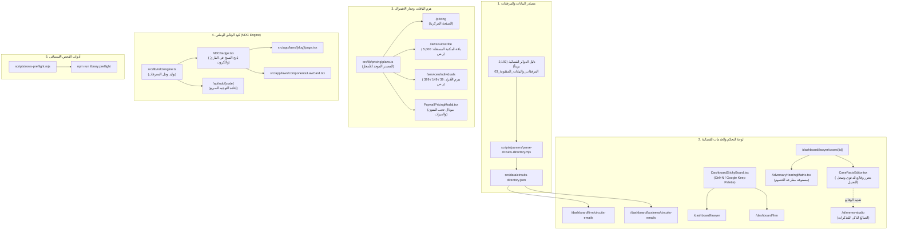

# 🏛️ الخطة المعمارية الشاملة للمهام المستقلة (Master Developer Execution Plan)

> **وثيقة تنفيذية معتمدة:** هذه الخطة تفصل بدقة كل ما يمكننا برمجته واختباره وتوصيله داخل منصة نظامي (`Nezamy.sa`) دون الحاجة لانتظار قرارات أو قبو المالك، مع ربط كافة الأجزاء معاً هندسياً وضمان عدم فقدان أي متطلب أو تكسير أي وظيفة قائمة.

---

## 🗺️ خريطة الترابط المعماري بين الموديولات (System Architecture & Connections)

---

## 📋 مصفوفة المهام التنفيذية المجزأة (Atomic Task Breakdown)

---

### المهمة ١: دمج دليل الدوائر القضائية الكامل (2,192 بريداً رسمياً لوزارة العدل)

**الهدف:** التخلص النهائي من العينة التجريبية المؤقتة (8 دوائر فقط) وتزويد المحامين والشركات بالدليل الرسمي الشامل الصادر عن وزارة العدل (2,192 دائرة قضائية وإدارة عدلية عبر 112 صفحة).

**الملفات المستهدفة:**
- **المصدر:** `C:\Users\LOQ\Downloads\حزمة_تسليم_المبرمج_محدثة_2026-10-09\03_المرفقات_والبيانات_المفقودة\دليل_البريد_الإلكتروني_للجهات_والإدارات_والدوائر_القضائية_وزارة_العدل.md`
- **إنشاء:** `scripts/parsers/parse-circuits-directory.mjs` (محلل الجداول النصية)
- **إنشاء:** `src/data/circuits-directory.json` (قاعدة بيانات محلية مهيكلة للدوائر)
- **تعديل:** `src/app/dashboard/firm/circuits-emails/page.tsx`
- **تعديل:** `src/app/dashboard/business/circuits-emails/page.tsx`
- **إنشاء:** `tests/circuits-directory.test.mjs` (فحص آلي للتأكد من استيعاب الـ 2,192 سجلاً)

#### الخطوات التفصيلية:
- [ ] **الخطوة 1.1: كتابة سكريبت المحلل (`parse-circuits-directory.mjs`)**
  - قراءة ملف الماركداون المصدري واستخراج الجداول عبر الـ 112 صفحة بدقة.
  - استخراج الحقول: `city` (المنطقة/المدينة)، `courtName` (المحكمة/الجهة)، `department` (الدائرة أو القسم)، `email` (البريد الإلكتروني)، `isVerified` (حالة التحقق).
  - معالجة الخلايا الـ 36 ذات العيوب الطباعية الموروثة من الـ PDF ووسمها بـ `needsVerification: true` مع تضمين الصيغة المرجّحة.
- [ ] **الخطوة 1.2: تشغيل السكريبت وتوليد ملف `circuits-directory.json`**
  - التأكد من أن عدد السجلات المستخرجة يطابق بالضبط **2,192 سجلاً**.
- [ ] **الخطوة 1.3: ترقية شاشة العرض في الداشبورد (`circuits-emails/page.tsx`)**
  - ربط الصفحة ببيانات `circuits-directory.json` المستخرجة.
  - توفير فلاتر سريعة بحسب:
    * مناطق المملكة الـ 13 (الرياض، مكة المكرمة، الشرقية، القصيم، عسير، المدينة، تبوك، حائل، الحدود الشمالية، جازان، نجران، الباحة، الجوف).
    * نوع الجهة (محاكم استئناف، محاكم عامة، تجارية، عمالية، أحوال شخصية، تنفيذ، كتابات عدل، إدارات الوزارة).
  - إضافة ميزة النسخ السريع للبريد بنقرة واحدة (Copy to Clipboard) مع إشعار Toast أخضر.
  - تطبيق التصفح بالصفحات (Pagination) أو العرض الافتراضي السريع لتفادي أي بطء في الرندر لـ 2,192 عنصراً.
- [ ] **الخطوة 1.4: كتابة وتشغيل الاختبار المؤتمت**
  - تشغيل `node tests/circuits-directory.test.mjs` للتأكد من خلو البيانات من الأخطاء وسلامة التصفية.

---

### المهمة ٢: تحديث هرم الباقات والأسعار المستقلة (قرارات المالك 165 و 168)

**الهدف:** مواءمة كامل صفحات الموقع والمودالات مع هرم الأسعار المعتمد من المالك والمجلس في 6 أكتوبر.

**الملفات المستهدفة:**
- **إنشاء:** `src/lib/pricing/plans.ts` (المصدر المركزي لبيانات الأسعار والمميزات)
- **تعديل:** `src/app/pricing/page.tsx` (صفحة الأسعار المركزية)
- **تعديل:** `src/app/laws/page.tsx` و `src/app/laws/subscribe/page.tsx` (باقة المكتبة المستقلة)
- **تعديل:** `src/app/services/individuals/page.tsx` (هرم باقات الأفراد)
- **تعديل:** `src/components/pricing/PaywallPricingModal.tsx` (مودال الترقية المنبثق)
- **اختبار:** `src/lib/pricing/plans.test.ts`

#### الخطوات التفصيلية:
- [ ] **الخطوة 2.1: بناء ملف تعريف الباقات المركزي (`src/lib/pricing/plans.ts`)**
  - دمج المواصفات من `pricing_library.patch.ts` و `pricing_individuals.patch.ts`.
  - تعريف باقة **المكتبة القانونية المستقلة**:
    * السنوي: **٥٬٠٠٠ ر.س/سنة** (مع كود خصم إطلاق الدفعة الأولى ١٬٠٠٠ ر.س).
    * الربع سنوي: **١٬٥٠٠ ر.س/٣ أشهر**.
    * إضافة الذكاء الاصطناعي للمكتبة: **٢٬٥٠٠ ر.س/سنة**.
  - تعريف هرم **باقات الأفراد**:
    * باقة المساعد الذكي للأفراد: **٣٩ ر.س/شهر** (٣٩٠ ر.س/سنة).
    * باقة الحماية والاستشارات الوقائية: **١٤٩ ر.س/شهر** (١٬٤٩٠ ر.س/سنة).
    * باقة التأمين القضائي والتمثيل الكامل: **٣٩٩ ر.س/شهر** (٣٬٩٩٠ ر.س/سنة) مع شروط التغطية وسقف ١٠ آلاف ريال.
    * باقة الربع القانوني (مجموعات وعائلات): **٦٩٩ ر.س/شهر**.
  - تعريف باقة **المستشار القانوني المستقل**:
    * السعر: **١٩٩ ر.س/شهر**.
    * حجب أدوات الترافع وإدارة الجلسات التزاماً بالمادة ١٨ محاماة.
- [ ] **الخطوة 2.2: تحديث صفحة الأنظمة والمكتبة (`/laws`)**
  - إبراز كارت اشتراك المكتبة المستقل بوضوح للزوار غير المشتركين.
- [ ] **الخطوة 2.3: تحديث صفحة الأفراد (`/services/individuals`)**
  - عرض الهرم الثلاثي للأفراد مع جدول المقارنة التفصيلي.
- [ ] **الخطوة 2.4: ربط مودال الترقية (`PaywallPricingModal.tsx`)**
  - عرض الباقة المناسبة تلقائياً حسب السياق (إذا حاول الزائر فتح مادة مقفلة يُعرض عليه اشتراك المكتبة؛ وإذا كان فرداً يُعرض عليه باقة الأفراد).
- [ ] **الخطوة 2.5: التحقق من خلو الأنواع من الأخطاء (`npx tsc --noEmit`)**

---

### المهمة ٣: دمج المفكرة الذكية للمحامي بنمط Google Keep (`DashboardStickyBoard`)

**الهدف:** إتاحة لوحة ملاحظات عائمة وسريعة للمحامي لتدوين الأفكار وربطها بالقضايا بنقرة واحدة (قرار المالك 169).

**الملفات المستهدفة:**
- **المصدر:** `02_الباتشات_البرمجية_وهجرات_قاعدة_البيانات/DashboardStickyBoard.patch.tsx`
- **إنشاء:** `src/components/dashboard/DashboardStickyBoard.tsx`
- **تعديل:** `src/app/dashboard/layout.tsx` أو الهيدر العلوي لتوفير اختصار `Ctrl+N` / `⌘N` وزر الملاحظات السريعة.
- **تعديل:** `src/app/dashboard/lawyer/page.tsx` و `src/app/dashboard/firm/page.tsx`

#### الخطوات التفصيلية:
- [ ] **الخطوة 3.1: بناء مكون `DashboardStickyBoard.tsx`**
  - دعم 5 تصنيفات للملاحظات: (ملاحظة حرة، تواصل مع عميل، تحضير جلسة ودفوع، مهمة للفريق، مهلة حرجة).
  - دعم ألوان الباستيل الـ 5 (أصفر، زمردي، أزرق، وردي، بنفسجي).
  - دعم مستويات الخصوصية المعتمدة بالقرار 169:
    * 🔒 خاصة بي فقط (`private`).
    * 👥 فريق القضية (`case_team`).
    * 🏢 كامل المكتب (`firm`).
- [ ] **الخطوة 3.2: محرك الربط التلقائي بالقضايا (Autocomplete Case Linking)**
  - بمجرد كتابة حرفين يبحث في قضايا المحامي لربط الملاحظة بالقضية وعرض بادج القضية في رأس الملاحظة.
- [ ] **الخطوة 3.3: التخزين المحلي المؤقت والجاهزية للمزامنة**
  - حفظ الملاحظات محلياً في `localStorage` لحمايتها من الضياع حتى لو أُغلقت الصفحة أو انقطع الاتصال.
- [ ] **الخطوة 3.4: تجربة اختصارات الكيبورد والاستجابة**
  - فحص فتح وإغلاق اللوحة بـ `Ctrl+N` وتجربة السحب والتثبيت.

---

### المهمة ٤: مصفوفة الخصوم وجلسات المرافعة ومحرر وقائع الدعوى

**الهدف:** تزويد المحامي بأدوات تكتيكية متقدمة لمقارعة دفوع الخصوم وتوثيق الوقائع الزمنية للدعوى وربطها بالصائغ الذكي.

**الملفات المستهدفة:**
- **المصدر:** `02_الباتشات_البرمجية_وهجرات_قاعدة_البيانات/AdversaryHearingMatrix.patch.tsx`
- **المصدر:** `02_الباتشات_البرمجية_وهجرات_قاعدة_البيانات/lawyer_case_facts_editor.patch.tsx`
- **إنشاء:** `src/components/cases/AdversaryHearingMatrix.tsx`
- **إنشاء:** `src/components/cases/CaseFactsEditor.tsx`
- **تعديل:** `src/app/dashboard/lawyer/cases/[id]/page.tsx`

#### الخطوات التفصيلية:
- [ ] **الخطوة 4.1: دمج مكون مصفوفة الخصوم (`AdversaryHearingMatrix`)**
  - تقسيم الجلسات إلى 3 مسارات ملونة:
    * المسار الأخضر: ما قدمه فريقنا (دفوع، أسانيد، مستندات).
    * المسار الذهبي: قرارات وتكليفات الدائرة القضائية للمحاكمة.
    * المسار الأحمر: دفوع ومطالب وردود الخصم.
  - مؤشر ميزان القوة التكتيكي للدعوى (Tactical Score).
- [ ] **الخطوة 4.2: دمج محرر وقائع القضية التفاعلي (`CaseFactsEditor`)**
  - حل مشكلة عجز المحامي عن تعديل الوقائع بعد حفظ القضية.
  - إتاحة تعديل الوقائع الابتدائية + نمط الإلحاق الزمني التراكمي (Chronological Appending) مع وسم تاريخ ووقت واسم كاتب التحديث.
- [ ] **الخطوة 4.3: ربط المحرر بصفحة تفاصيل القضية**
  - إضافة زر `[ وقائع القضية ومستجداتها ]` وزر `[ مصفوفة مقارعة الخصوم ]` داخل لوحة تفاصيل القضية.

---

### المهمة ٥: كود الوثائق الوطني الموحد (NDC Engine & Badge)

**الهدف:** بناء محرك الأكواد الوطنية الموحدة للوثائق (Nezamy Document Code) لضمان ثبات المراجع وروابط الاقتباس القضائي.

**الملفات المستهدفة:**
- **المصدر:** `02_الباتشات_البرمجية_وهجرات_قاعدة_البيانات/ndc_engine.patch.ts`
- **المصدر:** `02_الباتشات_البرمجية_وهجرات_قاعدة_البيانات/ndc_resolver_route.patch.ts`
- **المصدر:** `02_الباتشات_البرمجية_وهجرات_قاعدة_البيانات/NDCBadge.patch.tsx`
- **إنشاء:** `src/lib/ndc/engine.ts`
- **إنشاء:** `src/components/ui/NDCBadge.tsx`
- **إنشاء:** `src/app/api/ndc/[code]/route.ts`

#### الخطوات التفصيلية:
- [ ] **الخطوة 5.1: بناء محرك `src/lib/ndc/engine.ts`**
  - دعم الصيغة النظامية القياسية: `NZ-[SEC]-[YEAR]-[SEQ]`.
  - ربط أقسام الأنظمة الـ 13 بالكود الثنائي (CR للشركات، LB للعمل، CV للمدني، IP للملكية، PR للمبادئ، RD للأوامر الملكية).
- [ ] **الخطوة 5.2: بناء مسار التحويل السريع `/api/ndc/[code]`**
  - حل الكود وإعادة التوجيه (Redirect 307/301) للمسار الفعلي للوثيقة في المنصة.
- [ ] **الخطوة 5.3: بناء بادج `NDCBadge.tsx`**
  - بادج أنيق مع زر نسخ ومشاركة الكود الثابت يظهر في بطاقات القوانين وقارئ المواد.

---

### المهمة ٦: خط الفحص الآلي المستقل للمكتبة (`library:preflight`)

**الهدف:** دمج أداة التحقق الصارمة `rows-preflight.mjs` داخل مجلد السكريبتات بالمشروع وربطها كأمر رسمي في `package.json`.

**الملفات المستهدفة:**
- **نسخ:** `06_تحديث_المكتبة_والقبول_2026-10-09/03_الاختبارات/rows-preflight.mjs` إلى `scripts/rows-preflight.mjs`
- **نسخ:** `06_تحديث_المكتبة_والقبول_2026-10-09/03_الاختبارات/rows-preflight.test.mjs` إلى `scripts/rows-preflight.test.mjs`
- **تعديل:** `package.json` بإضافة سكريبت `"library:preflight": "node scripts/rows-preflight.mjs"`

#### الخطوات التفصيلية:
- [ ] **الخطوة 6.1: نقل وربط أداة الفحص المستقلة**
- [ ] **الخطوة 6.2: تشغيل الاختبارات الآلية للأداة (`node --test scripts/rows-preflight.test.mjs`)**
  - التأكد من اجتياز الـ 24 فحصاً بنسبة 100%.

---

## 🔒 معايير الجودة والأمان قبل أي اعتماد أو دمج (Quality & Safety Gates)

1. **سلامة الأنواع التامة:** تشغيل `npx tsc --noEmit` والتأكد من خلو المشروع تماماً من أي أخطاء (0 Errors).
2. **اجتياز الاختبارات السابقة:** تشغيل اختبارات الوحدة للتأكد من عدم كسر أي من الـ 2,068 فحصاً السابق اجتيازها.
3. **سلامة المسارات (Zero Regressions):** تجربة التنقل بين شاشات الداشبورد والصفحات المتأثرة للتأكد من استقرار الواجهة.
4. **حماية السيرفر الحي:** لا يتم المساس بأي جدول في قاعدة البيانات الحية، ولا تشغيل أي ترحيلات SQL مدمرة.

---

## 🛑 نقطة التوقف للمراجعة (Awaiting Developer Review)

**هذه الخطة جاهزة بالكامل ومفصلة بخطوات ذرية ومترابطة.**  
يرجى مراجعتها وتحديد ما إذا كنت توافق على بدء التنفيذ، أو إذا كنت ترغب في تعديل أو استبعاد أي مهمة قبل أن نبدأ بكتابة الكود.
