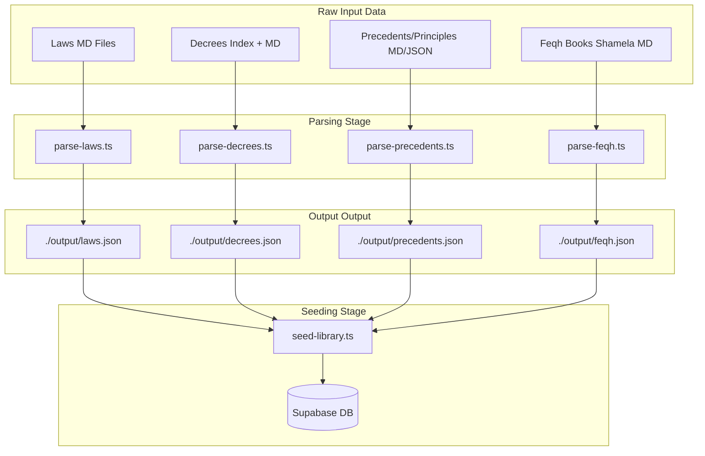

# 📚 Legal Library (المكتبة القانونية) — Seeding & Execution Flow Guide

This document provides a comprehensive blueprint and step-by-step instructions for parsing, seeding, and verifying the Saudi Legal Library data, as well as an overview of its architectural execution flow.

---

## 🛠️ 1. Environment & Setup

Before running the parsing or seeding commands, ensure your environment variables are configured correctly.

1. Open (or create) the `.env.local` file in your repository root:
   ```env
   # Supabase Credentials (Used by verify-library.ts and the website frontend)
   NEXT_PUBLIC_SUPABASE_URL="https://your-supabase-project.supabase.co"
   NEXT_PUBLIC_SUPABASE_ANON_KEY="your-anon-key-here"

   # Supabase Service Role Key (CRITICAL for seeding; bypasses Row Level Security)
   SUPABASE_SERVICE_ROLE_KEY="your-service-role-key-here"

   # AI / Webhook integrations (n8n workflow targets)
   N8N_EXPLAIN_ARTICLE_WEBHOOK_URL="https://n8n.yourdomain.com/webhook/..."
   N8N_LIBRARY_CHAT_WEBHOOK_URL="https://n8n.yourdomain.com/webhook/..."

   # Server host url for verification checks
   BASE_URL="http://localhost:3000"
   ```

2. Make sure you have the database schema deployed to Supabase first:
   ```bash
   npx supabase db push
   ```
   *This pushes the `20260626_legal_library_schema.sql` migration, creating the `library` schema, tables, triggers, indexes, and custom Arabic full-text search configurations.*

---

## 🔄 2. The Seeding Pipeline

The data pipeline takes raw Markdown files (from BOE or Qadha formats) or raw JSON collections, parses them into unified JSON structures, and then seeds them into the database in a foreign-key-safe order.



### Step 1: Run the Data Parsers

Execute the four specialized parsers using `npx tsx` to parse source directories and write structured JSON output files into the `./output` folder:

```bash
# Create target directory
mkdir output

# 1. Parse Laws & Regulations (الانظمة واللوائح)
npx tsx scripts/parsers/parse-laws.ts --input "D:\DEV\projects\nzamy\01_المكتبة_القانونية" --output "./output"

# 2. Parse Decrees & Royal Orders (التعاميم والمراسم)
npx tsx scripts/parsers/parse-decrees.ts --input "D:\DEV\projects\SITE MAPS NZAMY (1)\SITE MAPS NZAMY\المراسم جاهزه\المراسم" --output "./output"

# 3. Parse Judicial Precedents & Principles (مبادئ وسوابق قضائية)
npx tsx scripts/parsers/parse-precedents.ts --input "D:\DEV\projects\nzamy\01_المكتبة_القانونية\السوابق القضائية والتعاميم" --output "./output"

# 4. Parse Feqh Books (فقه وشريعة)
npx tsx scripts/parsers/parse-feqh.ts --input "D:\DEV\projects\nzamy\01_المكتبة_القانونية" --output "./output"
```

### Step 2: Validate Data via Dry-Run Seeding

To verify that the parsing output files are formatted correctly and that credentials work without modifying database records, run the universal seeder in dry-run mode:

```bash
npx tsx scripts/seed-library.ts --dir "./output" --dry-run
```

### Step 3: Run Live Seeding

Upload the parsed data to the Supabase database:

```bash
npx tsx scripts/seed-library.ts --dir "./output"
```

#### Seeder Command Arguments:
* `--dir <path>`: Directory containing parsed `.json` files.
* `--dry-run`: Validates environment settings, reads files, and prints statistics without inserting records.
* `--type <laws|decrees|precedents|feqh>`: Restricts the execution to a specific content type.
* `--clean`: Truncates/wipes existing database rows for the specified content type before seeding. *(Use with caution!)*

---

## 🏛️ 3. Database Schema Flow

All tables reside in the dedicated `library` schema. They follow a strict parent-child hierarchy to map complex legal structures:

```
                  ┌────────────────────────┐
                  │       library.laws     │
                  └───────────┬────────────┘
                              │ 1:N
                  ┌───────────▼────────────┐
                  │    library.chapters    │
                  └───────────┬────────────┘
                              │ 1:N
                  ┌───────────▼────────────┐
                  │    library.articles    │
                  └─────┬────────────┬─────┘
                    1:N │            │ 1:N
     ┌──────────────────▼──┐      ┌──▼──────────────────┐
     │ library.amendments  │      │ library.regulations │
     └─────────────────────┘      └─────────────────────┘
```

### Core Table Hierarchy:

1. **Laws (الأنظمة واللوائح):**
   * `library.laws` — Global properties of the law (e.g. slug, title, issuance date, decree reference).
   * `library.chapters` — Chapter headings and numbers.
   * `library.articles` — Raw text of each article, its number, status (active, amended, repealed), and paywall gating flag (`free: boolean`).
   * `library.article_amendments` — Historic amendments to a specific article.
   * `library.article_regulations` — Merged executive regulations associated with a specific article.

2. **Decrees & Circulars (التعاميم والمراسم):**
   * `library.decrees_circulars` — Title, reference, issue date, summary, and official source URL.
   * `library.decree_pages` — Extracted pages/sections or individual articles of the decree.

3. **Judicial Precedents & Principles (المبادئ والسوابق):**
   * `library.judicial_collections` — Large volumes or year-groups of precedents.
   * `library.principles` — Structured principles with classification keywords, session details, and ruling outcomes.
   * `library.principle_paragraphs` — Nested sub-principles/paragraphs representing itemized statements.

4. **Islamic Jurisprudence (الفقه):**
   * `library.feqh_books` — Book metadata, author, school of thought (e.g., Hanbali, Hanafi).
   * `library.feqh_chapters` — Top-level books (e.g., كتاب الطهارة).
   * `library.feqh_sections` — Nested sub-chapters/sections (e.g., باب الوضوء).
   * `library.feqh_blocks` — Structured pages/blocks with parsed Quranic verses `﴿…﴾` and Hadith references `«…»`.

---

## 🔍 4. Execution & Search Flow

The website uses a hybrid search and page-rendering flow to guarantee high performance, offline tolerance, and perfect Arabic search normalization.

```
       USER INTERACTION
              │
              ├──► 1. Autocomplete Search Request (Debounced)
              │         │
              │         └──► GET /api/library/autocomplete?q=...
              │                  │
              │                  ├───► DB Available? ──► Queries library.unified_search_view (FTS normalized)
              │                  │
              │                  └───► Offline Fallback ──► Matches local static JSON index
              │
              └──► 2. Advanced / Global Search Submission
                        │
                        └──► POST /api/library/search (Payload: query, section filters)
                                 │
                                 ├───► normalizes Arabic letters (أ، إ، آ -> ا)
                                 ├───► applies weights (Title: A, Body: B)
                                 └───► returns paginated search hits
```

### 1. Arabic Text Normalization (`src/utils/normalizeArabic.ts`)
To prevent misses due to Arabic character variations, search queries and database indices undergo normalization:
* Diacritics (تشكيل) are stripped.
* Alef characters (`أ`, `إ`, `آ`) normalize to standard Alef (`ا`).
* Yah (`ي`) and Yah/Alef-Maqsurah (`ى`) are unified.
* Ta Marbouta (`ة`) normalizes to Hah (`ه`).
* Hindi numerals (`١٢٣`) convert to standard numerals (`123`).

### 2. Search Autocomplete Router (`src/app/api/library/autocomplete`)
As the user types into the keyword bar, the UI triggers a debounced request. 
* **If Supabase is online:** Queries a unified search view `library.unified_search_view` which utilizes a customized database text search configuration (`library.arabic`).
* **Fallback:** Matches query substrings against static local mock files to ensure the client search doesn't crash during network outages.

### 3. Dynamic Page Routers (`src/app/api/library/...`)
Individual legal documents and precedents load dynamically through API-first page components:
* **Feqh book page** (`src/app/book/[slug]/page.tsx`) ➡️ Fetches from `/api/library/books/[slug]`.
* **Precedent page** (`src/app/precedents/[slug]/page.tsx`) ➡️ Fetches from `/api/library/precedents/[slug]`.
* *If the endpoint returns an empty set, pages automatically resolve to their local mock JSON imports.*

---

## 🤖 5. AI Features & Webhook Integration

The Legal Library integrates explaining and research workflows powered by **n8n** nodes:

### Explain Article (`/api/ai/explain-article`)
* **Trigger:** Click on "اشرح المادة" (Explain Article) in any law detail view.
* **Payload sent to n8n:**
  ```json
  {
    "law_title": "نظام الشركات",
    "article_number": 12,
    "article_text": "نص المادة القانونية هنا...",
    "regulations": ["نص اللائحة التنفيذية إن وجد..."]
  }
  ```
* **n8n Behavior:**
  1. Receives the webhook trigger.
  2. Embeds the article text into a legal AI prompt template.
  3. Queries the LLM for explanations, historical context, and real-world applications.
  4. Returns the response structured in Markdown format to the client page.

### Legal Library Chat (`/api/ai/library-chat`)
* **Trigger:** Interacting with the AI chat sidebar.
* **Payload sent to n8n:**
  ```json
  {
    "message": "ما هي عقوبة عدم سداد رأس مال الشركة؟",
    "history": [ ... ],
    "context": { "current_law_id": "companies-law" }
  }
  ```
* **n8n Behavior:** Runs a retrieval-augmented generation (RAG) agent, searching the vector database of Saudi laws, and stream-responds back to the website chat widget.

---

## 🧪 6. Testing & Verification

Ensure everything is configured and functioning correctly using the integrated testing tool.

Run the verification suite:
```bash
npx tsx scripts/verify-library.ts
```

### Checked Indicators:
1. **Schema Check:** Verifies that the `library` schema is present in Supabase.
2. **Table Check:** Counts rows in `laws`, `decrees_circulars`, `judicial_collections`, and `feqh_books`.
3. **Endpoint Check:** Fires HTTP requests to the autocomplete, laws, and precedents search routes to verify 200 OK statuses.
4. **FTS Normalization Check:** Sends Arabic test strings with diacritics to verify that the normalized search matches without error.
