# 🧪 تقرير الفحص الشامل لمنصة نظامي (nezamy.sa)
## الموجه إلى: د. محمد جمال

مرحباً بك دكتور محمد في هذا المجلد المنظم لتوثيق ومتابعة عمليات الفحص الشاملة لمنصة **نظامي**. تم إعداد هذا الملف وهيكلته ليكون دليلاً مرئياً سهلاً للقراءة البشرية، وقابلاً للتحليل المباشر بواسطة نماذج الذكاء الاصطناعي (LLMs) عند إرفاق المجلد بالكامل لها.

---

## 📌 فلسفة وهيكلية هذا المجلد
* **المنهجية:** تم تقسيم الفحص إلى اختبارات فردية للعميل، واختبارات فردية للمحامي، واختبارات مشتركة بينهما (End-to-End)، واختبارات الذكاء الاصطناعي/الواتساب.
* **التنظيم البصري:** يحتوي هذا المجلد على مجلد فرعي باسم `screenshots/`. يرجى وضع لقطات الشاشة فيه بالاسم المحدد لكل خطوة، لتظهر وتترابط تلقائياً داخل هذا المستند.
* **سهولة التحليل بالذكاء الاصطناعي:** تم تنسيق الجداول والرموز وصيغ المسارات البرمجية بعناية لتمكين الذكاء الاصطناعي من فهم المشاكل وحصرها بدقة برمجية بمجرد قراءته للمجلد.

---

## 📊 لوحة معلومات الفحص الإجمالية (Dashboard)

* **الموقع المستهدف:** [nezamy.sa](https://nezamy.sa)
* **بيئة الاختبار:** موقع الإنتاج المباشر (Production)
* **تاريخ البدء:** 28 يونيو 2026

| القسم | إجمالي الحالات | 🟢 ناجح | 🔴 معيب/فشل | 🟡 قيد التجربة | ⚪ لم يفحص | نسبة الإنجاز |
| :--- | :---: | :---: | :---: | :---: | :---: | :---: |
| **1. لوحة العميل (Client)** | 9 | 2 | 1 | 6 | 0 | `100%` |
| **2. لوحة المحامي (Lawyer)** | 7 | 1 | 0 | 6 | 0 | `100%` |
| **3. التدفق المشترك (E2E)** | 2 | 0 | 0 | 1 | 1 | `50%` |
| **4. الواتساب والذكاء الاصطناعي** | 3 | 0 | 0 | 2 | 1 | `67%` |
| **5. المكتبة القانونية والذكاء الاصطناعي** | 31 | 0 | 0 | 0 | 31 | `0%` |
| **الإجمالي العام** | **52** | **3** | **1** | **15** | **33** | **36%** |

---

## 👥 أولاً: اختبارات طالب الخدمة (العميل) منفصلاً — Client-Only Tests

### 1. تسجيل حساب عميل جديد
* **رابط الفحص:** [nezamy.sa/register/client](https://nezamy.sa/register/client)
* **المطلوب:** إنشاء حساب عميل فرد والتأكد من التحويل المباشر للوحة دون شاشات استكمال عائقة.
* **الحالة الحالية:** `🟢 ناجح`
* **الملاحظات:** تم التسجيل بنجاح والتحويل المباشر للوحة العميل دون عوائق.
* **اللقطة البصرية:** *(لا توجد ملاحظات أو لقطة شاشة)*

---

### 2. لوحة التحكم الرئيسية للعميل
* **رابط الفحص:** [nezamy.sa/dashboard/client](https://nezamy.sa/dashboard/client)
* **المطلوب:** تصفح اللوحة، التحقق من ظهور السواقط (Skeletons) أثناء التحميل، وخلو الصفحة من البيانات الوهمية القديمة.
* **الحالة الحالية:** `🟡 ملاحظات فحص`
* **الملاحظات:**
  1. **مشكلة الفتح في لسان جديد (Open in new tab):** عند محاولة فتح رابط الاستشارات (`/ai/consult`) في علامة تبويب جديدة كليك يمين، يحدث إعادة توجيه (Redirect) تلقائياً إلى صفحة تسجيل الدخول أو الصفحة الرئيسية على الرغم من كون المستخدم مسجل الدخول بالفعل وتعمل الصفحة عند الضغط المباشر عليها.
  2. **تجربة المستخدم للتحويل لصفحة حجز الاستشارة:** عند الضغط على "احجز استشارة" في البنر العلوي الأخضر، يفضل توجيه المستخدم لصفحة اختيار نوع الاستشارة مباشرة بدلاً من إجباره على اختيار "استشارة" مرة أخرى كخطوة وسيطة مكررة.
  3. **صندوق 'لديك سؤال قانوني؟' (عدم انتقال نص السؤال):** عند كتابة سؤال في حقل الإدخال باللوحة الرئيسية والضغط على زر 'اسأل'، يتم تحويل المستخدم لصفحة المحادثة مع الذكاء الاصطناعي، ولكن لا ينتقل نص السؤال الذي كتبه في حقل الإدخال، مما يضطره لإعادة كتابة السؤال مرة أخرى داخل الشات.
  4. **هوية العلامة التجارية (اللوجو):** يظهر اللوجو في أعلى شريط التنقل بلوحة العميل كحرف نون (ن) تجريبي داخل دائرة خضراء بدلاً من شعار منصة 'نظامي' الرسمي والكامل.
  5. **ظهور المكتبة القانونية في القائمة الجانبية للعميل (خطأ صلاحيات الأدوار):** يظهر خيار 'المكتبة القانونية' في القائمة الجانبية (Sidebar) لحساب العميل، على الرغم من أن المكتبة مخصصة فقط للمحامين ومقدمي الخدمات القانونية (Pro/Providers)، مما يشكل خللاً في عزل مميزات الأدوار (Role-Gating).
  6. **شريط الإعدادات الجانبي وتداخل القوائم (Sidebar duplication in Settings):** عند فتح صفحة الإعدادات `/settings` يظهر شريط تنقل الإعدادات على اليمين، ولكن القائمة الجانبية للوحة التحكم الرئيسية لا يتم إخفاؤها بالكامل، مما يسبب تداخلاً وازدواجية بصرية غير متناسقة.
  7. **أداة محاكاة تبديل الأدوار في البيئة المباشرة (Dev Switcher Security Risk):** تظهر أداة "منطقة ديمو التطوير للاختبار" في أسفل صفحة الإعدادات وتتيح التنقل الفوري بين الحسابات والأدوار. هذه الأداة مفيدة للفحص حالياً ولكن **يجب التنبيه بشدة على حظر إزالتها كلياً من السيرفر المباشر (Production build)** لخطورتها الأمنية القصوى.
* **اللقطة البصرية:**
  * بنر لوحة التحكم وحجز الاستشارة:
    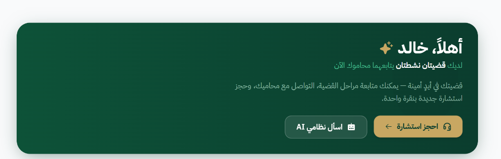
  * خيارات الاستشارات المتاحة:
    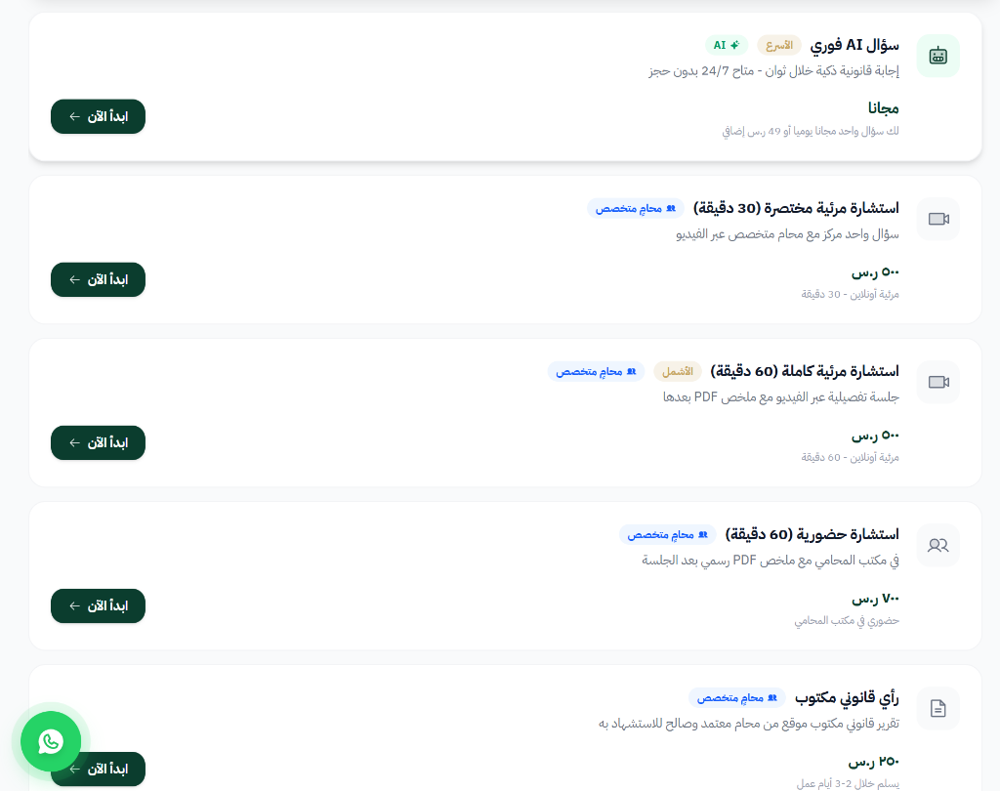
  * مشكلة الفتح في لسان جديد:
    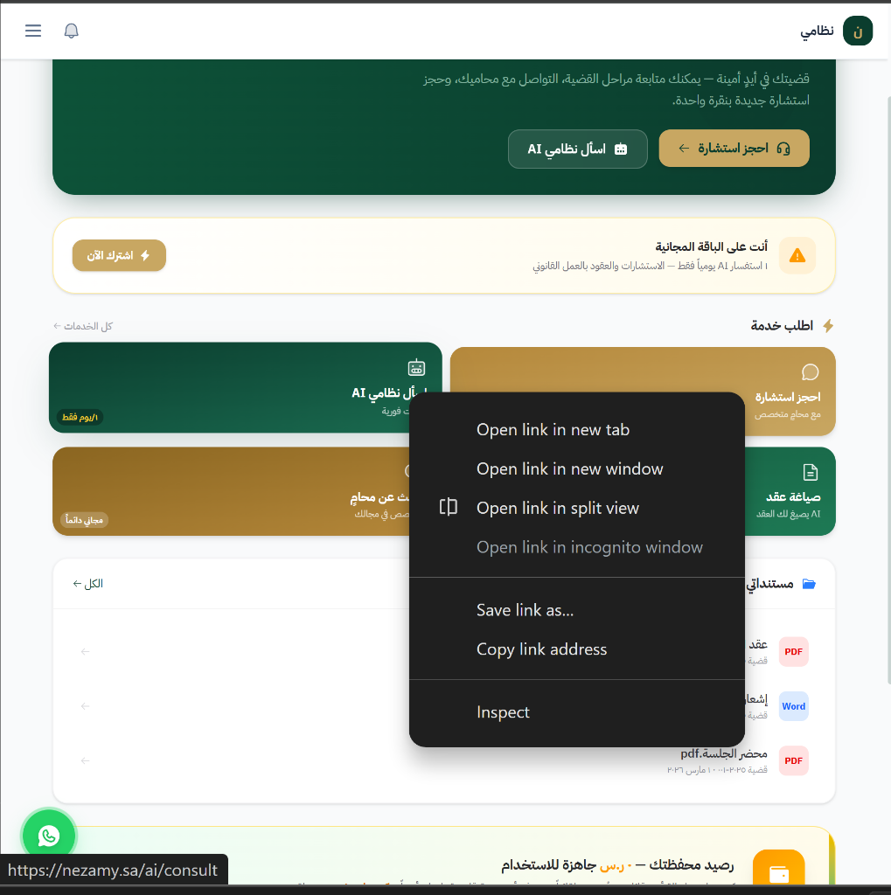
  * بطاقات حجز الخدمات:
    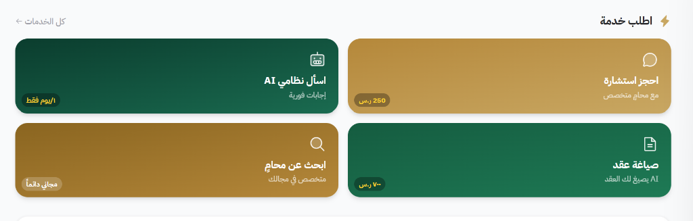
  * حقل إدخال السؤال والذكاء الاصطناعي:
    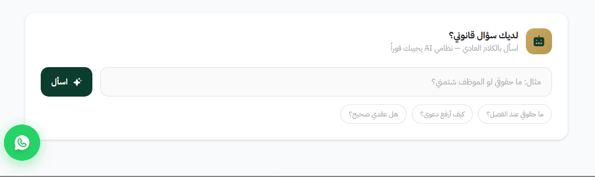
  * شعار اللوحة العلوي (حرف نون):
    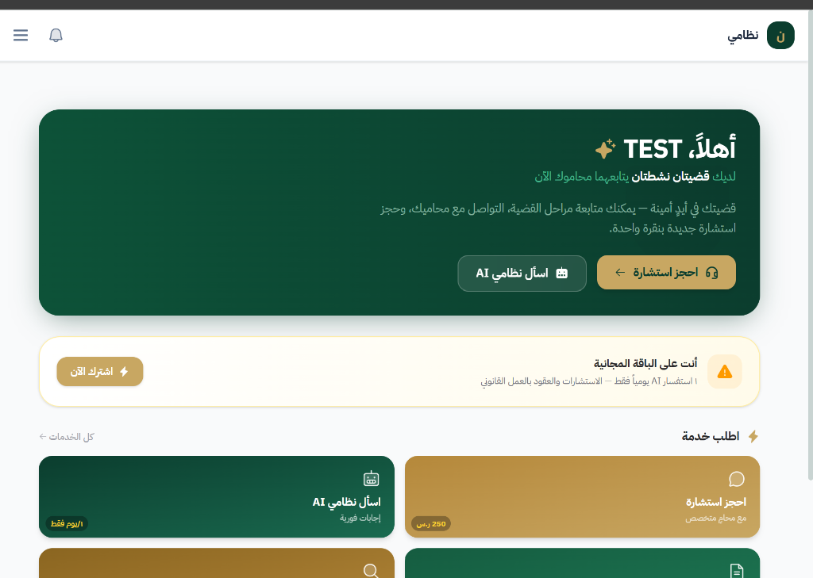
  * ظهور المكتبة القانونية في قائمة العميل:
    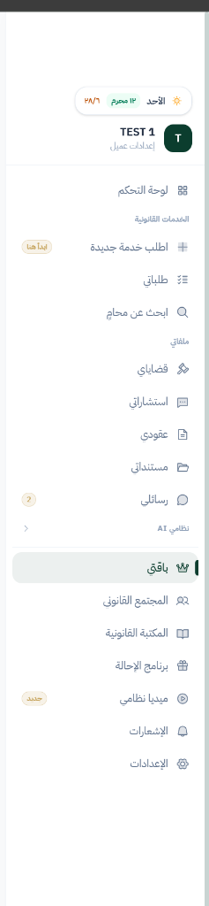
  * تداخل شريط الإعدادات وأداة محاكي الأدوار:
    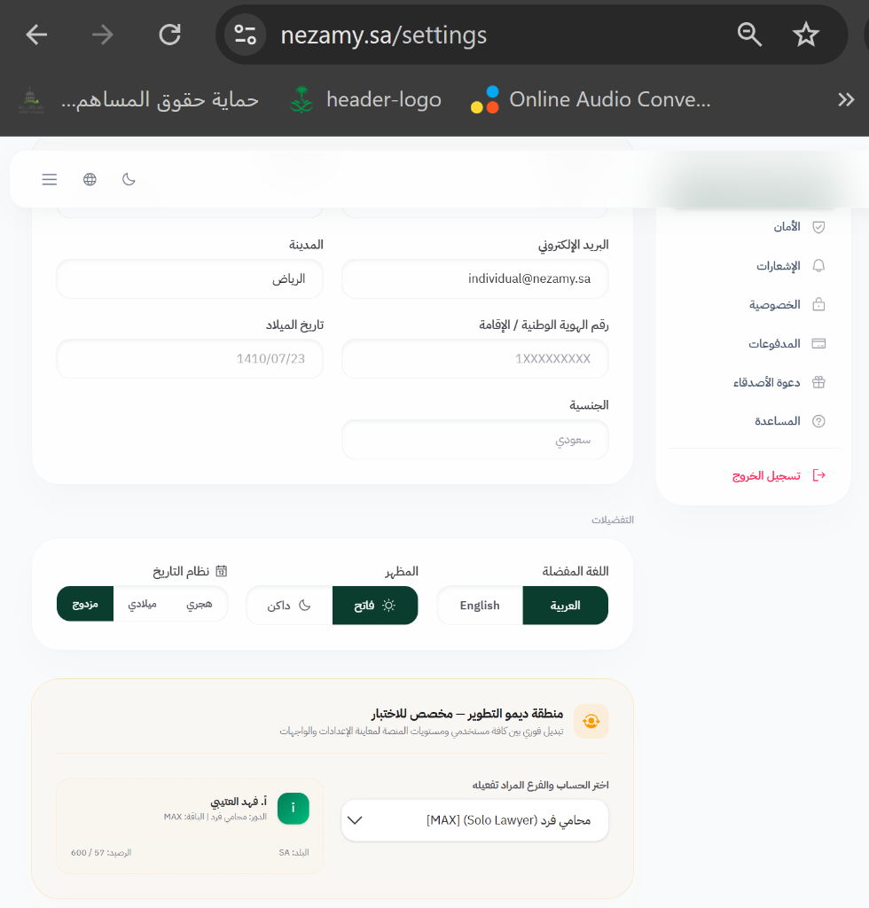
  * أداة محاكي الأدوار منفصلة:
    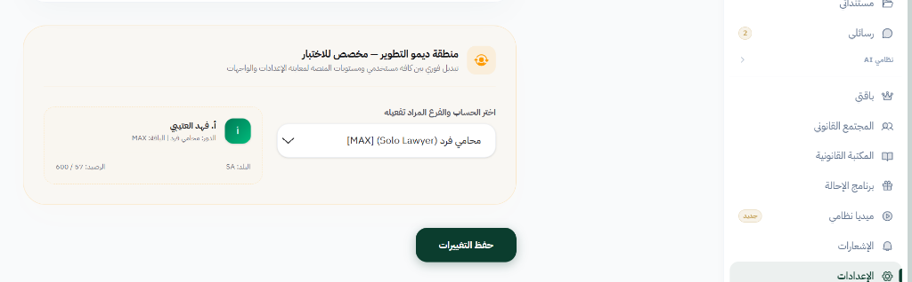

---

### 3. إنشاء طلب خدمة جديد (ويشمل تدفق صياغة العقود والخطابات وتقييم القضية)
* **المسار:** قائمة الطلبات ➡️ **طلب جديد** (أو بطاقات صياغة عقد/خطاب)
* **المطلوب:** إنشاء طلب صياغة عقد أو استشارة والتحقق من إدراجه في القائمة بحالة `قيد الانتظار` أو `pending_assignment`.
* **الحالة الحالية:** `🟡 ملاحظات فحص`
* **الملاحظات:**
  1. **مأزق المستخدم بعد صياغة العقد (UX Dead-end):** بعد الوصول لخطوة تأكيد إعداد مسودة العقد (الخطوة الرابعة)، لا يوجد أي زر أو خيار للعودة للوحة التحكم الرئيسية للعميل أو قائمة طلباتي، مما يعلق المستخدم في هذه الصفحة.
  2. **عدم اختصار مسار صياغة/مراجعة العقود:** عند اختيار 'صياغة عقد' من قائمة الخدمات، يفضل توجيه العميل مباشرة لواجهة الإنشاء بدلاً من إجباره على التنقل بين خيارات 'صياغة مخصصة' و 'مراجعة العقد' في صفحات منفصلة.
  3. **نقص في مدخلات مراجعة العقد (فجوة منطق العمل):** عند اختيار مراجعة عقد، لا يطلب النظام من المستخدم تحديد 'لصالح أي طرف' يتم مراجعة العقد (مثال: هل هو المؤجر أم المستأجر؟ البائع أم المشتري؟)، وهو خيار بالغ الأهمية لتحديد البنود الواجب حمايتها قانونياً.
  4. **محدودية خيارات الموجه إليه الخطاب (الخطابات الرسمية):** في الخطوة الثانية من صياغة خطاب رسمي، يقتصر اختيار "الطرف الآخر" على ستة خيارات ثابتة ومحدودة فقط (مالك عقار، بنك، إلخ) دون توفير خيار "أخرى" (Other) لكتابة خطاب لجهة مغايرة، ويوصى بأن تكون هذه الخيارات ديناميكية ومرنة حسب نوع الخطاب المختار.
  5. **فقدان تحديد صفة المُرسل (صفتي في الخطاب):** لا يطلب المعالج تحديد "صفة المستخدم" بالنسبة للمرسل إليه (مثال: إذا كان الموجه له الخطاب هو "صاحب العمل"، فيجب تحديد صفة المستخدم كـ "موظف") لضبط صياغة الضمائر في الخطاب آلياً بشكل قانوني سليم.
  6. **شاشة نجاح صياغة الخطاب ورابط العودة:** يرجى توفير مسار تنقل واضح يعيد المستخدم للوحة تحكم العميل أو إلى "صائغ الخطابات" الرئيسي عند الانتهاء.
  7. **تداخل مفهوم "التقييم الأولي" مع "تحليل العقد":** تتشابه فلسفة خدمة "التقييم الأولي بالذكاء الاصطناعي" بصرياً ولفظياً مع "تحليل كشف مخاطر العقد". يفضل تمييزهما في واجهة المستخدم (UX) ليتضح أن التقييم الأولي مخصص لوصف الأحداث والوقائع القانونية لتقدير نسب النجاح في الدعوى، بينما كشف المخاطر مخصص للمستندات والوثائق التعاقدية.
* **اللقطة البصرية:**
  * شاشة نجاح صياغة العقد ومأزق العودة (Dead-end):
    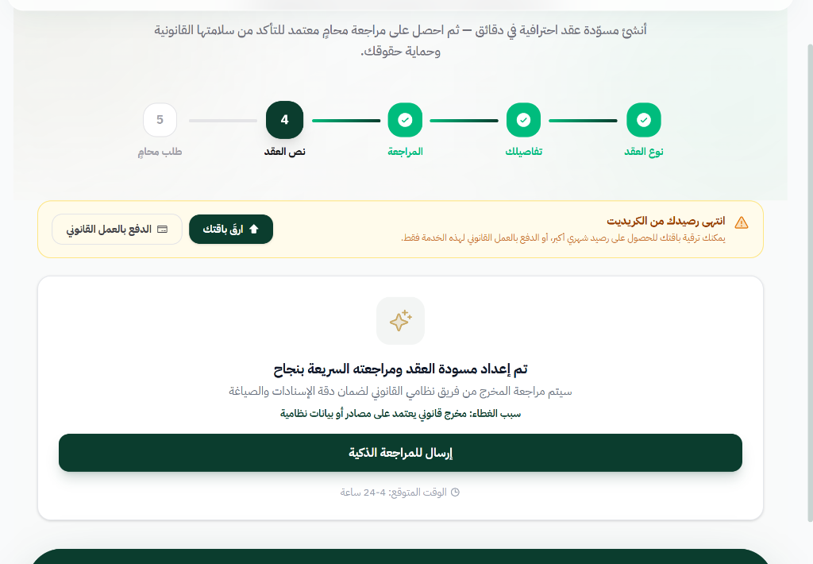
  * خيارات صياغة ومراجعة العقد بالـ AI:
    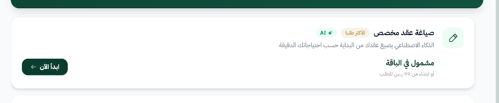
    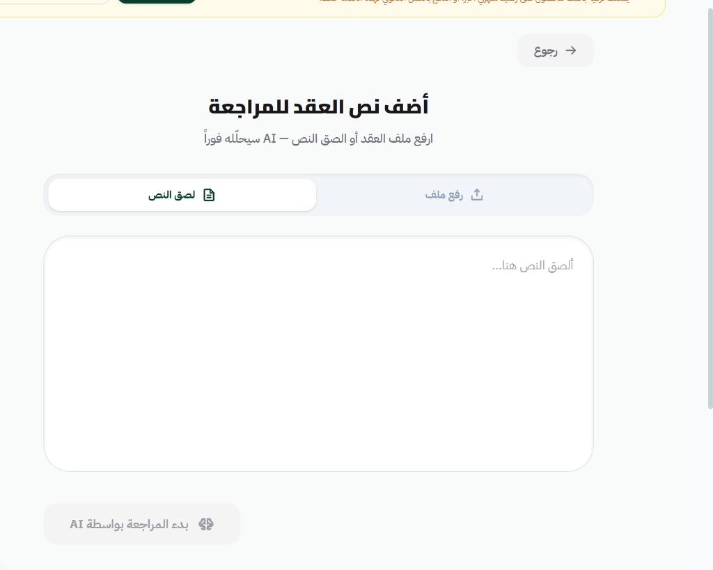
  * نموذج اختيار التخصص القانوني بدون تحديد مصلحة الطرف:
    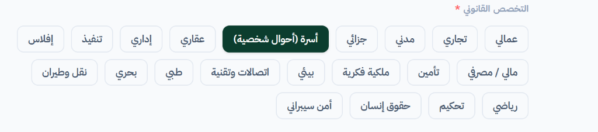
  * محدودية خيارات الموجه إليه الخطاب وغياب صفة المرسل:
    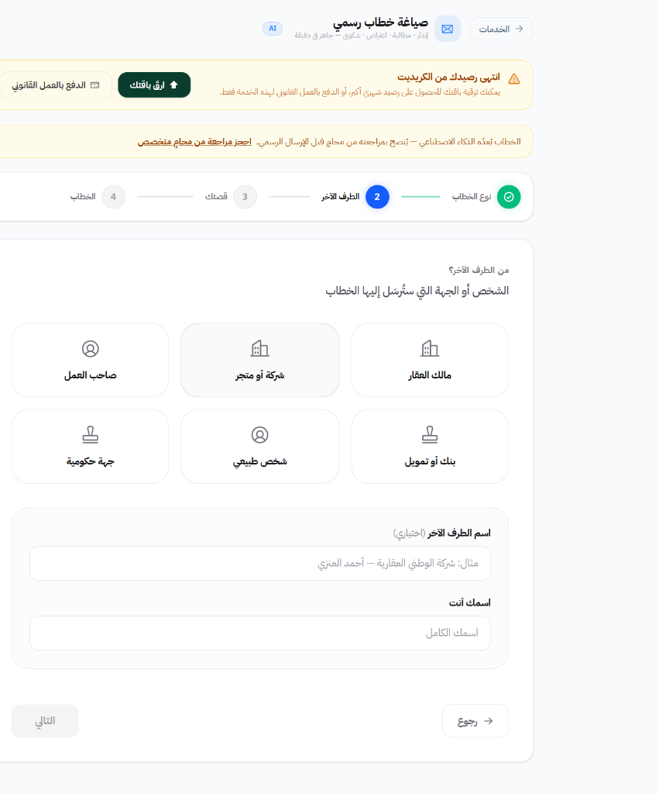
  * شاشة نجاح صياغة الخطاب:
    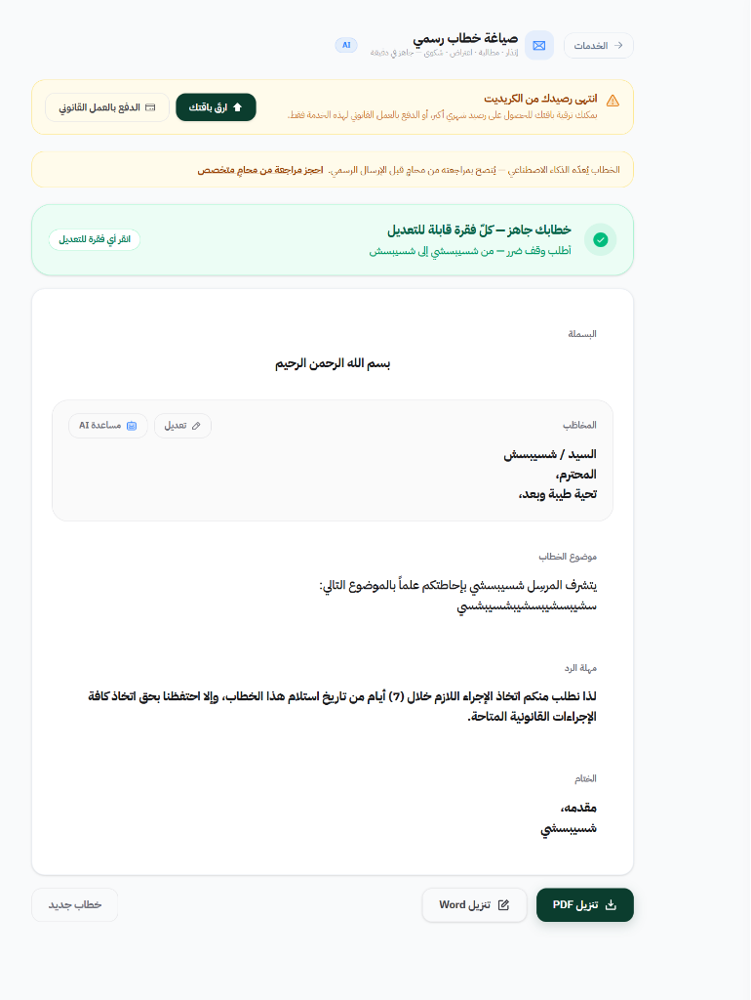
  * خدمة التقييم الأولي بالذكاء الاصطناعي داخل لوحة دراسة القضية:
    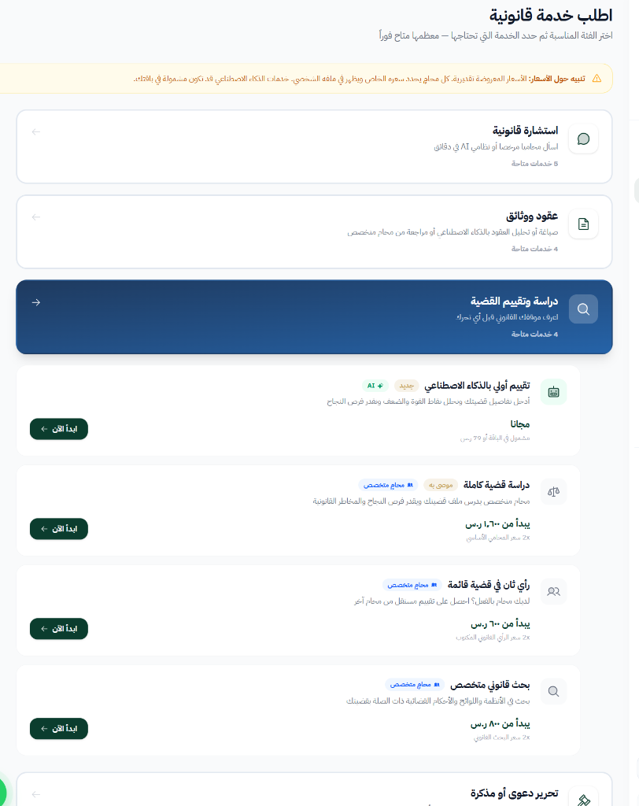
    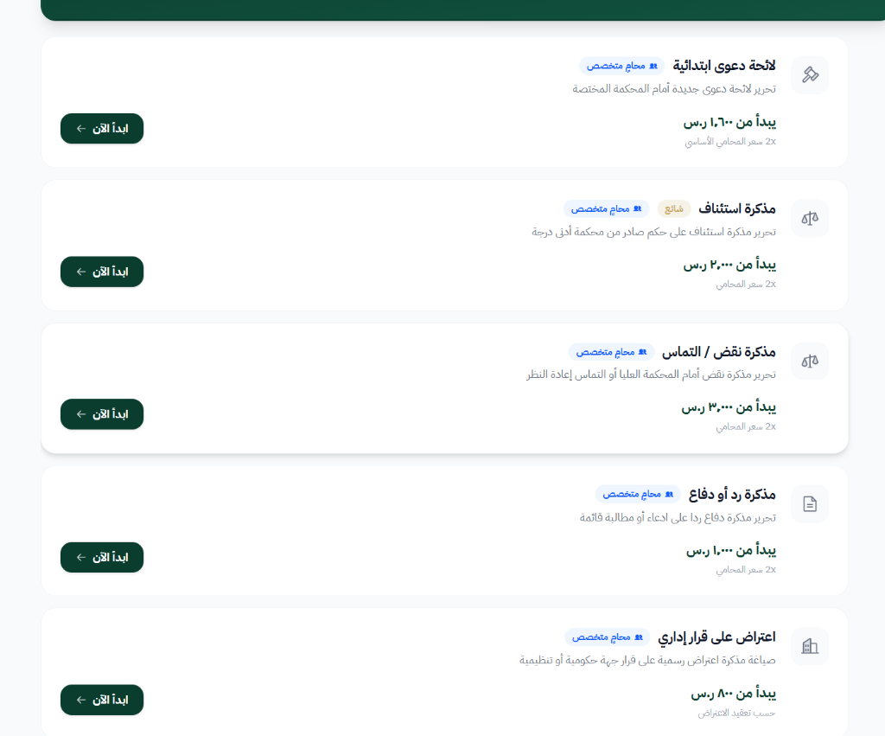

---

### 4. حجز استشارة قانونية منفصلة
* **المسار:** القائمة الجانبية ➡️ **الاستشارات** ➡️ **حجز استشارة جديدة**
* **المطلوب:** حجز موعد محدد والتأكد من ظهوره في جدول الاستشارات بحالة "قيد الانتظار".
* **الحالة الحالية:** `🟡 ملاحظات فحص`
* **الملاحظات:**
  - **خطوات حجز الاستشارة:** بدلاً من إجبار المستخدم على اختيار "استشارة قانونية" ثم "نوع الاستشارة" في خطوات متتالية ومكررة، يفضل تحويله فوراً لصفحة اختيار نوع الاستشارة مباشرة (استشارة AI، ### 3. لوحة التحكم الرئيسية للمحامي
* **رابط الفحص:** [nezamy.sa/dashboard/lawyer](https://nezamy.sa/dashboard/lawyer)
* **المطلب:** التحقق من ظهور الإحصائيات وخلوها من البيانات التجريبية العشوائية غير المرتبطة بقاعدة البيانات.
* **الحالة الحالية:** `🟡 ملاحظات فحص`
* **الملاحظات:**
  1. **غياب ميزة الإضافة السريعة من التقويم:** لا تتيح نافذة تقويم اليوم إمكانية إضافة ميعاد أو جلسة أو مهمة بشكل سريع عند الضغط على تاريخ محدد، وتقتصر فقط على العرض (عرض ثابت). يُوصى بتوفير خيار "إضافة سريعة" للحدث من داخل التقويم وإمكانية ربطه لاحقاً بقضية أو عميل أو مهمة.
  2. **مقترح حاسبة مواعيد الطعن والسقوط (فكرة ميزة ممتازة):** يُقترح إضافة ميزة حاسبة مواعيد الطعن (معرفة ميعاد السقوط) بداخل نافذة محول التاريخ، بحيث يقوم المحامي بإدخال تاريخ الحكم ونوع القضية والطعن (استئناف، نقض، لجان، التماس... إلخ) ومستوى الاستعجال، ليقوم النظام باحتساب ميعاد السقوط التلقائي بالهجري والميلادي مع خيار إضافته كتنبيه في التقويم.
  3. **أزرار تالفة بالهيدر وبنر الترقية:** 
     - زر **"نشر في السوق"** في شريط الهيدر العلوي لا يعمل (كليك ميت / Dead link).
     - زر **"ترقية الباقة"** بالبنر الإرشادي الأصفر لا يوجه المستخدم لصفحة ترقية الباقة أو واجهة الدفع.
  4. **خلل منطق إسناد القضايا لفرق العمل (باقة المحامي الفرد):** عند الضغط على "إضافة قضية جديدة"، يظهر حقل منسدل يطلب إسناد القضية لـ "فريق العمل"، على الرغم من أن حساب المحامي قد يكون باقة "محامي فرد" (Solo) ولا يوجد لديه فريق عمل أصلاً. يُفترض إخفاء هذا الحقل وتعيينه تلقائياً للمحامي نفسه إذا كانت باقته فردية.
  5. **خطأ التوجيه والصفحة التالفة لـ "استشارة جديدة":** عند الضغط على زر "استشارة جديدة" في لوحة المحامي، يوجه النظام المستخدم لصفحة تفاصيل استشارة بمعرف مفقود أو خاطئ، مما يسبب ظهور صفحة خطأ حمراء بعنوان "الاستشارة غير موجودة". الصحيح هو توجيهه لنموذج إنشاء استشارة جديدة أو فتح نافذة إنشاء.
  6. **إعادة تسمية وتوحيد خدمات العقود (الصائغ ومحترف العقود والرأي الفصل):** يوصى بتغيير مسمى "صيغ مستند" ليكون **"الصائغ القانوني"** وإضافة **"محترف العقود"** بجانبه، وكذلك إتاحة خيار **"الرأي الفصل"** بكامل مسار العمل الخاص به (حتى لو كانت هذه الخدمات تظهر مغلقة/معطلة للترويج للترقية بناءً على باقة المحامي).
  7. **فقدان ربط الكيانات في سجل الأنشطة والمهام (تعميم منطق الربط العضوي):** سجل الأنشطة اليومية والمهام يظهر كبطاقات نصية مسطحة دون وجود روابط فعلية تربط النشاط أو المهمة بقضية محددة أو عميل. يجب تعميم منطق الربط العضوي بحيث يتاح للمحامي عند إضافة أي مهمة أو حدث أو نشاط أن يربطه بقضية نشطة أو عميل محدد (مع استبعاد المؤرشفين).
  8. **تعطيل ظهور الميزات التشاركية للمحامي الفرد (LegalMail كمثال):** ميزات مثل `LegalMail` هي ميزات مؤسسية مصممة للشركات ومكاتب المحاماة التشاركية، ويجب إخفاؤها أو تعطيلها في لوحة المحامي الفرد (Solo Lawyer) لتجنب التزاحم غير المفيد في الواجهة.
  9. **عدم تحديث البيانات تلقائياً بعد الإضافة (مزامنة الحالة):** عند قيام المحامي بإضافة قضية جديدة أو موعد أو مهمة، لا تظهر البيانات المضافة في اللوحة الرئيسية فوراً (بسبب عدم عمل تحديث فوري React State Update أو إعادة جلب للبيانات Revalidation من السيرفر).
  10. **خلل وتكرار غير منطقي في فلاتر وتصنيفات القضايا:**
      - يوجد تكرار وتداخل غير مبرر في فلتر "المحكمة" (مثال: فصل "المحكمة الإدارية" عن "ديوان المظالم (الإدارية)"، وهما نفس المصطلح قضائياً).
      - فلتر "درجة التقاضي" يحتوي على تصنيفات لا علاقة لها بدرجات التقاضي (مثل خلط درجات "ابتدائي، استئناف، عليا" مع تصنيفات موضوعية مثل "عمالية، جزائية، إداري").
      - **التوصية:** إعادة هيكلة الفلاتر لتصبح "درجة التقاضي" مستقلة (ابتدائي، استئناف، عليا/نقض)، وتصنيف المحاكم تحت فرعين رئيسيين: **قضاء عادي** (ويندرج تحته: العامة، الجزائية، العمالية، الأحوال الشخصية، التجارية) و **ديوان المظالم/قضاء إداري** (ويندرج تحته: المحكمة الإدارية، استئناف إداري، المحكمة الإدارية العليا)، مع خيار "أخرى".
  11. **ميزة إخفاء/إظهار ملخص الإنتاجية (Productivity Widget Toggle):** يطلب المستخدم تزويد لوحة التحكم بزر مرن وجميل باللون الذهبي يُشبه زر الأدوات بـ (المكتبة القانونية) يتيح إخفاء أو إظهار كارت "ملخص الإنتاجية" حسب رغبة المحامي لتجنب تشويه واجهة الداشبورد وجعلها مريحة بصرياً.
  12. **إسناد القضايا لعميل موكل (موجود سابقاً أو جديد):** عند إضافة قضية جديدة، يجب ربط حقل "اسم الموكل" بقاعدة بيانات العملاء المسجلين مسبقاً مع توفير إمكانية إضافة موكل جديد بالكامل بشكل سريع من داخل النموذج.
  13. **عدم ارتباط بطاقات راصد التشريعات الذكي بالمكتبة الحقيقية:** البطاقات والتنبيهات المذكورة في راصد التشريعات (مثل تعديل المادة 77 من نظام العمل) تظهر كنصوص مسطحة ثابتة ولا يمكن النقر عليها. الصحيح هو أن تكون هذه البطاقات قابلة للضغط (Clickable) لتوجه المحامي مباشرة للمستند التشريعي أو التعميم الحقيقي في قاعدة البيانات، وإذا كان الخبر خارجياً (تغريدة مثلاً) توجهه لمصدر الخبر وتاريخه. حالياً لا تعكس البطاقات وضع حقيقة المكتبة القانونية الموثوقة للمنصة.
  14. **اختفاء القائمة الجانبية (Sidebar) في المجمع البحثي:** عند فتح صفحة «المجمع البحثي»، يختفي شريط القائمة الجانبية للملاحة تماماً من الصفحة. التوصية الفنية: يجب تغليف مسار صفحة المجمع البحثي بداخل مكون التخطيط الرئيسي للوحة التحكم (`DashboardLayout`) لضمان ظهور شريط الملاحة بشكل مستمر.
  15. **التشتت البصري وازدحام شبكة عقود مراجعة العقود (محترف العقود):** تعرض واجهة مراجعة وصياغة العقود شبكة ضخمة جداً ومربكة لجميع أنواع العقود (~30 بطاقة). التوصية: الاقتصار على عرض 4 إلى 5 أنواع رئيسية شائعة (مثل عقود العمل، الإيجار، الشركات، اتفاقيات السرية NDA)، وإضافة خيار **«أخرى»** يفتح حقل نصي لكتابة نوع العقد، مع زر **«أظهر المزيد»** في الأسفل لتوسيع الشبكة عند الطلب لحماية نظافة وجمال الواجهة.
* **اللقطة البصرية:**
  * شاشة تقويم اليوم وغياب خيار الإضافة:
    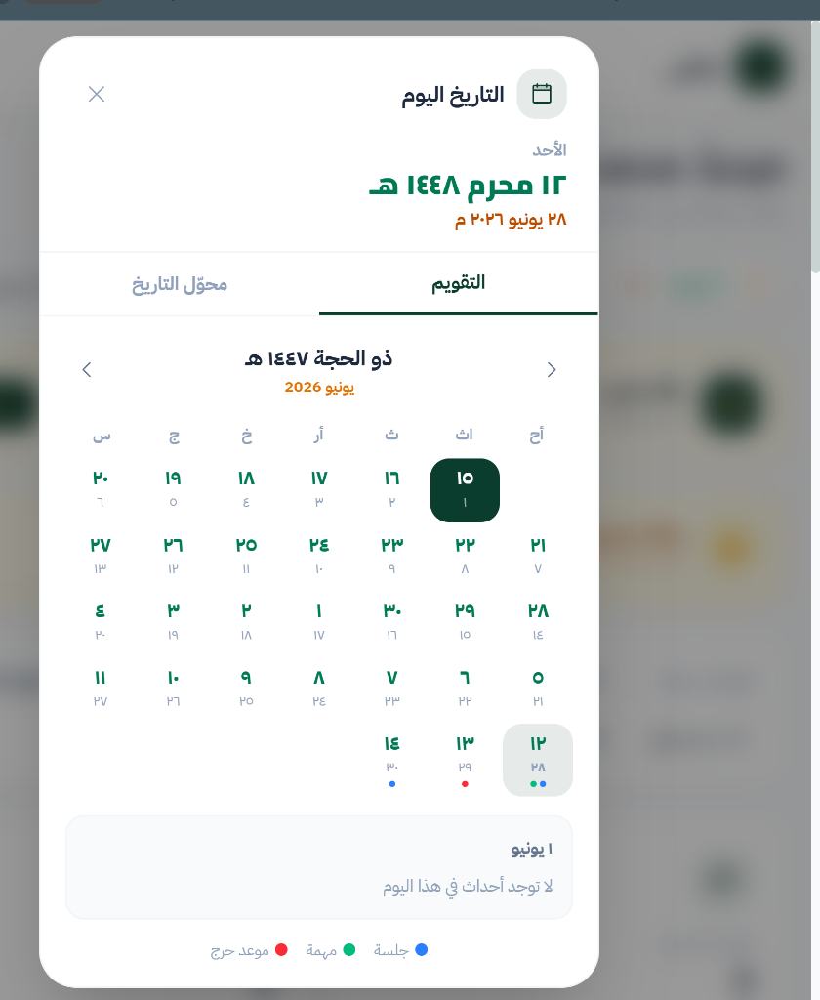
  * شاشة محول التاريخ ومقترح حاسبة السقوط:
    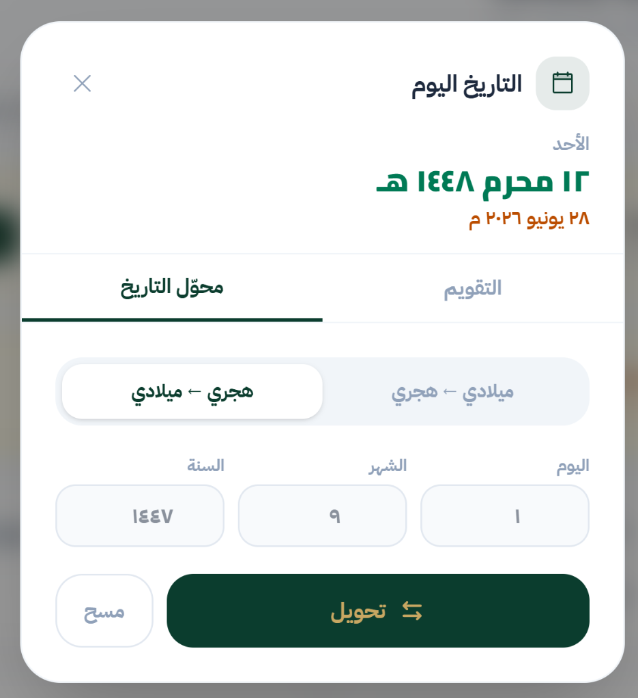
  * أزرار السوق والترقية التالفة بلوحة المحامي:
    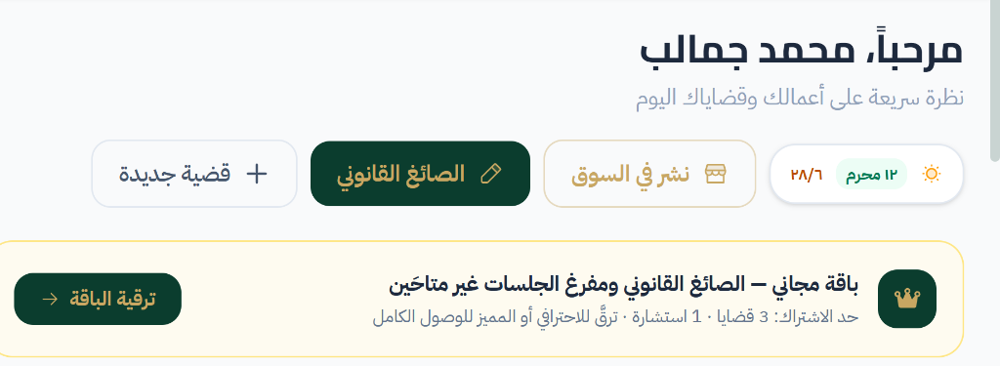
  * خلل إسناد القضايا لفرق العمل في الباقة الفردية:
    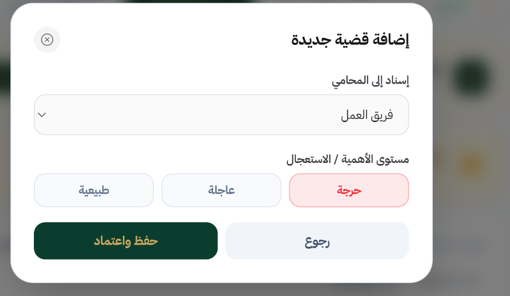
  * خطأ التوجيه والصفحة التالفة لـ "استشارة جديدة":
    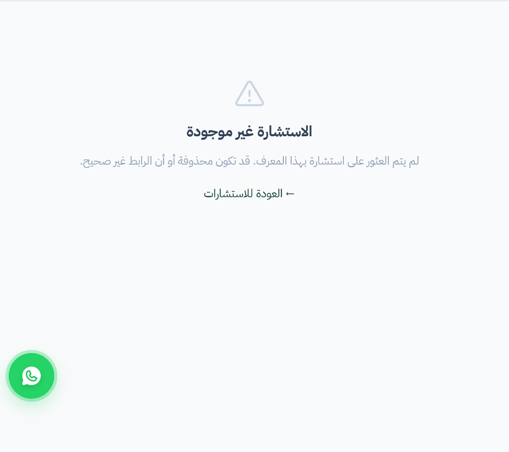
  * سجل الأنشطة وتداخل ميزات LegalMail والربط العضوي:
    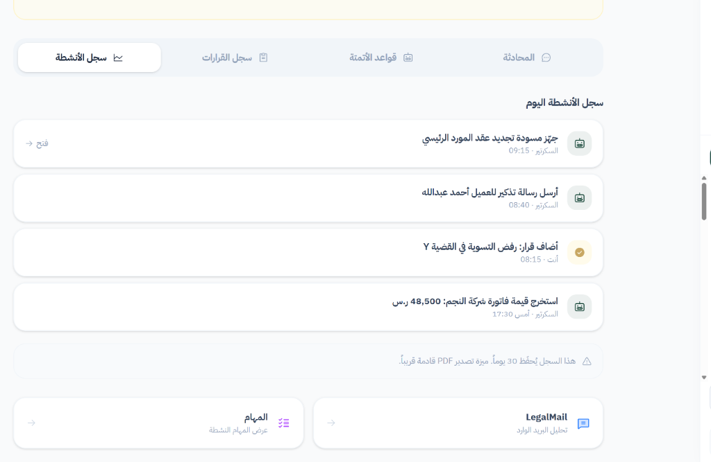
  * فلاتر وتصنيفات القضايا المتداخلة:
    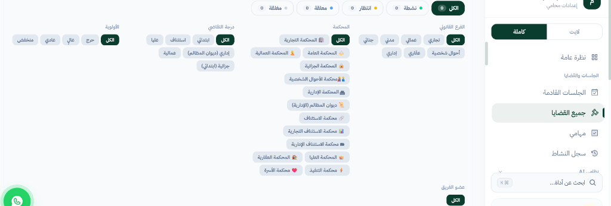
  * ملخص الإنتاجية المطلوب جعله قابلاً للإخفاء والتفعيل:
    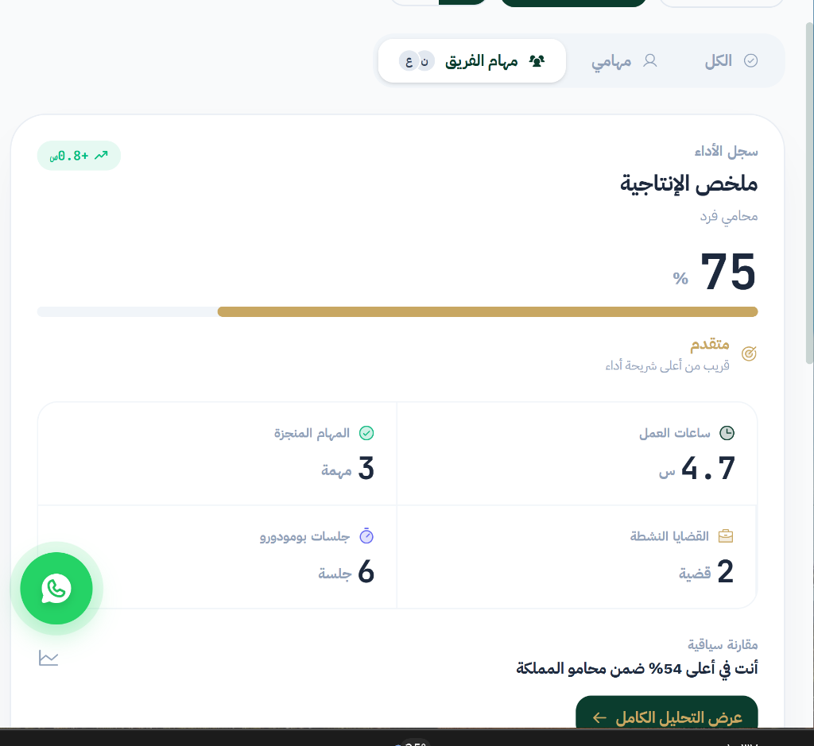
  * صفحة المهام والإنتاجية العامة:
    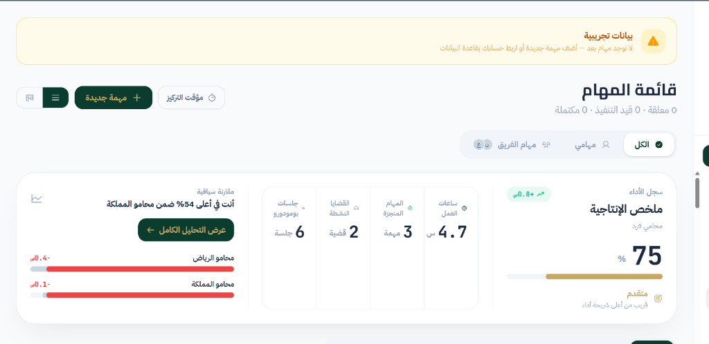
  * نموذج إضافة قضية وتدفق الموكلين:
    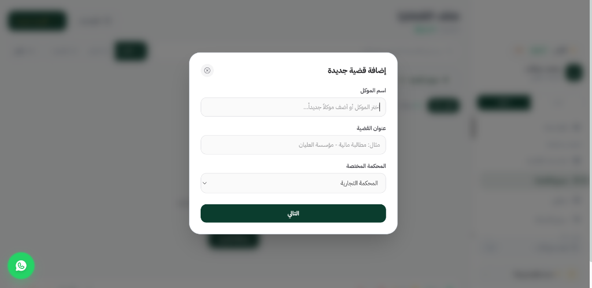
  * راصد التشريعات الذكي وبطاقاته غير المرتبطة:
    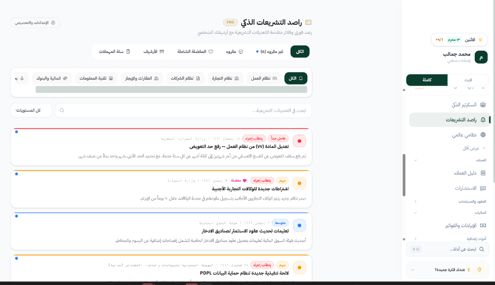
  * إعدادات تخصيص مجالات الرصد وإشعارات الواتساب:
    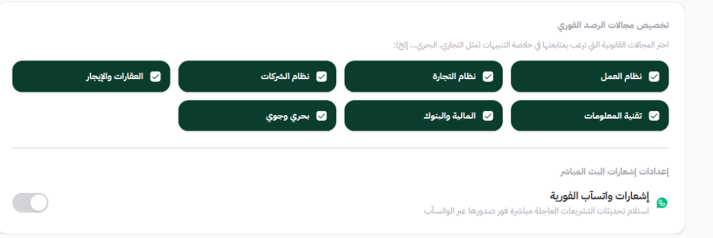
  * اختفاء القائمة الجانبية في صفحة المجمع البحثي:
    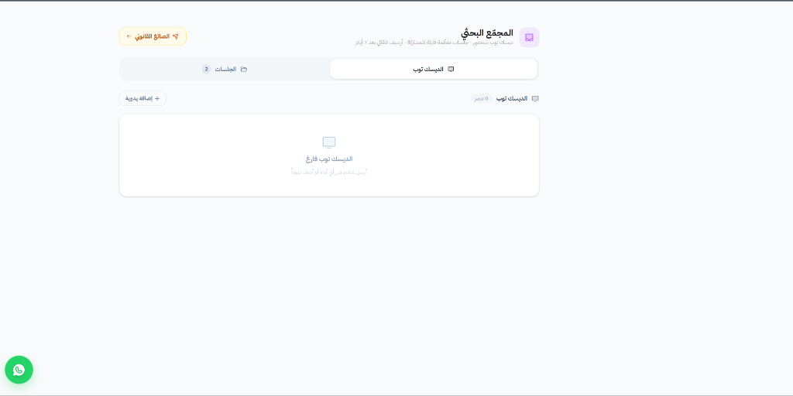
  * واجهة العقود المزدحمة وتوصيات محترف العقود:
    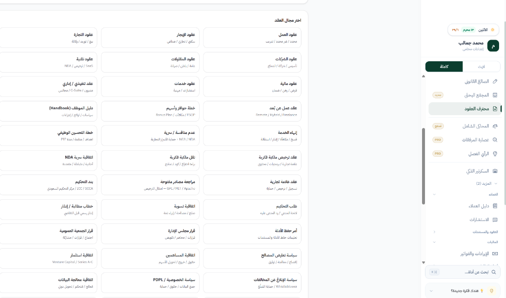

### 4. إدارة المهام اليومية للمحامي (Kanban Tasks)
* **رابط الفحص:** [nezamy.sa/dashboard/lawyer/tasks](https://nezamy.sa/dashboard/lawyer/tasks)
* **المطلوب:** إنشاء مهمة جديدة، سحبها وإفلاتها بين الأعمدة، والتأكد من ثبات حالتها في قاعدة البيانات واحتفالية النجاح عند اكتمالها.
* **الحالة الحالية:** `🟡 ملاحظات فحص`
* **الملاحظات:**
  1. **ظهور نصوص تالفة ومفككة (Mojibake Text Bug):** رصد وجود نصوص ورموز مشوهة وغير مفهومة (مثل `ىءورىءور`) عند استعراض بطاقات أو قائمة المهام المضافة. هذا يشير إلى وجود خلل في ترميز البيانات المدخلة باللغة العربية أثناء الحفظ أو الاسترجاع من قاعدة البيانات (Character Encoding/Mojibake Issue).
  2. **غموض وظيفة "تتبع الوقت" (Time Tracker):** تساءل المستخدم عن الغرض الفعلي لزر تتبع الوقت بداخل المهام. التوصية هي ربطه بمؤقت ذكي (مثل Pomodoro Session أو Timer) يُحسب بالدقائق والساعات عند بدء العمل على المهمة لتوثيق الجهد الفعلي وحساب الساعات القابلة للفلترة (Billable Hours) للعملاء.
  3. **طلب ميزة جديدة - "المستمع الذكي" (Smart Listener):** ميزة قانونية حصرية تتيح للمحامي تسجيل جلسة استماع حية أو رفع ملف صوتي لاجتماع، مع إدخال موجز بسيط عن طبيعة الجلسة والطرف الذي يمثله والتركيز عليه، ليقوم نظام الذكاء الاصطناعي بتفريغ الصوت كتابياً وتلخيص النقاط الرئيسية والمخرجات القانونية للجلسة بشكل ذكي.
* **اللقطة البصرية:**
  * ظهور نصوص مشوهة وتالفة بداخل قائمة المهام:
    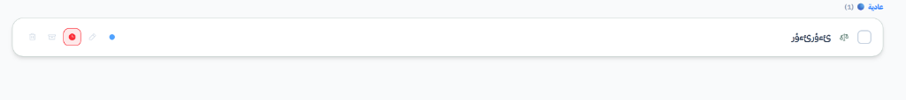

### 5. صفحة الإيرادات والمالية للمحامي
* **رابط الفحص:** [nezamy.sa/dashboard/lawyer/finance](https://nezamy.sa/dashboard/lawyer/finance)
* **المطلوب:** التأكد من ظهور البنر التنبيهي البرتقالي الخاص ببوابة الدفع وفحص لوجيك الإيرادات والماليات.
* **الحالة الحالية:** `🟡 ملاحظات فحص`
* **الملاحظات:**
  1. **ربط تتبع الوقت بنموذج فوترة القضية (Billing Model Gating):** يجب ألا يتم تفعيل أو ربط عداد "تتبع الوقت" بالفاتورة تلقائياً إلا إذا كان المحامي قد حدد مسبقاً في تفاصيل القضية أن طريقة الاتفاق المالي هي **"فوترة بالساعة" (Hourly Billing)**. أما إذا كان الاتفاق بمبلغ مقطوع (Flat Fee) أو نسبة (Percentage)، فيجب تعطيل هذا الربط التلقائي بالفاتورة (أو توضيحه بأنه لأغراض إحصائية داخلية للمكتب فقط).
  2. **غياب لوجيك هيكلة الاتفاقيات المالية للقضايا:** يجب أن تحتوي الشاشات المالية للقضية على بنية تفصيلية تدعم:
     - **نوع الاتفاق المالي:** (مبلغ مقطوع، بالساعة، نسبة من المحكوم به، هجين).
     - **العربون / دفعة التعاقد مقدمًا (Retainer / Downpayment).**
     - **جدول الدفعات (Installments schedule):** ربط الدفعات بمراحل سير القضية (مثلاً: دفعة عند تقديم الصحيفة، ودفعة عند صدور حكم أول درجة).
     - **المصاريف القضائية الإضافية (Disbursements):** إمكانية إدراج وتوثيق الرسوم الحكومية أو رسوم الخبراء التي يدفعها المحامي وتُحسب على العميل بشكل مستقل عن أتعابه.
* **اللقطة البصرية:** *(لا توجد لقطة شاشة)*

### 6. صفحة الملف الشخصي للمحامي
* **رابط الفحص:** [nezamy.sa/dashboard/lawyer/profile](https://nezamy.sa/dashboard/lawyer/profile)
* **المطلوب:** مراجعة صحة جلب الاسم والتخصص وظهور بنر التنبيه البرتقالي الخاص بالتقييمات التجريبية.
* **الحالة الحالية:** `🟡 ملاحظات فحص`
* **الملاحظات:**
  1. **تسريب البيانات الحساسة (خصوصية التواصل):** يعرض الملف المهني للمحامي رقم الجوال الشخصي، البريد الإلكتروني، والموقع الإلكتروني بشكل علني. هذا يضر بنموذج عمل المنصة ويسمح بالتواصل المباشر والتعاقد خارج الموقع (Offline transactions). يُوصى بشدة بحجب رقم الجوال والبريد والموقع الشخصي من الملف التعريفي العام للمحامي.
  2. **توطين التسميات والمصطلحات القانونية (السعودة):** مكتوب حالياً "رقم النقابة" وهو مصطلح مصري غير معمول به في القضاء السعودي. يجب تعديل المسمى ليكون **"ترخيص المحاماة"** أو **"رقم الترخيص"**.
  3. **أزرار تالفة بالملف التعريفي:**
     - زر **"تصدير PDF"** للملف المهني للمحامي معطل ولا يؤدي لأي وظيفة (Dead Button).
     - زر **"تعديل"** الملف الشخصي يوجه إلى صفحة بيضاء تالفة تماماً ولا تعمل.
* **اللقطة البصرية:**
  * صفحة الملف المهني للمحامي وملاحظات الخصوصية والأزرار التالفة:
    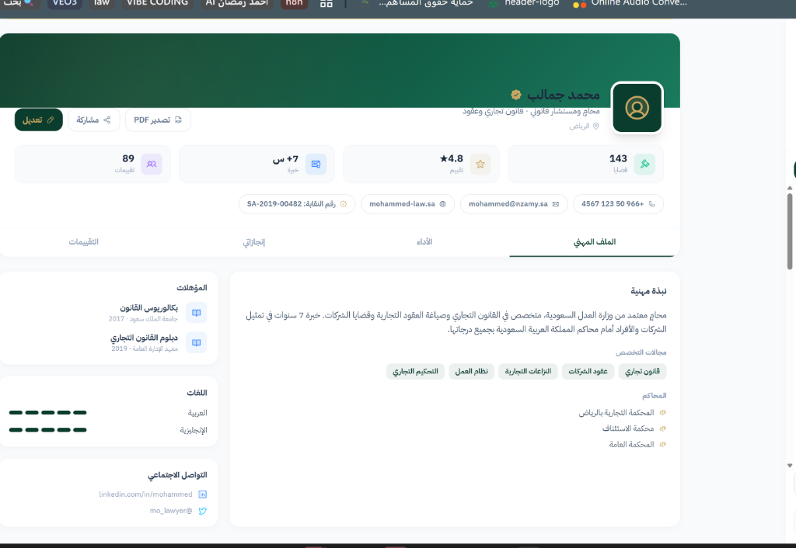

### 7. فحص بنرات الصفحات الموقوتة بالوضع التجريبي
* **المسار:** مراجعة الصفحات التالية للتأكد من ظهور البنر البرتقالي الحامي من الأخطاء البرمجية:
  - التحليلات: `/dashboard/lawyer/analytics`
  - الشبكة والتعاون: `/dashboard/lawyer/network`
  - الندب الخارجي: `/dashboard/lawyer/secondment`
  - الإعلانات والترويج: `/dashboard/lawyer/promotions` (العروض الترويجية)
  - الأرشيف: `/dashboard/lawyer/archive`
  - التقييمات: `/dashboard/lawyer/reviews`
* **المطلوب:** التحقق من ظهور بنر "قيد التفعيل" على جميع هذه الصفحات الستة.
* **الحالة الحالية:** `🟡 ملاحظات فحص`
* **الملاحظات:**
  1. **عدم فاعلية شاشة العروض الترويجية:** صفحة العروض الترويجية `/dashboard/lawyer/promotions` هي صفحة تحت الإنشاء (Placeholder Page) وتعرض شاشة فارغة تفيد بأن الميزة قيد التطوير وليست جاهزة للإنتاج الفعلي. تم التحقق من بقية البنرات لضمان حماية الواجهات المؤقتة.
* **اللقطة البصرية:**
  * شاشة العروض الترويجية الفارغة (قيد التطوير):
    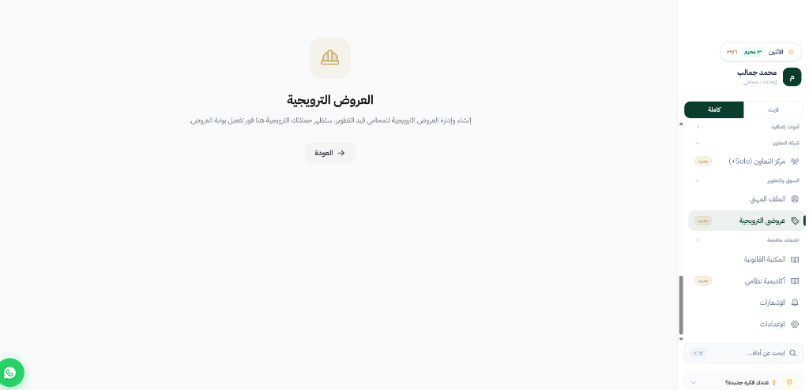

## 🤝 ثالثاً: الاختبارات المشتركة بين العميل والمحامي (Combined E2E)

### 1. دورة العمل الكاملة (طلب ⬅️ قبول ⬅️ تسليم ⬅️ تقييم)
* **المطلوب:** فتح متصفحين (عادي لطلب العميل، وخفي لقبول المحامي في نفس الوقت)، ومتابعة تحديثات الحالة التلقائية والمحادثات الحية وتنبيهات البريد والواتساب عبر النظام.
* **الحالة الحالية:** `🟡 ملاحظات فحص`
* **الملاحظات:**
  1. **اعتماد دليل البحث على قائمة بيانات ثابتة (Mock Data):** عند قيام العميل بالبحث عن اسم المحامي المسجل حديثاً (مثل: محمد جمالب) في صفحة استكشاف المحامين `/find-lawyer` لطلب الخدمة منه، تظهر النتيجة "لا يوجد محامون متاحون حالياً". يعود السبب في ذلك إلى أن دليل استكشاف المحامين مبرمج ببيانات ثابتة (كود صلب) في ملف `find-lawyer/data.ts` ويحتوي على 8 محامين افتراضيين فقط، ولا يجلب المحامين المسجلين حديثاً من قاعدة البيانات.
  2. **آلية محاكاة التدفق المشترك:** لتمكين فحص الدورة الكاملة وتفادي عائق البحث، يمكن للعميل حجز موعد مع أي محامٍ افتراضي من الدليل (مثل: فيصل الغامدي)، وحيث أن النظام يتشارك بيانات الطلبات محلياً عبر ذاكرة المتصفح (`localStorage`) للطلبات الموجهة للمحامين، ستظهر الاستشارة مباشرة عند فتح صفحة استشارات المحامي `/dashboard/lawyer/consultations`.
  3. **عائق بوابة الدفع المعطلة وكيفية تجاوزه:** عند محاولة تأكيد حجز الاستشارة، يظهر تنبيه باللون الأحمر يمنع الإتمام: «الدفع غير متاح حالياً. سيتم تفعيل بوابة الدفع قريباً. لا يمكن إتمام الطلب المدفوع حتى التشغيل» ويصبح زر التأكيد معطلاً. لتجاوز هذا العائق وإتمام الحجز تجريبياً بدون رسوم:
           - قم بتسجيل الخروج من الحساب الحالي.
      - اذهب لصفحة تسجيل الدخول: `https://nezamy.sa/login` وسجل الدخول باستخدام بيانات حساب العميل التجريبي المشمول بالباقة:
        * **البريد الإلكتروني:** `client@nzamy.test`
        * **كلمة المرور:** `Nzamy@2026`
      - بعد الدخول (باسم العميل خالد السلمي)، اذهب لصفحة حجز الاستشارة الجديدة: `https://nezamy.sa/dashboard/client/consultation/new`.
      - ستجد أن التكلفة أصبحت **«0 ر.س (مشمولة في باقتك)»**، وسيختفي تنبيه الدفع المعطل ويصبح زر **«تأكيد بدون رسوم»** نشطاً وقابلاً للضغط لإتمام الحجز بنجاح.
      - لقبول الطلب كـ محامٍ: سجل الخروج ثم ادخل بحساب المحامي التجريبي:
        * **البريد الإلكتروني:** `lawyer@nzamy.test`
        * **كلمة المرور:** `Nzamy@2026`
        * اذهب لصفحة الاستشارات `/dashboard/lawyer/consultations` لقبول الطلب وتجربة المحادثة.
* **اللقطة البصرية:**
  * نتيجة البحث الفارغة عن المحامي المسجل حديثاً:
    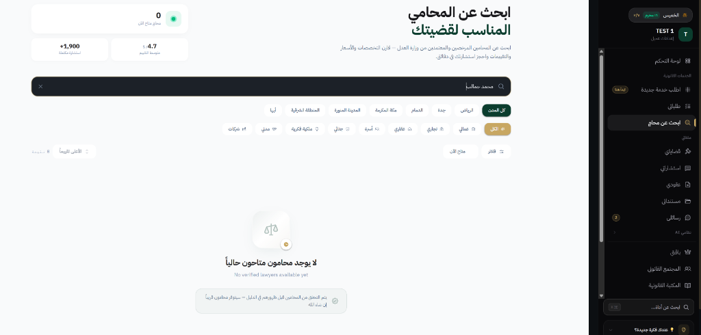

### 2. تدفق التذكيرات للاستشارات المجدولة
* **المطلوب:** حجز استشارة ليوم الغد ومتابعة استلام الطرفين لرسائل التذكير التلقائية (قبل 24 ساعة، وقبل ساعة واحدة).
* **الحالة الحالية:** `⚪ لم يفحص`
* **الملاحظات:**
  * *(اكتب ملاحظاتك هنا)*
* **اللقطة البصرية:**
  

---

## 🤖 رابعاً: اختبارات الذكاء الاصطناعي والواتساب (AI & WhatsApp)

### 1. توجيه وتصنيف طلبات الواتساب التلقائي
* **المطلوب:** إرسال رسالة من جوال شخصي للواتساب مثل: *"أريد محامياً لمساعدتي في صياغة عقد تجاري بالرياض"*، والتأكد من تصنيفها التلقائي بالذكاء الاصطناعي كطلب مدرج في النظام، وتلقي رد برقم الطلب. أو إرسال سؤال عام والحصول على إجابة قانونية مباشرة مدعمة بالمواد النظامية دون إنشاء طلب.
* **الحالة الحالية:** `⚪ لم يفحص`
* **الملاحظات:**
  * *(اكتب ملاحظاتك هنا)*
* **اللقطة البصرية:**
  

---

### 2. ميزة الصوت الذكي (Smart Audio) - دمج المفرّغ والمستمع الذكي
* **رابط الفحص:** [nezamy.sa/ai/transcriber](https://nezamy.sa/ai/transcriber)
* **المطلوب:** دمج المفرغ الذكي مع المستمع الذكي للاجتماعات في شاشة واحدة وإعادة تسمية الأداة برمجياً إلى «الصوت الذكي» (Smart Audio).
* **الحالة الحالية:** `🟡 ملاحظات فحص`
* **الملاحظات:**
  1. **قصور ميزة التسجيل الحي:** يقتصر عمل المفرغ حالياً على رفع الملفات الجاهزة (File Upload)، ويفتقر تماماً لخيار التسجيل الحي المباشر من المتصفح (Live Microphone Recording).
  2. **الدمج المطلوب (الصوت الذكي):** يجب دمج المفرغ والمستمع بإنشاء واجهة موحدة تحتوي على تبويبين (Tabs):
     - **التبويب الأول (تسجيل حي):** يحتوي على واجهة مسجل صوتي مدمج مع مؤقت وموجة صوتية تفاعلية، ويقوم بتوليد ملف الصوت فور إيقافه.
     - **التبويب الثاني (رفع ملف):** الواجهة الحالية لرفع الملفات الصوتية والنصية.
  3. **مدخلات سياق الاجتماع التفاعلية:** السماح للمحامي بعد انتهاء التسجيل أو الرفع بتحديد معطيات الاجتماع لتخصيص التحليل (الطرف الممثل، موضوع التركيز، موجز سريع) قبل الضغط على "تحليل" لضمان مطابقة النتائج.
  4. **مخرجات التحليل:** إخراج تفريغ حرفي كامل (Verbatim) مع الطوابع وتحديد المتحدثين (Diarization)، أو استخلاص محضر اجتماع وقائع قانوني (Legal Summary) يشمل الدفوع المثارة والمهام والتكليفات.
* **اللقطة البصرية:**
  * *(تمت مطابقة اللوجيك برمجياً بداخل الكود في `src/app/ai/transcriber/page.tsx`)*

---

### 3. بوابات حظر اشتراكات الإعدادات (Subscription Gating in Settings)
* **رابط الفحص:** [nezamy.sa/settings](https://nezamy.sa/settings) (تبويب الاشتراكات)
* **المطلوب:** التأكد من التمييز بين باقة نقاط الذكاء الاصطناعي وباقة المكتبة القانونية المستقلة في لوحة التحكم وتلافي الخلط.
* **الحالة الحالية:** `🟡 ملاحظات فحص`
* **الملاحظات:**
  1. **الخلط بين الاشتراكات وديمو الواجهة:** تظهر صفحة الاشتراكات حالياً شريط تبديل واجهات يدوي للمستخدم (`activePlanView`) ليعاين باقة المكتبة أو باقة الـ AI أو كلاهما. هذا غير صالح للإنتاج.
  2. **ربط البيانات بالـ Backend:** يجب إخفاء شريط التبديل اليدوي، والاعتماد بالكامل على جلب حالة اشتراك المستخدم الحقيقية من قاعدة البيانات وعرض البطاقات بناءً عليها:
     - **إذا كان مشتركاً في باقة المكتبة فقط:** تظهر بطاقة المكتبة نشطة وبطاقة محفظة نقاط الذكاء الاصطناعي مغلقة (Locked) مع زر ترويجي للترقية.
     - **إذا كان مشتركاً في باقة النقاط فقط:** تظهر محفظة النقاط نشطة وبطاقة المكتبة مغلقة مع زر تفعيل.
     - **الاشتراك الكامل:** تظهر كلتا البطاقتين نشطتين مع إحصائيات استهلاك مستقلة لكل منهما.
* **اللقطة البصرية:**
  * *(تمت مطابقة اللوجيك برمجياً بداخل الكود في `src/app/settings/components/tabs/SubscriptionTab.tsx`)*

## 📚 خامساً: فحص المكتبة القانونية وأدوات الذكاء الاصطناعي — Legal Library & AI

## 🗂️ أولاً: الصفحة الرئيسية للمكتبة والتصفح — `/laws`

التحقق من تحميل الصفحة الرئيسية وتبويباتها الأربعة والفلاتر.

### 1. تحميل الصفحة الرئيسية وتبويبات المحتوى
* **الخطوات**:
  1. افتح `/laws` دون تسجيل دخول.
  2. انتقل بين التبويبات الأربعة: **أنظمة** · **مبادئ قضائية** · **تعاميم ومراسم** · **فقه وشريعة**.
* **التحقق**:
  * [ ] تظهر شاشات التحميل (Skeletons) ثم تُحمّل البيانات من `/api/library/init` (وليس مصفوفات ثابتة).
  * [ ] كل تبويب يعرض عدد العناصر الفعلي من قاعدة البيانات (`catTotalCount`).
  * [ ] تبويب «فقه وشريعة» يعرض الكتب مع تصنيفات المذاهب والأنواع بشكل صحيح.
  * [ ] لا تظهر عناصر تجريبية (Demo) في وضع الإنتاج — يجب أن تظهر حالة فارغة منظمة إذا خلت قاعدة البيانات.
* **الحالة الحالية:** `🟢 ناجح`
* **الملاحظات:**
  * *(اكتب ملاحظاتك هنا)*
* **اللقطة البصرية:**
  

---

### 2. الفلاتر والتصنيفات
* **الخطوات**:
  1. داخل تبويب «أنظمة»، اضغط على تصنيف فرعي (مثل: أنظمة عمل، أنظمة تجارية، أنظمة جنائية).
  2. جرّب قائمة «تصنيفات أخرى» (Other) واختر تصنيفاً غير رئيسي.
  3. بدّل وضع العرض بين **شبكة (Grid)** و**قائمة (List)**.
  4. اضغط على أحد الوسوم (Hashtags) لفلترة المحتوى.
* **التحقق**:
  * [x] تتغير القائمة فوراً عند اختيار تصنيف وتعود النتائج صحيحة من قاعدة البيانات.
  * [x] يظهر عدد النتائج المتطابقة مع التصنيف المختار.
  * [x] التبديل بين الشبكة والقائمة سلس ويحافظ على الفلتر الحالي.
  * [x] إلغاء الوسوم (Hashtag) يرجع القائمة لحالتها الكاملة.
* **الحالة الحالية:** `🟡 ملاحظات فحص`
* **الملاحظات:**
  1. **تصنيفات أخرى (Coming Soon):** عند الضغط على تصنيفات أخرى يظهر للمستخدم تنبيه أو placeholder يفيد بأن الميزة "قريباً" دون فرز حقيقي للعناصر.
  2. **طلب تعديل فلاتر الفقه الشرعي:** فلاتر الفقه الفرعية (`متون فقهية`، `شروح وحواشي`، `موسوعات وخلافه`) تظهر حالياً عند اختيار تبويب الفقه الشرعي ويجب حذفها تماماً وإخفاؤها من الواجهة.
  3. **طلب إضافة فلتر أخرى للوضعي:** الفلاتر الفرعية للقانون الوضعي ممتازة ويُطلب إضافة خيار **«أخرى»** إليها.
  4. **طلب حذف فقه مقارن:** يجب حذف تبويب **«فقه مقارن»** بالكامل من شريط التبديل الرئيسي للفقه.
* **اللقطة البصرية:**
  - 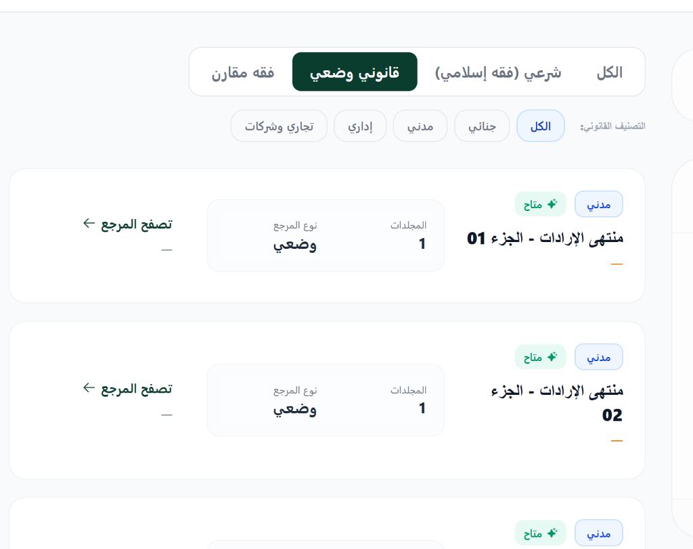
  - 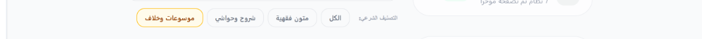
  - 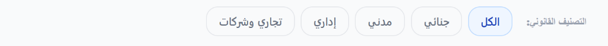

---

### 3. البطاقات الجانبية (Widgets)
* **التحقق** بزيارة الصفحة الرئيسية:
  * [ ] **المجلدات الذكية (Smart Folders)** تظهر في الجانب وتعرض المجلدات الافتراضية.
  * [ ] **ملاحظاتي (My Notes)** تظهر وتُحمّل من قاعدة البيانات للمستخدم الحالي.
  * [ ] **بطاقة التحفيز (Gamification)** تعرض تقدم المستخدم (إن وُجدت بيانات).
  * [ ] **التحديثات التشريعية (Legislative Updates)** تظهر أحدث الأنظمة/المراسيم.
  * [ ] **الجلسات الأخيرة (Recent Sessions)** تعرض آخر جلسات بحث/قراءة.

---

## 🔍 ثانياً: البحث والاقتراحات (Search & Autocomplete)
* **الحالة الحالية:** `⚪ لم يفحص`
* **الملاحظات:**
  * *(اكتب ملاحظاتك هنا)*
* **اللقطة البصرية:**
  

---

### 4. شريط البحث والاقتراحات الفورية (Autocomplete)
* **الخطوات**:
  1. اكتب في شريط البحث كلمة لا تقل عن حرفين، مثلاً: `إثبات`.
  2. راقب قائمة الاقتراحات المنسدلة (تظهر بعد ~300ms).
  3. اضغط على أحد الاقتراحات للانتقال لمحتواه.
* **التحقق**:
  * [ ] الاقتراحات تأتي من `/api/library/autocomplete?q=...` وتعرض عدداً لكل قسم (أنظمة/مبادئ/مراسم/فقه).
  * [ ] **تطبيع الأحرف العربية**: البحث بـ `الإثبات` يطابق المحتوى المخزّن بـ `الاثبات` (همزة مقطوعة/موصلة).
  * [ ] **الأرقام الهندية**: البحث بسنة `١٤٤٤` يطابق `1444` المخزّنة.
  * [ ] اختيار اقتراح ينقل المستخدم لصفحة التفاصيل الصحيحة.
* **الحالة الحالية:** `⚪ لم يفحص`
* **الملاحظات:**
  * *(اكتب ملاحظاتك هنا)*
* **اللقطة البصرية:**
  

---

### 5. البحث الأساسي عبر الأقسام
* **الخطوات**:
  1. اكتب استعلاماً مثل `عقد إيجار` واضغط Enter (أو زر البحث).
  2. بدّل القسم (Section) بين: الكل / أنظمة / مبادئ / مراسم / فقه.
  3. جرّب الفرز (Sort): الصلة · الأحدث · الأقدم · أبجدي.
* **التحقق**:
  * [ ] يُستدعى `POST /api/library/search` ويعرض نتائج من الأقسام المختارة فقط.
  * [ ] الفرز يغيّر ترتيب النتائج فعلياً.
  * [ ] إذا لم توجد نتائج، تظهر حالة فارغة واضحة (وليس شاشة بيضاء/تعطل).
  * [ ] التنقل بين صفحات النتائج (Pagination) يعمل إن وُجدت نتائج كثيرة.
* **الحالة الحالية:** `⚪ لم يفحص`
* **الملاحظات:**
  * *(اكتب ملاحظاتك هنا)*
* **اللقطة البصرية:**
  

---

### 6. البحث القانوني المتقدم (Advanced Search) — 🔒 ميزة مدفوعة
* **الخطوات**:
  1. بحساب **Free**: اضغط زر «البحث المتقدم» → يجب أن يظهر **PaywallModal** يطلب الترقية لباقة AI.
  2. بحساب **AI/Pro**: افتح البحث المتقدم واملأ حقلاً واحداً على الأقل:
     - عنوان/رقم النظام، نوع النظام (نظام/لائحة)، المصدر، الجهة المُصدرة، السنة الهجرية، الحالة (ساري/معدّل/ملغى)، الفرع القانوني، تاريخ من/إلى.
  3. اضغط **تطبيق**.
* **التحقق**:
  * [ ] حساب Free يُحجب بوابة الدفع بشكل صحيح (لا يمكن فتح النموذج).
  * [ ] حساب AI يفتح النموذج ويرسل الفلاتر إلى `/api/library/search` ويرجع نتائج مطابقة.
  * [ ] زر الإلغاء/الإغلاق يعمل دون ترك الصفحة في حالة معلقة.

---

## 📄 ثالثاً: صفحة تفاصيل النظام — `/laws/[slug]`

أهم صفحة في المكتبة — تحتوي على أدوات متعددة يجب فحص كل منها.
* **الحالة الحالية:** `⚪ لم يفحص`
* **الملاحظات:**
  * *(اكتب ملاحظاتك هنا)*
* **اللقطة البصرية:**
  

---

### 7. تحميل النظام والتنقل بين مواده
* **الخطوات**:
  1. افتح نظامٌ حقيقي مثل `/laws/labor-law` (أو أي slug موجود في البذور).
  2. تصفّح فصول النظام ومواده في القائمة الجانبية (`_sidebar`).
  3. اضغط على مادة للانتقال إليها.
* **التحقق**:
  * [ ] يُجلب النظام من `/api/library/laws/[slug]` مع مواده وفصوله ولائحته التنفيذية.
  * [ ] التنقل بين المواد سلس ويُحدّث المؤشر النشط في الشريط الجانبي.
  * [ ] ترقيم المواد (`number` / `number_text`) يظهر بدقة.
* **الحالة الحالية:** `⚪ لم يفحص`
* **الملاحظات:**
  * *(اكتب ملاحظاتك هنا)*
* **اللقطة البصرية:**
  

---

### 8. البحث داخل النظام
* **الخطوات**:
  1. استخدم حقل البحث داخل صفحة النظام.
  2. ابحث برقم مادة، أو عنوان، أو نص، أو مرجع اللائحة التنفيذية.
* **التحقق**:
  * [ ] يفلتر البحث المواد (يشمل رقم المادة + عنوانها + نصها + اللائحة التنفيذية).
  * [ ] تُبرز (Highlight) الكلمة المطابقة داخل النتائج بشكل صحيح ولا يكسر تطبيع الأحرف موضع الإبراز.
* **الحالة الحالية:** `⚪ لم يفحص`
* **الملاحظات:**
  * *(اكتب ملاحظاتك هنا)*
* **اللقطة البصرية:**
  

---

### 9. اللائحة التنفيذية وتبويب «اللائحة فقط»
* **الخطوات**:
  1. افتح نظاماً ذا لائحة تنفيذية (`document_type = نظام_ولائحة`).
  2. بدّل بين تبويب **النظام + اللائحة** وتبويب **اللائحة فقط**.
* **التحقق**:
  * [ ] يظهر التبويب فقط للأنظمة التي تملك لائحة تنفيذية فعلية.
  * [ ] عرض اللائحة وحدها يخفي مواد النظام الأصلية ولا يدمجها.
  * [ ] التسمية الديناميكية (`executive_label_override`) تظهر عند وجودها.
* **الحالة الحالية:** `⚪ لم يفحص`
* **الملاحظات:**
  * *(اكتب ملاحظاتك هنا)*
* **اللقطة البصرية:**
  

---

### 9ب. تبويب «الجداول والملاحق فقط» — ميزة جديدة (أُضيفت للكود 2026-07-02)
> **ملاحظة سياق:** هذه ميزة جديدة كلياً لم تكن موجودة في السكرين شوت الأصلي للمكتبة — طُلبت لأن بعض الأنظمة (مثل نظام مكافحة المخدرات وجداول موادّه المصنّفة، أو نظام رسوم الأراضي البيضاء وملحق مقارنة أحكامه قبل/بعد التعديل) تحتوي على جداول وملاحق **مستوى الوثيقة** لا تنتمي لمادة واحدة بعينها، وليس لها مكان في تبويبي «النظام» أو «اللائحة» الحاليين.
* **الملفات المتأثرة (للمرجعية البرمجية):**
  - `src/app/laws/data.ts` — إضافة `interface LawAppendix` وحقل `appendices?: LawAppendix[]` إلى `LawSystem`.
  - `src/app/laws/[slug]/page.tsx` — توسيع `viewMode` ليشمل `"appendix"`، زر تبديل رابع (يظهر **فقط** إذا كانت `law.appendices` غير فارغة)، وفرع عرض جديد يسرد بطاقات الجداول/الملاحق.
  - محول البيانات: `SITE MAPS NZAMY/محول ملفات المكتبة القانونية/md_to_platform_json.py` — يستخرج الآن وسوم `<!-- APPENDIX {...} --> ... <!-- APPENDIX_END -->` من ملفات الماركداون المصدرية إلى مصفوفة `appendices`.
* **الخطوات**:
  1. افتح نظاماً تحتوي بياناته (JSON/DB) على مصفوفة `appendices` غير فارغة.
  2. تحقق من ظهور الزر الرابع «الجداول والملاحق فقط» بجانب الأزرار الثلاثة الحالية.
  3. اضغط عليه وتحقق من عرض بطاقات الجداول/الملاحق (شارة نوع + عنوان + محتوى).
* **التحقق**:
  * [ ] الزر **لا يظهر إطلاقاً** للأنظمة التي لا تملك `appendices` (أغلب الأنظمة حالياً — هذا هو السلوك الصحيح المتوقع، وليس عيباً).
  * [ ] عند وجود بيانات، يعرض الزر بطاقات منفصلة لكل جدول/ملحق مع شارة `📊 جدول` أو `📁 ملحق`.
  * [ ] محتوى الجدول يظهر حالياً كنص خام (لا يوجد بعد مُصيِّر جدول ماركداون تفاعلي — هذا تحسين مستقبلي مفتوح وليس عيباً حرجاً، وثّقه إن كان يستحق أولوية).
* **⚠️ ملاحظة اختبار مهمة:** لا توجد حالياً أي مادة/نظام مُقاد (seeded) في قاعدة البيانات ببيانات `appendices` حقيقية — لاختبار هذا التبويب فعلياً يلزم إما (أ) تشغيل `md_to_platform_json.py` على ملف ماركداون يحتوي وسوم `APPENDIX` وحقن ناتجه بالـ DB، أو (ب) إضافة بيانات تجريبية مؤقتة لأي نظام أثناء الفحص فقط.
* **الحالة الحالية:** `⚪ لم يفحص` (ميزة جديدة — لم تُختبر بعد على بيانات حقيقية)
* **الملاحظات:**
  * *(اكتب ملاحظاتك هنا)*
* **اللقطة البصرية:** *(لا توجد بعد — ميزة جديدة)*

---

### 10. أدوات المادة: نسخ / حفظ / طباعة
* **الخطوات**:
  1. اضغط زر **نسخ** على إحدى المواد.
  2. اضغط زر **حفظ/إشارة مرجعية (Bookmark)**.
  3. اضغط زر **طباعة** (`Printer`) في رأس الصفحة.
* **التحقق**:
  * [ ] النسخ يضع نص المادة في الحافظة بنص عربي سليم (يتضمن مرجع اللائحة عند وجوده).
  * [ ] الإشارة المرجعية تُحفظ وتظهر في قسم الملاحظات/المحفوظات.
  * [ ] الطباعة تفتح معاينة طباعة مع **علامة مائية (PrintWatermark)** ولا تكسر التنسيق العربي (RTL).
* **الحالة الحالية:** `⚪ لم يفحص`
* **الملاحظات:**
  * *(اكتب ملاحظاتك هنا)*
* **اللقطة البصرية:**
  

---

### 11. أدوات الذكاء الاصطناعي في الشريط الجانبي — 🔒 ميزة مدفوعة
* **الخطوات**:
  1. بحساب **Free**: تحقق من ظهور قفل/بوابة على بطاقة `LibraryAI`.
  2. بحساب **AI/Pro**: اضغط **شرح المادة** على إحدى المواد، ثم جرّب **محادثة المكتبة**.
* **التحقق**:
  * [ ] حساب Free يُحجب عن أدوات AI مع رسالة ترقية واضحة.
  * [ ] حساب AI: إن وُصل webhook الخاص بـ n8n (`N8N_EXPLAIN_ARTICLE_WEBHOOK_URL`)، يعود شرح المادة. **إن لم يُوصل بعد**، يجب أن تظهر رسالة صريحة «الذكاء الاصطناعي قيد التفعيل» بدلاً من رد وهمي بـ `setTimeout`. (⚠️ راجع العنصر المؤجل في قسم «ملاحظات معروفة»).
  * [ ] لا تظهر إجابة AI ملفّقة/ثابتة — إن لم يكن هناك اتصال حقيقي، تُعرض حالة «قريباً».
* **الحالة الحالية:** `⚪ لم يفحص`
* **الملاحظات:**
  * *(اكتب ملاحظاتك هنا)*
* **اللقطة البصرية:**
  

---

### 12. المستندات المرتبطة
* **التحقق**:
  * [ ] الشريط الجانبي يعرض المستندات المرتبطة (مراسيم/لائحة/سوابق) للنظام الحالي وروابطها تعمل.

---

## 📁 رابعاً: المجلدات الذكية (Smart Folders) — `/api/library/folders`
* **الحالة الحالية:** `⚪ لم يفحص`
* **الملاحظات:**
  * *(اكتب ملاحظاتك هنا)*
* **اللقطة البصرية:**
  

---

### 13. إنشاء مجلد ذكي وإدارة عناصره
* **الخطوات**:
  1. سجّل دخولك (المجلدات مرتبطة بالمستخدم).
  2. اضغط **مجلد جديد** (`CreateFolderInline`).
  3. أدخل اسماً، اختر لوناً من 8 ألوان، وأيقونة (افتراضي/نجمة/تثبيت/كتاب).
  4. أضف نظاماً/مبدأً/مرسوماً إلى المجلد (من بطاقة العنصر أو من داخل التفاصيل).
  5. ثبّت (Pin) المجلد ليظهر في الأعلى.
* **التحقق**:
  * [ ] يُحفظ المجلد عبر `POST /api/library/folders` ويظهر فوراً.
  * [ ] العناصر المُضافة تُحفظ وتبقى بعد تحديث الصفحة (F5).
  * [ ] التثبيت (Pin) يعيد ترتيب المجلدات.
  * [ ] تعديل المجلد (`PATCH`) يحدّث الاسم/اللون/الأيقونة.
* **الحالة الحالية:** `⚪ لم يفحص`
* **الملاحظات:**
  * *(اكتب ملاحظاتك هنا)*
* **اللقطة البصرية:**
  

---

### 14. حذف المجلد والملكية
* **الخطوات**:
  1. احذف مجلداً أنشأته.
  2. (للمطور) تأكد أن مسار `DELETE /api/library/folders` يتحقق من **ملكية** المجلد قبل الحذف.
* **التحقق**:
  * [ ] يُحذف المجلد وعناصره دون التأثير على مجلدات مستخدم آخر.
  * [ ] ⚠️ **ملاحظة أمنية معروفة**: فحص الملكية على DELETE قد يكون ناقصاً (راجع العنصر #16 في `NEXT_STEPS.md`) — اختبر بحسابين وتأكد أن مستخدم (أ) لا يستطيع حذف مجلد مستخدم (ب) عبر تلاعب بالمعرف.

---

## 📝 خامساً: الملاحظات (Notes) — `MyNotesSection`
* **الحالة الحالية:** `⚪ لم يفحص`
* **الملاحظات:**
  * *(اكتب ملاحظاتك هنا)*
* **اللقطة البصرية:**
  

---

### 15. إنشاء/تعديل/حذف الملاحظات
* **الخطوات**:
  1. بحساب مسجّل، افتح قسم «ملاحظاتي».
  2. أضف ملاحظة مرتبطة بمادة/نظام، ثم عدّلها، ثم احذفها.
* **التحقق**:
  * [ ] تُحفظ الملاحظات لكل مستخدم على حدة وتظهر بعد تحديث الصفحة.
  * [ ] لا تظهر ملاحظات مستخدم آخر (عزل البيانات عبر RLS).

---

## ⚖️ سادساً: المحتوى القانوني الآخر (مبادئ/سوابق/مراسم/فقه/كتب)
* **الحالة الحالية:** `⚪ لم يفحص`
* **الملاحظات:**
  * *(اكتب ملاحظاتك هنا)*
* **اللقطة البصرية:**
  

---

### 16. صفحة تفاصيل المبدأ القضائي — `/precedents/[slug]`
* **التحقق**:
  * [ ] تُحمّل هوية المبدأ (`_identity-panel`)، نص المبدأ (`_principle-block`)، والمحتوى المرتبط (`_related`) ولوحة الجانب (`_sidebar`).
  * [ ] البيانات تأتي من `/api/library/precedents/[slug]`.
* **الحالة الحالية:** `⚪ لم يفحص`
* **الملاحظات:**
  * *(اكتب ملاحظاتك هنا)*
* **اللقطة البصرية:**
  

---

### 17. صفحة تفاصيل الحكم — `/precedents/judgment/[slug]`
* **التحقق**:
  * [ ] ⚠️ **ملاحظة معروفة**: هذه الصفحة قد تكون تجريبية/غير مربوطة بمسار API حقيقي (راجع `NEXT_STEPS.md` — العنصر #16: إضافة مسار أو إظهارها كـ«قريباً»). إن ظهرت بيانات ثابتة دون استدعاء API، سجّلها كملاحظة تعديل.
* **الحالة الحالية:** `⚪ لم يفحص`
* **الملاحظات:**
  * *(اكتب ملاحظاتك هنا)*
* **اللقطة البصرية:**
  

---

### 18. صفحة تفاصيل المرسوم/التعاميم — `/laws/orders/[slug]`
* **التحقق**:
  * [ ] يُجلب المرسوم من `/api/library/decrees/[id]` مع الجهة المُصدِرة وتاريخ الإصدار.
  * [ ] تبويب «تعاميم ومراسم» في الرئيسية يفلترها بشكل صحيح.
* **الحالة الحالية:** `⚪ لم يفحص`
* **الملاحظات:**
  * *(اكتب ملاحظاتك هنا)*
* **اللقطة البصرية:**
  

---

### 19. صفحة تفاصيل الكتاب الفقهي — `/book/[slug]`
* **التحقق**:
  * [ ] يُجلب الكتاب من `/api/library/books/[slug]` مع هوية الكتاب ولوحته الجانبية.
  * [ ] صفحة `/book` (قائمة الكتب) و`/book/consultation` تفتحان دون أخطاء.
* **الحالة الحالية:** `🔴 خلل برمجي`
* **الملاحظات:**
  1. **خلل "عفواً الكتاب غير موجود":** عند محاولة تصفح أي كتاب فقهي عدا الكتابين التجريبيين (`rawd-al-murbi` و `sources-of-right-1`) يواجه المستخدم صفحة خطأ تفيد بأن الكتاب غير موجود. يعود ذلك لأن صفحة القراءة `/book/[slug]` تعتمد على تحميل مشروط ثابت (hardcoded) لهذين الكتابين فقط ولا تجلب البيانات ديناميكياً من قاعدة البيانات للكتب الأخرى.
  2. **خلل عدم التمييز بين الوضعي والشرعي:** تُعرض بعض الكتب الفقهية الكلاسيكية كـ «منتهى الإرادات» (وهو كتاب فقه حنبلي شرعي) مصنفاً في الواجهة بـ «نوع المرجع: وضعي» وتحت تبويب «قانوني وضعي» بدلاً من «شرعي»، مما يدل على خلل تصنيف في قاعدة البيانات أو ملفات البذر.
  3. **خلل "This page couldn't load":** تظهر شاشة خطأ كاملة للمتصفح أحياناً عند محاولة الانتقال لروابط بعض الكتب الفقهية بسبب مشاكل رندر Hydration أو أخطاء غير معالجة في كود الصفحة.
* **اللقطة البصرية:**
  - 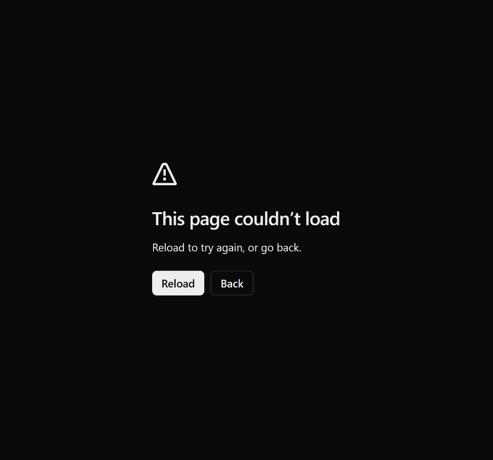
  - 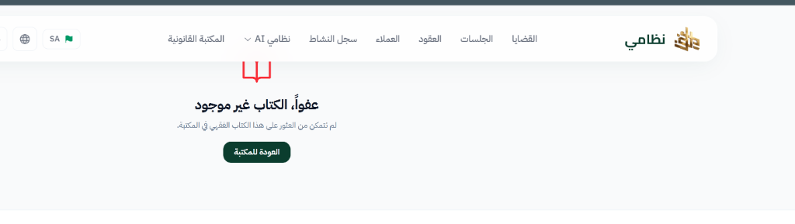

---

### 20. معاينة الفقه — `/laws/feqh-preview`
* **التحقق**:
  * [ ] تفتح المعاينة وتعرض بنية الكتب الفقهية بشكل سليم.

---

## 🔐 سابعاً: بوابات الدفع وقيود الباقات (Paywall & Tier Gating)

المكتبة مقيدة حسب الباقة. استخدم حسابات بباقات مختلفة للتحقق.

| الميزة | الباقة المطلوبة | المرجع البرمجي |
|--------|----------------|----------------|
| وصول كامل للمكتبة | **Pro** (`library-full-access`) | `access-control.ts` |
| البحث المتقدم | **AI** (`library-advanced-search`) | `access-control.ts` |
| شرح المادة / محادثة المكتبة | **AI** | `LibraryAI` |
| العناصر المجانية المفتوحة دائماً | Free | `library_free_items` (إعداد إداري) |
* **الحالة الحالية:** `⚪ لم يفحص`
* **الملاحظات:**
  * *(اكتب ملاحظاتك هنا)*
* **اللقطة البصرية:**
  

---

### 21. قيود المستخدم المجاني (Free Tier)
* **الخطوات**:
  1. سجّل دخولك بحساب Free.
  2. تصفّح الأنظمة وتجاوز حد المواد المجانية (`library_free_article_limit`).
  3. حاول فتح نظام غير مُدرج في القائمة البيضاء (`library_free_items` / `library_whitelisted_laws`).
* **التحقق**:
  * [ ] يظهر **PaywallModal** بعد تجاوز الحد المجاني يدعو للترقية.
  * [ ] العناصر المُدرجة في القائمة البيضاء تفتح مجاناً دون حجب.
  * [ ] زر «ترقية الاشتراك» في البوابة ينقل لصفحة الاشتراك `/laws/subscribe`.
* **الحالة الحالية:** `⚪ لم يفحص`
* **الملاحظات:**
  * *(اكتب ملاحظاتك هنا)*
* **اللقطة البصرية:**
  

---

### 22. صفحة الاشتراك — `/laws/subscribe`
* **التحقق**:
  * [ ] تعرض الباقات والأسعار بشكل صحيح.
  * [ ] ⚠️ **ملاحظة معروفة**: بوابة الدفع الحقيقية **غير مفعّلة** (محجوبة بعلم `payments_gateway = disabled` عبر لوحة الإدارة). زر الاشتراك يجب أن يعرض رسالة «الدفع غير متاح حالياً» بدلاً من إنشاء طلب. (هذا متوقع — راجع `payments-gateway-admin-gate.md`).

---

## 🤖 ثامناً: أدوات الذكاء الاصطناعي — `/ai/*`

> ملاحظة: معظم أدوات AI تعتمد على ربط n8n webhooks. إن لم تُربط بعد، يجب أن تظهر حالة «قريباً/قيد التفعيل» بدلاً من ردود وهمية. سجّل أي أداة تعرض رداً ثابتاً بـ `setTimeout` كخطأ.
* **الحالة الحالية:** `⚪ لم يفحص`
* **الملاحظات:**
  * *(اكتب ملاحظاتك هنا)*
* **اللقطة البصرية:**
  

---

### 23. المحلل الذكي — `/ai/analyze`
* **الخطوات**:
  1. ارفع مرفقاً/وثيقة أو أدخل نصاً قانونياً.
  2. جرّب تصدير المرفق إلى صندوق المسودات (Draft Inbox) عبر `AttachmentSqueezer`.
  3. شغّل التحليل.
* **التحقق**:
  * [ ] رفع المرفقات يعمل ويُصدّر إلى `draftInboxStore` عبر `researchService.addToDesktop`.
  * [ ] التحليل يعرض تقريراً (`evalReport`) أو حالة «قيد التفعيل» إن لم يُربط n8n.
* **الحالة الحالية:** `⚪ لم يفحص`
* **الملاحظات:**
  * *(اكتب ملاحظاتك هنا)*
* **اللقطة البصرية:**
  

---

### 24. المساعد القانوني — `/ai/assistant`
* **التحقق**:
  * [ ] يفتح واجهة المحادثة؛ الردود تأتي من n8n (`N8N_LIBRARY_CHAT_WEBHOOK_URL`) أو تظهر «قريباً».
* **الحالة الحالية:** `⚪ لم يفحص`
* **الملاحظات:**
  * *(اكتب ملاحظاتك هنا)*
* **اللقطة البصرية:**
  

---

### 25. أدوات AI الإضافية
جرّب كل صفحة وتحقق أنها تفتح دون تعطل وأن أي رد AI حقيقي/أو حالة قريباً واضحة:
- [ ] `/ai/compare` — مقارنة المستندات (مع لوحة الإصلاح التلقائي `_auto-fix-panel`).
- [ ] `/ai/case-brief` — ملخص القضية.
- [ ] `/ai/brief-check` — تدقيق الملخص.
- [ ] `/ai/analyze-strength` — قوة الدعوى (مع `ScoreGauge`).
- [ ] `/ai/collector` — جامع الأدلة (`SessionsPanel` + `DesktopPanel`).
- [ ] `/ai/communicate` — التواصل.

---

## 🛠️ تاسعاً: لوحة إدارة المكتبة (Admin) — `/dashboard/admin`
* **الحالة الحالية:** `⚪ لم يفحص`
* **الملاحظات:**
  * *(اكتب ملاحظاتك هنا)*
* **اللقطة البصرية:**
  

---

### 26. إدارة محتوى المكتبة
* **الخطوات**:
  1. سجّل دخولك بحساب مدير.
  2. افتح تبويب المكتبة (`LibraryTab`) في لوحة الإدارة.
  3. جرّب فلترة المحتوى بالتصنيفات، وتعديل «العناصر المجانية» (`library_free_items`).
* **التحقق**:
  * [ ] تصنيفات الفلتر موحّدة بين الواجهة والمسار (`/api/v1/admin/library`) وكل تصنيف يرجع نتائج.
  * [ ] تبديل «العناصر المجانية» فعّال فعلاً ويُفتح المحتوى للمستخدمين المجانيين بعد الحفظ (راجع `nzamy-audit-fix-status.md` — البند P0 #4).
  * [ ] تبويب الإعدادات (`/dashboard/admin/settings`) يتيح التحكم في بوابة الدفع `payments_gateway`.
* **الحالة الحالية:** `⚪ لم يفحص`
* **الملاحظات:**
  * *(اكتب ملاحظاتك هنا)*
* **اللقطة البصرية:**
  

---

### 27. التقارير — `/api/library/reports`
* **التحقق**:
  * [ ] مسار التقارير يرجع بيانات صحيحة للمدير (إحصاءات استخدام المكتبة) أو يُحجب عن غير المدير.

---

## 📱 عاشراً: التوافق والتجربة العامة (UX / RTL / الطباعة)
* **الحالة الحالية:** `⚪ لم يفحص`
* **الملاحظات:**
  * *(اكتب ملاحظاتك هنا)*
* **اللقطة البصرية:**
  

---

### 28. ثنائية اللغة واتجاه RTL/LTR
* **التحقق**:
  * [ ] الواجهة العربية (RTL) متسقة: الأيقونات، التبويبات، الجداول، الفلاتر.
  * [ ] التبديل للإنجليزية (LTR) يصحّح الاتجاه ولا يكسر التخطيط.
  * [ ] النصوص المختلطة (عربي + أرقام هندية/إنجليزية) تظهر بشكل صحيح.
* **الحالة الحالية:** `⚪ لم يفحص`
* **الملاحظات:**
  * *(اكتب ملاحظاتك هنا)*
* **اللقطة البصرية:**
  

---

### 29. الجوال والاستجابة (Responsive)
* **التحقق**:
  * [ ] على شاشة جوال (≤768px): الشريط الجانبي يطوى، الفلاتر في قائمة منسدلة، البطاقات بعمود واحد.
  * [ ] أزرار النسخ/الطباعة/الحفظ تعمل باللمس.
* **الحالة الحالية:** `⚪ لم يفحص`
* **الملاحظات:**
  * *(اكتب ملاحظاتك هنا)*
* **اللقطة البصرية:**
  

---

### 30. الطباعة
* **التحقق**:
  * [ ] طباعة صفحة نظام تطبع المواد مع العلامة المائية ولا تقطع النصوص.
  * [ ] معاينة الطباعة تحافظ على RTL.

---

## ⚠️ ملاحظات معروفة (متوقعة — ليست أخطاء برمجية)

هذه عناصر **مؤجلة عن قصد** موثّقة في `NEXT_STEPS.md` و`nzamy-audit-fix-status.md`. عند اختبارها، إن ظهرت بالشكل الموصوف فهي متوقعة؛ إن ظهرت بشكل مختلف فسجّلها كخطأ:

| # | العنصر | السلوك المتوقع حالياً |
|---|--------|----------------------|
| 1 | ردود AI الوهمية (`setTimeout`) | إن وُجدت ردود ثابتة بدل n8n، يجب أن تُستبدل بحالة «قريباً» — سجّل أي رد وهمي |
| 2 | مسار `/precedents/judgment/[slug]` | قد يكون تجريبياً — يجب إضافة مسار أو إظهار «قريباً» |
| 3 | بيانات `demo-data*.ts` و`law-metadata-map.ts` | تظهر فقط في وضع التطوير (dev-fallback)؛ في الإنتاج يجب أن تظهر حالة فارغة |
| 4 | البحث المتقدم وتطبيع الأحرف | يجب أن يعمل `الإثبات`↔`الاثبات` و`١٤٤٤`↔`1444` — إن لم يعمل فسجّله (P1 #11) |
| 5 | `seed-library.ts --clean` | قد تكون no-op حالياً — لا تعتمد عليه لمسح البيانات قبل البذر |
| 6 | ترقيم `parse-feqh.ts` | قد يُرجع `volume:1` ثابتاً للكتب الفقهية |
| 7 | بوابة الدفع | معطّلة بعلم `payments_gateway` — رسالة «الدفع غير متاح حالياً» متوقعة |

---
* **الحالة الحالية:** `⚪ لم يفحص`
* **الملاحظات:**
  * *(اكتب ملاحظاتك هنا)*
* **اللقطة البصرية:**
  

---

## 💎 تحديثات وتعديلات المطور (يوليو 2026) — Developer Updates & Fixes
تمت معالجة وإصلاح الملاحظات والخلل البرمجي المكتشف في المكتبة القانونية والمسودات وتوثيقها لتسليمها للمبرمج مباشرة:

### 1. مزامنة الذاكرة والمسودة (LocalStorage vs Cloud DB)
- **السلوك الحالي:** تُحفظ المواد والمجلدات والملاحظات حالياً محلياً في الذاكرة المؤقتة للمتصفح `localStorage` (لأنها واجهات نموذج أولي Frontend Prototype).
- **ملاحظة فنية للمبرمج:** عند استخدام **المتصفح الخفي (Incognito Mode)** أو تسجيل الخروج ومسح بيانات الجلسة، يقوم المتصفح تلقائياً بمسح `localStorage` بالكامل، مما يخفي المسودات والمجلدات.
- **توصية التطوير:** يجب ربط واجهة المجلدات والمسودات بقاعدة البيانات السحابية (مثلاً جدول `draft_items` و `folders` في Supabase) لتثبيتها سحابياً وربطها برقم حساب المستخدم بشكل دائم.

### 2. إخفاء واختفاء نصوص المواد واللوائح في المسودة
- **المشكلة السابقة:** كانت نصوص المواد تظهر كسطر واحد مقتضب (line-clamp-1) واللوائح التنفيذية يظهر عنوانها فقط دون إمكانية قراءة نصوصها الكاملة داخل شريط المسودة.
- **الإصلاح والتعديل:** تم إضافة لوجيك التمدد والطي (Expand/Collapse accordion) داخل المسودة `DraftDrawer.tsx`.
  - أصبح بالإمكان الضغط على اسم المادة أو كرت اللائحة أو أيقونة السهم لتمديد الكرت وإظهار النص الكامل بشكل منسق وقابل للقراءة والنسخ.
  - عند الطي، يعود الكرت لحجمه المدمج للمحافظة على انسيابية التنقل.

### 3. إصلاح خلل نسخ جزء محدد من المادة (Copy Selection)
- **المشكلة السابقة:** عند تحديد (تظليل) جملة معينة من المادة والضغط على زر النسخ، كان النظام يقوم بنسخ نص المادة بالكامل متجاهلاً التحديد.
- **الإصلاح والتعديل:** تم ترقية لوظيفة الحصول على النص المظلل `getSelectedTextWithin` في كافة الصفحات والمكونات (`_article-components.tsx` و `orders/[slug]/page.tsx` و `precedents/judgment/[slug]/_helpers.ts` و `DraftDrawer.tsx`):
  - يقوم الكود بالتحقق الذكي مما إذا كان المستخدم قد ظلل جزءاً من النص يقع ضمن نطاق المادة أو اللائحة الجاري نسخها.
  - إذا وجد تظليلاً مطابقاً، يقتصر النسخ على **الجزء المحدد فقط** مع إرفاق الترويسة القانونية المناسبة له.
  - إذا لم يجد أي تظليل نشط، ينسخ كامل نص المادة تلقائياً كخيار بديل.

### 4. البطاقة التعريفية (ميتاداتا المستندات) ومدى شموليتها
- **الاستفسار:** هل البطاقة التعريفية (النوع، جهة الإصدار، تاريخ الإصدار والتعديل) ستشمل كافة الملفات عند التحديث؟
- **الإجابة الفنية:** نعم. تم هيكلة خريطة الميتاداتا في الملف [law-metadata-map.ts](file:///C:/Users/Judge/Desktop/%D8%AA%D9%8A%D8%B3%D8%AA%20%D9%86%D8%B8%D8%A7%D9%85%D9%8ي%20-%D8%AF%D9%83%D8%AA%D9%8ور%20%D9%85%D8%AD%D9%85%D8%AF%20%D8%AC%D9%85%D8%A7%D9%84/modifications/src/app/laws/law-metadata-map.ts) لتدعم ديناميكياً كافة الأنواع (الأنظمة، اللوائح، المبادئ القضائية، السوابق، التعاميم، والكتب الفقهية).
- عند ربطها بالباكيند (Backend)، ستقرأ الواجهة الحقول المقابلة من جدول `law_metadata` في قاعدة البيانات ليعرض لكل نوع الحقول الملائمة له (مثلاً: المحكمة ورقم القضية للأحكام، المجلد والجزء للكتب الفقهية، وتاريخ المرسوم للأنظمة).

### 5. تفعيل أزرار إضافة وإدارة المحتوى داخل المجلدات
- تم إضافة أزرار مخصصة وتفاعلية داخل كرت المجلد المفتوح [FolderCard.tsx](file:///C:/Users/Judge/Desktop/%D8%AA%D9%8a%D8%B3%D8%AA%20%D9%86%D8%B8%D8%A7%D9%85%D9%8ي%20-%D8%AF%D9%83%D8%AA%D9%88%D8%B1%20%D9%85%D8%AD%D9%85%D8%AF%20%D8%AC%D9%85%D8%A7%D9%84/modifications/src/app/laws/components/FolderCard.tsx):
  - **«إضافة محتوى للمجلد»** (عند فراغ المجلد).
  - **«إدارة محتوى المجلد (إضافة / حذف)»** (عند وجود عناصر).
  - تتيح هذه الأزرار للمستخدم إدارة المحتويات وتسكين القوانين مباشرة وبكل سهولة.

### 6. التبديل الفعلي بين عرض القائمة والمربعات (List vs Grid) بالملاحظات
- تم ربط أزرار قائمة ومربعات لوحة التحكم في [MyNotesSection.tsx](file:///C:/Users/Judge/Desktop/%D8%AA%D9%8a%D8%B3%D8%AA%20%D9%86%D8%B8%D8%A7%D9%85%D9%8ي%20-%D8%AF%D9%83%D8%AA%D9%88%D8%B1%20%D9%85%D8%AD%D9%85%D8%AF%20%D8%AC%D9%85%D8%A7%D9%84/modifications/src/app/laws/components/MyNotesSection.tsx):
  - **عرض القائمة:** يعرض الملاحظات كأسطر متتالية تقليدية.
  - **عرض المربعات:** يعرضها كـ Post-it Cards (كروت صفراء لاصقة) وبداخلها نص الملاحظات مباشرة لتسهيل القراءة السريعة.

